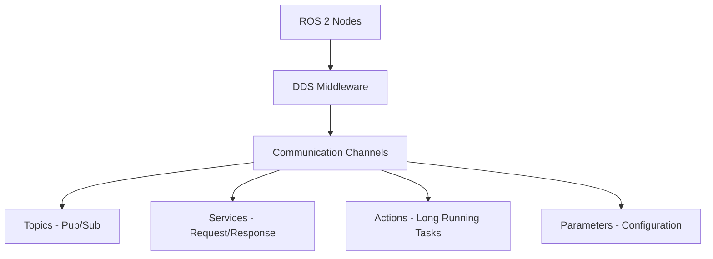

# Chapter 1.1: Why ROS 2 is the De Facto Robotic Nervous System

## Introduction

Robotic Operating System 2 (ROS 2) has emerged as the standard framework for developing complex robotic applications. Unlike traditional software frameworks, ROS 2 serves as the "nervous system" of modern robots, providing the essential communication infrastructure, middleware, and tools needed to coordinate complex robotic behaviors.

This chapter explores why ROS 2 has become the de facto standard for robotics development and how it enables the creation of sophisticated robotic systems.

## The Evolution of Robotic Software Architecture

### Traditional Approaches vs. ROS 2

In traditional robotic software development, engineers faced significant challenges:

- **Tight Coupling**: Components were tightly integrated, making modifications difficult
- **Platform Dependency**: Code was often tied to specific hardware or operating systems
- **Communication Complexity**: Implementing inter-process communication required significant effort
- **Reusability Issues**: Code reuse across projects was limited

ROS 2 addresses these challenges by providing:

- **Loose Coupling**: Components communicate through standardized interfaces
- **Platform Independence**: Runs on multiple operating systems and architectures
- **Simplified Communication**: Built-in messaging system with various Quality of Service (QoS) policies
- **Extensive Reusability**: Large ecosystem of packages and tools

## Core Architecture of ROS 2

ROS 2 is built on Data Distribution Service (DDS), a middleware standard that provides:

- **Publish-Subscribe Communication**: Asynchronous message passing between nodes
- **Service-Client Communication**: Synchronous request-response interactions
- **Action Communication**: Long-running tasks with feedback
- **Parameter Management**: Centralized configuration system

## Why ROS 2 is the "Nervous System" of Robotics

### 1. Communication Infrastructure

Like the nervous system in biological organisms, ROS 2 provides the communication pathways that allow different parts of a robot to coordinate:

- **Sensors to Processors**: Real-time data flow from perception systems
- **Processors to Actuators**: Command delivery to motors and effectors
- **Inter-Module Coordination**: Communication between different functional modules

### 2. Distributed Processing

ROS 2 enables distributed computing across multiple devices, from embedded systems to cloud services:

- **Edge Computing**: Processing on robot hardware
- **Cloud Integration**: Offloading complex computations
- **Multi-Robot Systems**: Coordination between multiple robots

### 3. Real-Time Capabilities

Modern robotics requires deterministic behavior and timing guarantees:

- **Real-Time Scheduling**: Support for real-time operating systems
- **Quality of Service**: Configurable reliability and performance settings
- **Deterministic Communication**: Predictable message delivery

## Key Advantages of ROS 2

### 1. Security by Design

ROS 2 includes built-in security features:

- **Authentication**: Identity verification for nodes
- **Authorization**: Access control for topics and services
- **Encryption**: Data protection in transit and at rest

### 2. Scalability

ROS 2 scales from simple educational robots to complex industrial systems:

- **Micro-Robotics**: Lightweight implementations for small robots
- **Industrial Systems**: Robust implementations for production environments
- **Multi-Robot Coordination**: Systems with dozens or hundreds of robots

### 3. Industry Adoption

Major companies and research institutions have adopted ROS 2:

- **Automotive**: Self-driving cars and autonomous vehicles
- **Manufacturing**: Industrial automation and collaborative robots
- **Healthcare**: Surgical robots and assistive devices
- **Space Exploration**: Mars rovers and satellite systems

## Learning Objectives

By the end of this chapter, you should be able to:

- Explain the role of ROS 2 as a robotic nervous system
- Identify the key architectural components of ROS 2
- Compare traditional robotic software approaches with ROS 2
- Understand the advantages of ROS 2 for robotic applications
- Recognize the industries and applications where ROS 2 is used

## Quiz Questions

1. What does DDS stand for in the context of ROS 2?
   - A) Distributed Development System
   - B) Data Distribution Service
   - C) Dynamic Discovery System
   - D) Distributed Data Service

2. Which communication pattern is best suited for sensor data streaming?
   - A) Service-Client
   - B) Action-Goal
   - C) Publish-Subscribe
   - D) Parameter-Server

3. What makes ROS 2 suitable for real-time robotic applications?
   - A) Only runs on Linux
   - B) Built on DDS with QoS policies
   - C) Limited to single-threaded execution
   - D) Requires cloud connectivity

## Coding Challenge

Create a simple ROS 2 publisher node that publishes messages containing your name and the current timestamp to a topic called "robot_status". The message should be published at 1 Hz.

## Summary

ROS 2 serves as the nervous system of modern robotics by providing the essential communication infrastructure, middleware, and tools needed for complex robotic systems. Its adoption as the de facto standard is driven by its robust architecture, security features, and industry support.