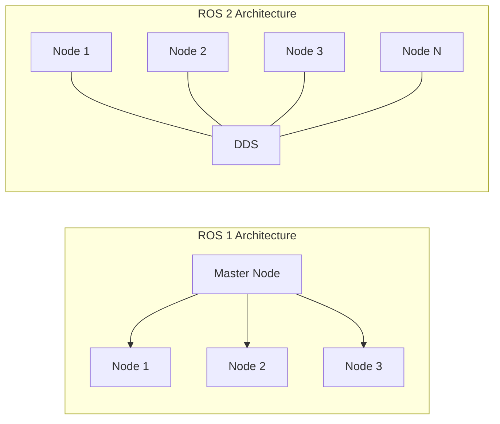

# Chapter 1.2: From ROS 1 to ROS 2

## Introduction

The transition from ROS 1 to ROS 2 represents one of the most significant evolutions in robotics software development. While ROS 1 established the foundation for robotic software frameworks, ROS 2 addresses critical limitations and introduces modern architectural improvements that make it suitable for production robotics applications.

This chapter examines the key differences between ROS 1 and ROS 2, the motivations behind the transition, and the benefits that ROS 2 brings to robotic development.

## Historical Context: The Legacy of ROS 1

### The ROS 1 Era

ROS 1, initially released in 2010, revolutionized robotics development by:

- **Standardizing Communication**: Introducing publish-subscribe and service-based communication
- **Building an Ecosystem**: Creating a vast library of packages and tools
- **Enabling Collaboration**: Facilitating code sharing across research institutions
- **Lowering Barriers**: Making robotics development accessible to a broader audience

### Limitations of ROS 1

Despite its success, ROS 1 had several limitations that became apparent as robotics moved toward commercial applications:

- **Single Master Architecture**: Centralized master node created a single point of failure
- **No Native Security**: Lack of authentication, authorization, and encryption
- **Limited Real-Time Support**: Not designed for real-time deterministic behavior
- **Middleware Dependency**: Tightly coupled to custom communication middleware
- **Quality of Service Issues**: No configurable reliability or performance settings
- **Multi-Robot Challenges**: Difficult to coordinate multiple robots reliably

## Key Architectural Differences

### 1. Communication Middleware

**ROS 1 Approach:**
- Custom TCPROS and UDPROS protocols
- XML-RPC for service calls
- Centralized master for name resolution
- Single machine communication model

**ROS 2 Approach:**
- DDS (Data Distribution Service) as the underlying middleware
- Distributed architecture with no single point of failure
- Native support for multi-machine and multi-robot systems
- Configurable Quality of Service (QoS) policies



### 2. Quality of Service (QoS) Policies

ROS 2 introduces QoS policies that allow fine-tuning of communication behavior:

- **Reliability**: Reliable vs. best-effort delivery
- **Durability**: Volatile vs. transient-local data persistence
- **History**: Keep-all vs. keep-last message history
- **Deadline**: Time constraints for message delivery
- **Lifespan**: Message validity period

### 3. Security Architecture

**ROS 1 Security:**
- No built-in security mechanisms
- Security typically implemented at the network level
- No authentication or authorization

**ROS 2 Security:**
- SROS2 (Secure ROS 2) with authentication
- Encryption for data in transit
- Authorization and access control
- Secure parameter management

## Migration Considerations

### Code Structure Changes

ROS 2 introduces several changes to the basic code structure:

**ROS 1 Node Example:**
```cpp
// ROS 1 approach
ros::init(argc, argv, "node_name");
ros::NodeHandle nh;
ros::Publisher pub = nh.advertise<std_msgs::String>("topic", 10);
```

**ROS 2 Node Example:**
```cpp
// ROS 2 approach
rclcpp::init(argc, argv);
auto node = std::make_shared<rclcpp::Node>("node_name");
auto pub = node->create_publisher<std_msgs::msg::String>("topic", 10);
```

### Client Library Changes

- **rclcpp**: C++ client library for ROS 2
- **rclpy**: Python client library for ROS 2
- **rcl**: ROS Client Library layer providing common interfaces
- **rmw**: ROS Middleware Interface layer

## Practical Comparison: ROS 1 vs ROS 2 Examples

### Publisher Node Comparison

**ROS 1 Publisher:**
```cpp
#include <ros/ros.h>
#include <std_msgs/String.h>

int main(int argc, char **argv) {
    ros::init(argc, argv, "talker");
    ros::NodeHandle n;
    ros::Publisher chatter_pub = n.advertise<std_msgs::String>("chatter", 1000);

    ros::Rate loop_rate(10);

    int count = 0;
    while (ros::ok()) {
        std_msgs::String msg;
        std::stringstream ss;
        ss << "hello world " << count;
        msg.data = ss.str();

        chatter_pub.publish(msg);
        ros::spinOnce();
        loop_rate.sleep();
        ++count;
    }

    return 0;
}
```

**ROS 2 Publisher:**
```cpp
#include <rclcpp/rclcpp.hpp>
#include <std_msgs/msg/string.hpp>

using namespace std::chrono_literals;

class MinimalPublisher : public rclcpp::Node {
public:
    MinimalPublisher() : Node("minimal_publisher"), count_(0) {
        publisher_ = this->create_publisher<std_msgs::msg::String>("topic", 10);
        timer_ = this->create_wall_timer(
            500ms, std::bind(&MinimalPublisher::timer_callback, this));
    }

private:
    void timer_callback() {
        auto message = std_msgs::msg::String();
        message.data = "Hello, world! " + std::to_string(count_++);
        RCLCPP_INFO(this->get_logger(), "Publishing: '%s'", message.data.c_str());
        publisher_->publish(message);
    }
    rclcpp::TimerBase::SharedPtr timer_;
    rclcpp::Publisher<std_msgs::msg::String>::SharedPtr publisher_;
    size_t count_;
};

int main(int argc, char * argv[]) {
    rclcpp::init(argc, argv);
    rclcpp::spin(std::make_shared<MinimalPublisher>());
    rclcpp::shutdown();
    return 0;
}
```

## Benefits of the Transition

### 1. Production Readiness

ROS 2 is designed for production environments with:

- **Reliability**: Distributed architecture eliminates single points of failure
- **Security**: Built-in security mechanisms for commercial applications
- **Real-Time Support**: Integration with real-time operating systems
- **Determinism**: Predictable behavior for safety-critical applications

### 2. Industry Standards Compliance

ROS 2 aligns with industry standards:

- **DDS Standard**: Compliance with OMG DDS specification
- **Real-Time Systems**: Support for RTI Connext, eProsima Fast DDS, Eclipse Cyclone DDS
- **Security Standards**: Implementation of SROS2 security profile
- **Interoperability**: Better integration with existing enterprise systems

### 3. Improved Tooling

ROS 2 offers enhanced development tools:

- **Better Debugging**: Improved introspection and monitoring tools
- **Enhanced Visualization**: Updated RViz2 with new features
- **Improved Testing**: Better test frameworks and CI/CD integration
- **Package Management**: More robust package management with colcon

## Migration Strategies

### 1. Gradual Migration

For existing ROS 1 codebases, consider:

- **Bridge Tools**: Use ros1_bridge for temporary ROS 1/ROS 2 interoperability
- **Parallel Development**: Maintain both versions during transition
- **Component-by-Component**: Migrate individual packages incrementally

### 2. New Development

For new projects:

- **Start with ROS 2**: Begin with ROS 2 to avoid migration later
- **Leverage New Features**: Utilize QoS policies and security from the start
- **Modern Practices**: Follow ROS 2 best practices and patterns

## Learning Objectives

By the end of this chapter, you should be able to:

- Identify the key differences between ROS 1 and ROS 2 architectures
- Explain the motivations behind the transition from ROS 1 to ROS 2
- Compare code examples between ROS 1 and ROS 2
- Understand the benefits of ROS 2 for production robotics
- Recognize the migration strategies for existing ROS 1 projects

## Quiz Questions

1. What is the underlying middleware used in ROS 2?
   - A) XML-RPC
   - B) TCPROS
   - C) DDS (Data Distribution Service)
   - D) HTTP

2. Which ROS 2 feature allows configuration of message delivery behavior?
   - A) Node handles
   - B) Quality of Service (QoS) policies
   - C) Launch files
   - D) Parameter servers

3. What was a major limitation of ROS 1's architecture?
   - A) Too many packages available
   - B) Single master node creating a point of failure
   - C) Excessive security features
   - D) Poor documentation

## Coding Challenge

Create a ROS 2 package that includes both a publisher and subscriber node. The publisher should send messages containing a counter value and timestamp, while the subscriber should receive and log these messages with the time difference between sent and received timestamps. Compare the code structure with equivalent ROS 1 code.

## Summary

The transition from ROS 1 to ROS 2 represents a significant evolution in robotics software development, addressing critical limitations while maintaining the collaborative spirit that made ROS 1 successful. ROS 2's modern architecture, security features, and production readiness make it the clear choice for current and future robotic applications.