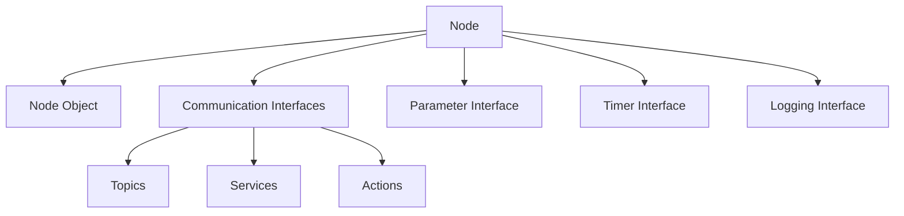
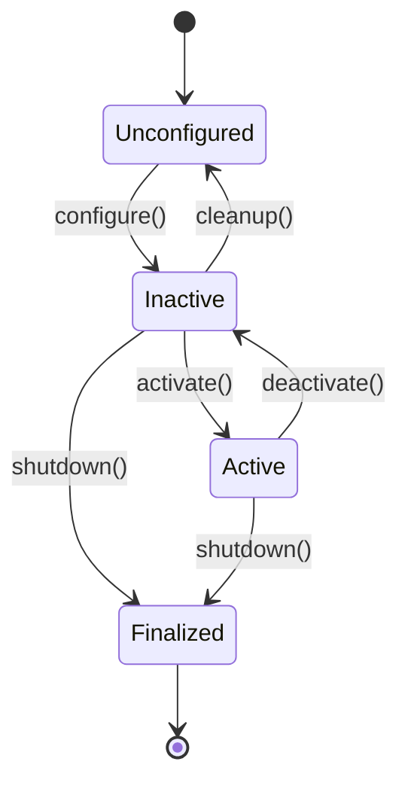

# 1.3.1: Nodes - The Living Cells of a Robot

## Introduction

In ROS 2, a **Node** is the fundamental execution unit that performs computation. Like living cells in biological organisms, nodes are the basic building blocks that form the complex systems of robotic applications. Each node encapsulates specific functionality and communicates with other nodes to achieve the overall robotic behavior.

This section explores the concept of nodes in ROS 2, their lifecycle, and how they serve as the foundational elements of robotic systems.

## What is a Node?

A node in ROS 2 is:

- **An executable process**: A running program that performs specific tasks
- **A communication endpoint**: A participant in the ROS 2 communication system
- **A functional unit**: A module that implements specific robotic functionality
- **A resource container**: Manages topics, services, parameters, and other resources

Nodes can range from simple sensor drivers to complex perception or planning algorithms. Each node runs independently and communicates with other nodes through the ROS 2 middleware.

## Node Architecture and Components

### Basic Node Structure

Every ROS 2 node contains:

- **Node Handle/Node Object**: The primary interface to ROS 2 functionality
- **Communication Interfaces**: Publishers, subscribers, services, and actions
- **Parameter Interface**: Configuration and runtime parameter access
- **Timer Interface**: Periodic execution capabilities
- **Logging Interface**: Message logging and debugging support



## Creating a Node in Different Languages

### C++ Node Example

```cpp
#include <rclcpp/rclcpp.hpp>
#include <std_msgs/msg/string.hpp>

class MinimalNode : public rclcpp::Node {
public:
    MinimalNode() : Node("minimal_node") {
        // Create a publisher
        publisher_ = this->create_publisher<std_msgs::msg::String>(
            "topic", 10);

        // Create a subscription
        subscription_ = this->create_subscription<std_msgs::msg::String>(
            "topic", 10,
            [this](const std_msgs::msg::String::SharedPtr msg) {
                RCLCPP_INFO(this->get_logger(), "I heard: '%s'", msg->data.c_str());
            });

        // Create a timer
        timer_ = this->create_wall_timer(
            std::chrono::milliseconds(500),
            [this]() { this->timer_callback(); });
    }

private:
    void timer_callback() {
        auto message = std_msgs::msg::String();
        message.data = "Hello, world!";
        RCLCPP_INFO(this->get_logger(), "Publishing: '%s'", message.data.c_str());
        publisher_->publish(message);
    }

    rclcpp::TimerBase::SharedPtr timer_;
    rclcpp::Publisher<std_msgs::msg::String>::SharedPtr publisher_;
    rclcpp::Subscription<std_msgs::msg::String>::SharedPtr subscription_;
};

int main(int argc, char * argv[]) {
    rclcpp::init(argc, argv);
    rclcpp::spin(std::make_shared<MinimalNode>());
    rclcpp::shutdown();
    return 0;
}
```

### Python Node Example

```python
import rclpy
from rclpy.node import Node
from std_msgs.msg import String

class MinimalNode(Node):
    def __init__(self):
        super().__init__('minimal_node')

        # Create a publisher
        self.publisher_ = self.create_publisher(String, 'topic', 10)

        # Create a subscription
        self.subscription = self.create_subscription(
            String,
            'topic',
            self.listener_callback,
            10)

        # Create a timer
        self.timer = self.create_timer(0.5, self.timer_callback)
        self.i = 0

    def timer_callback(self):
        msg = String()
        msg.data = 'Hello World: %d' % self.i
        self.publisher_.publish(msg)
        self.get_logger().info('Publishing: "%s"' % msg.data)
        self.i += 1

    def listener_callback(self, msg):
        self.get_logger().info('I heard: "%s"' % msg.data)

def main(args=None):
    rclpy.init(args=args)
    minimal_node = MinimalNode()
    rclpy.spin(minimal_node)
    minimal_node.destroy_node()
    rclpy.shutdown()

if __name__ == '__main__':
    main()
```

## Node Lifecycle

ROS 2 introduces a formal **Lifecycle** for nodes, allowing for more sophisticated state management:

### Lifecycle States

1. **Unconfigured**: Node created but not configured
2. **Inactive**: Configured but not active
3. **Active**: Running and operational
4. **Finalized**: Node is shutting down



### Lifecycle Node Example

```cpp
#include <rclcpp/rclcpp.hpp>
#include <rclcpp_lifecycle/lifecycle_node.hpp>
#include <rclcpp_lifecycle/lifecycle_publisher.hpp>

class LifecycleNodeClass : public rclcpp_lifecycle::LifecycleNode {
public:
    explicit LifecycleNodeClass(const std::string & node_name)
    : rclcpp_lifecycle::LifecycleNode(node_name) {}

protected:
    // Callbacks for each lifecycle state transition
    rclcpp_lifecycle::node_interfaces::LifecycleNodeInterface::CallbackReturn
    on_configure(const rclcpp_lifecycle::State &) {
        RCLCPP_INFO(get_logger(), "Configuring lifecycle node");
        pub_ = this->create_publisher<std_msgs::msg::String>("topic", 10);
        return rclcpp_lifecycle::node_interfaces::LifecycleNodeInterface::CallbackReturn::SUCCESS;
    }

    rclcpp_lifecycle::node_interfaces::LifecycleNodeInterface::CallbackReturn
    on_activate(const rclcpp_lifecycle::State &) {
        RCLCPP_INFO(get_logger(), "Activating lifecycle node");
        pub_->on_activate();
        return rclcpp_lifecycle::node_interfaces::LifecycleNodeInterface::CallbackReturn::SUCCESS;
    }

    rclcpp_lifecycle::node_interfaces::LifecycleNodeInterface::CallbackReturn
    on_deactivate(const rclcpp_lifecycle::State &) {
        RCLCPP_INFO(get_logger(), "Deactivating lifecycle node");
        pub_->on_deactivate();
        return rclcpp_lifecycle::node_interfaces::LifecycleNodeInterface::CallbackReturn::SUCCESS;
    }

    rclcpp_lifecycle::node_interfaces::LifecycleNodeInterface::CallbackReturn
    on_cleanup(const rclcpp_lifecycle::State &) {
        RCLCPP_INFO(get_logger(), "Cleaning up lifecycle node");
        pub_.reset();
        return rclcpp_lifecycle::node_interfaces::LifecycleNodeInterface::CallbackReturn::SUCCESS;
    }

private:
    std::shared_ptr<rclcpp_lifecycle::LifecyclePublisher<std_msgs::msg::String>> pub_;
};
```

## Node Management and Best Practices

### Node Naming and Namespacing

Proper node naming follows these conventions:

- **Unique Names**: Each node should have a unique name within its namespace
- **Descriptive Names**: Use names that reflect the node's function
- **Namespacing**: Use namespaces to organize related nodes

```cpp
// Creating a node with namespace
auto node = std::make_shared<rclcpp::Node>(
    "sensor_driver",
    rclcpp::NodeOptions().arguments({"--ros-args", "-r", "__ns:=/robot1"}));
```

### Resource Management

Nodes should properly manage resources:

- **Clean Shutdown**: Properly destroy publishers, subscribers, and other resources
- **Exception Handling**: Handle errors gracefully without crashing
- **Memory Management**: Avoid memory leaks in long-running nodes
- **Timer Management**: Properly manage timer callbacks and intervals

## Communication Patterns in Nodes

### Publisher-Subscriber Pattern

Nodes communicate through topics using the publish-subscribe pattern:

```cpp
// Publisher creation
auto publisher = node->create_publisher<MessageType>("topic_name", qos_profile);

// Subscriber creation
auto subscriber = node->create_subscription<MessageType>(
    "topic_name",
    qos_profile,
    [](const MessageType::SharedPtr msg) {
        // Process message
    });
```

### Service-Client Pattern

For request-response communication:

```cpp
// Service server
auto service = node->create_service<ServiceType>(
    "service_name",
    [node](const Request::SharedPtr request, Response::SharedPtr response) {
        // Process request and fill response
    });

// Service client
auto client = node->create_client<ServiceType>("service_name");
```

## Learning Objectives

By the end of this section, you should be able to:

- Define what a node is in ROS 2 and explain its role
- Create nodes in both C++ and Python
- Understand the lifecycle of a node and its states
- Implement lifecycle nodes for complex state management
- Apply best practices for node naming and resource management
- Use different communication patterns within nodes

## Quiz Questions

1. What is the fundamental execution unit in ROS 2?
   - A) Topic
   - B) Node
   - C) Service
   - D) Message

2. Which of the following is NOT a lifecycle state in ROS 2?
   - A) Unconfigured
   - B) Active
   - C) Sleeping
   - D) Inactive

3. What is the primary purpose of the Node object in ROS 2?
   - A) To store data only
   - B) To serve as the primary interface to ROS 2 functionality
   - C) To manage hardware directly
   - D) To replace the need for topics

## Coding Challenge

Create a lifecycle node that simulates a sensor driver. The node should:
1. Transition through all lifecycle states properly
2. Publish sensor data when active
3. Stop publishing when inactive
4. Implement proper resource management
5. Include parameter configuration for sensor update rate

## Summary

Nodes serve as the fundamental building blocks of ROS 2 applications, analogous to living cells in biological systems. Understanding node creation, lifecycle management, and communication patterns is essential for developing robust robotic applications. The lifecycle node concept adds sophisticated state management capabilities for complex robotic systems.