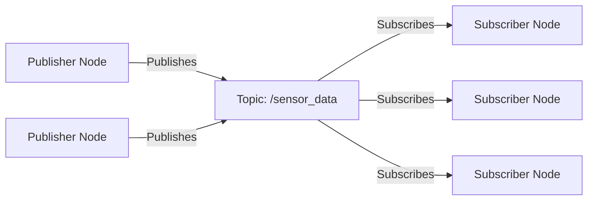

# 1.3.2: Topics - The Publish-Subscribe Bloodstream

## Introduction

In ROS 2, **Topics** serve as the primary mechanism for asynchronous communication between nodes, functioning like the bloodstream in a biological organism. Topics enable the flow of data throughout the robotic system using the publish-subscribe pattern, allowing nodes to share information without direct coupling.

This section explores the concept of topics, Quality of Service (QoS) policies, and how topics facilitate the distributed nature of robotic systems.

## Understanding Topics

### The Publish-Subscribe Pattern

Topics implement the **publish-subscribe** communication pattern:

- **Publishers**: Nodes that send messages to a topic
- **Subscribers**: Nodes that receive messages from a topic
- **Messages**: Data structures exchanged between nodes
- **DDS Middleware**: Underlying infrastructure that routes messages

This pattern decouples publishers and subscribers, allowing them to operate independently and at different rates.



### Topic Characteristics

Topics in ROS 2 have several key characteristics:

- **Asynchronous**: Publishers and subscribers operate independently
- **Many-to-Many**: Multiple publishers and subscribers can connect to the same topic
- **Typed**: Each topic has a specific message type
- **Named**: Topics follow a hierarchical naming convention (e.g., `/robot/sensors/laser_scan`)

## Message Types and Definitions

### Standard Message Types

ROS 2 provides a rich set of standard message types:

- **std_msgs**: Basic data types (String, Int32, Float64, etc.)
- **sensor_msgs**: Sensor data (LaserScan, Image, PointCloud2, etc.)
- **geometry_msgs**: Geometric transformations (Pose, Twist, Vector3, etc.)
- **nav_msgs**: Navigation messages (Odometry, Path, OccupancyGrid, etc.)

### Creating Custom Messages

Custom messages are defined using `.msg` files:

```
# Custom message: RobotStatus.msg
string robot_name
int32 battery_level
bool is_operational
float64[] joint_positions
```

## Quality of Service (QoS) Policies

One of the key improvements in ROS 2 is the ability to configure **Quality of Service** policies for topics, allowing fine-tuning of communication behavior.

### Reliability Policy

Controls how messages are delivered:

- **Reliable**: All messages are delivered, with retries if needed
- **Best Effort**: Messages are sent once without guarantee of delivery

```cpp
// Reliable QoS
rclcpp::QoS reliable_qos(10);
reliable_qos.reliability(RMW_QOS_POLICY_RELIABILITY_RELIABLE);

// Best effort QoS
rclcpp::QoS best_effort_qos(10);
best_effort_qos.reliability(RMW_QOS_POLICY_RELIABILITY_BEST_EFFORT);
```

### Durability Policy

Controls message persistence:

- **Volatile**: Messages are only available to currently active subscribers
- **Transient Local**: Messages are stored and delivered to late-joining subscribers

```cpp
// Volatile QoS
rclcpp::QoS volatile_qos(10);
volatile_qos.durability(RMW_QOS_POLICY_DURABILITY_VOLATILE);

// Transient Local QoS
rclcpp::QoS transient_qos(10);
transient_qos.durability(RMW_QOS_POLICY_DURABILITY_TRANSIENT_LOCAL);
```

### History Policy

Controls how many messages to store:

- **Keep Last**: Store only the most recent N messages
- **Keep All**: Store all messages (limited by system resources)

```cpp
// Keep last 10 messages
rclcpp::QoS keep_last_qos(10);

// Keep all messages
rclcpp::QoS keep_all_qos = rclcpp::QoS(rclcpp::KeepAll());
```

### Deadline Policy

Specifies timing constraints for message delivery:

```cpp
// Messages must be delivered within 1 second
rclcpp::QoS qos(10);
qos.deadline(std::chrono::seconds(1));
```

## Topic Implementation Examples

### C++ Publisher Example

```cpp
#include <rclcpp/rclcpp.hpp>
#include <std_msgs/msg/string.hpp>
#include <sensor_msgs/msg/laser_scan.hpp>

class TopicPublisher : public rclcpp::Node {
public:
    TopicPublisher() : Node("topic_publisher") {
        // Create publisher with default QoS
        publisher_ = this->create_publisher<std_msgs::msg::String>("chatter", 10);

        // Create publisher with custom QoS for sensor data
        auto sensor_qos = rclcpp::QoS(rclcpp::KeepLast(100))
            .best_effort()
            .durability_volatile();
        sensor_publisher_ = this->create_publisher<sensor_msgs::msg::LaserScan>(
            "laser_scan", sensor_qos);

        // Create timer to publish messages
        timer_ = this->create_wall_timer(
            std::chrono::milliseconds(500),
            [this]() { this->publish_messages(); });
    }

private:
    void publish_messages() {
        // Publish string message
        auto message = std_msgs::msg::String();
        message.data = "Hello, ROS 2! " + std::to_string(count_++);
        publisher_->publish(message);

        // Publish sensor message
        auto scan_msg = sensor_msgs::msg::LaserScan();
        scan_msg.header.stamp = this->now();
        scan_msg.header.frame_id = "laser_frame";
        scan_msg.angle_min = -1.57;  // -90 degrees
        scan_msg.angle_max = 1.57;   // 90 degrees
        scan_msg.angle_increment = 0.01;
        scan_msg.ranges.resize(314); // 314 points for 180 degrees at 0.01 radian increments
        for (auto& range : scan_msg.ranges) {
            range = 1.0 + static_cast<float>(rand()) / RAND_MAX * 9.0; // Random range 1-10 meters
        }
        sensor_publisher_->publish(scan_msg);
    }

    rclcpp::TimerBase::SharedPtr timer_;
    rclcpp::Publisher<std_msgs::msg::String>::SharedPtr publisher_;
    rclcpp::Publisher<sensor_msgs::msg::LaserScan>::SharedPtr sensor_publisher_;
    size_t count_ = 0;
};
```

### C++ Subscriber Example

```cpp
#include <rclcpp/rclcpp.hpp>
#include <std_msgs/msg/string.hpp>
#include <sensor_msgs/msg/laser_scan.hpp>

class TopicSubscriber : public rclcpp::Node {
public:
    TopicSubscriber() : Node("topic_subscriber") {
        // Create subscriber with default QoS
        subscription_ = this->create_subscription<std_msgs::msg::String>(
            "chatter", 10,
            [this](const std_msgs::msg::String::SharedPtr msg) {
                RCLCPP_INFO(this->get_logger(), "Received: '%s'", msg->data.c_str());
            });

        // Create subscriber with matching QoS for sensor data
        auto sensor_qos = rclcpp::QoS(rclcpp::KeepLast(100))
            .best_effort()
            .durability_volatile();
        sensor_subscription_ = this->create_subscription<sensor_msgs::msg::LaserScan>(
            "laser_scan", sensor_qos,
            [this](const sensor_msgs::msg::LaserScan::SharedPtr msg) {
                RCLCPP_INFO(this->get_logger(),
                    "Received laser scan with %zu ranges, range to obstacle: %.2f",
                    msg->ranges.size(), msg->ranges[157]); // Middle of the scan
            });
    }

private:
    rclcpp::Subscription<std_msgs::msg::String>::SharedPtr subscription_;
    rclcpp::Subscription<sensor_msgs::msg::LaserScan>::SharedPtr sensor_subscription_;
};
```

### Python Examples

```python
import rclpy
from rclpy.node import Node
from std_msgs.msg import String
from sensor_msgs.msg import LaserScan
from rclpy.qos import QoSProfile, ReliabilityPolicy, DurabilityPolicy

class TopicPublisher(Node):
    def __init__(self):
        super().__init__('topic_publisher')

        # Create publisher with default QoS
        self.publisher_ = self.create_publisher(String, 'chatter', 10)

        # Create publisher with custom QoS
        sensor_qos = QoSProfile(
            depth=100,
            reliability=ReliabilityPolicy.BEST_EFFORT,
            durability=DurabilityPolicy.VOLATILE
        )
        self.sensor_publisher_ = self.create_publisher(LaserScan, 'laser_scan', sensor_qos)

        # Create timer
        self.timer = self.create_timer(0.5, self.publish_messages)
        self.count = 0

    def publish_messages(self):
        # Publish string message
        msg = String()
        msg.data = f'Hello ROS 2: {self.count}'
        self.publisher_.publish(msg)
        self.get_logger().info(f'Publishing: "{msg.data}"')

        # Publish sensor message
        scan_msg = LaserScan()
        scan_msg.header.stamp = self.get_clock().now().to_msg()
        scan_msg.header.frame_id = 'laser_frame'
        scan_msg.angle_min = -1.57
        scan_msg.angle_max = 1.57
        scan_msg.angle_increment = 0.01
        scan_msg.ranges = [1.0 + (i / 100.0) for i in range(314)]
        self.sensor_publisher_.publish(scan_msg)

        self.count += 1

class TopicSubscriber(Node):
    def __init__(self):
        super().__init__('topic_subscriber')

        # Create subscriber with default QoS
        self.subscription = self.create_subscription(
            String,
            'chatter',
            self.string_callback,
            10)

        # Create subscriber with matching QoS
        sensor_qos = QoSProfile(
            depth=100,
            reliability=ReliabilityPolicy.BEST_EFFORT,
            durability=DurabilityPolicy.VOLATILE
        )
        self.sensor_subscription = self.create_subscription(
            LaserScan,
            'laser_scan',
            self.sensor_callback,
            sensor_qos)

        self.subscription  # prevent unused variable warning

    def string_callback(self, msg):
        self.get_logger().info(f'Received: "{msg.data}"')

    def sensor_callback(self, msg):
        self.get_logger().info(f'Received laser scan with {len(msg.ranges)} ranges')
```

## Advanced Topic Concepts

### Topic Remapping

Topics can be remapped at runtime:

```cpp
// Remap topic during node creation
rclcpp::NodeOptions options;
options.arguments({"--ros-args", "-r", "chatter:=new_topic_name"});
auto node = std::make_shared<rclcpp::Node>("remapped_node", options);
```

### Topic Statistics

ROS 2 provides topic statistics for monitoring:

```cpp
// Enable topic statistics
auto options = rclcpp::NodeOptions()
    .enable_topic_statistics(true);
auto node = std::make_shared<rclcpp::Node>("stats_node", options);
```

### Connection Callbacks

Monitor publisher/subscriber connections:

```cpp
// Publisher connection callback
publisher_->set_on_new_entity_callback([]() {
    RCLCPP_INFO(node->get_logger(), "New subscriber connected");
});

// Subscription connection callback
subscription_->set_on_new_entity_callback([]() {
    RCLCPP_INFO(node->get_logger(), "New publisher connected");
});
```

## Best Practices for Topic Usage

### 1. Appropriate QoS Selection

- Use **Reliable** QoS for critical data (commands, safety messages)
- Use **Best Effort** QoS for sensor data where occasional loss is acceptable
- Use **Transient Local** for configuration or static data
- Use **Keep All** for historical data, **Keep Last** for current state

### 2. Efficient Message Design

- Keep messages small to reduce network overhead
- Use appropriate data types (avoid unnecessary precision)
- Consider message frequency and bandwidth requirements
- Use arrays and vectors judiciously

### 3. Topic Naming Conventions

- Use descriptive, hierarchical names
- Follow the pattern: `/namespace/subsystem/component/message_type`
- Use lowercase with underscores
- Be consistent across the system

## Learning Objectives

By the end of this section, you should be able to:

- Explain the publish-subscribe communication pattern in ROS 2
- Create publishers and subscribers with appropriate QoS policies
- Design custom message types for specific applications
- Apply best practices for topic usage and message design
- Monitor and debug topic communication
- Understand the importance of QoS policies in robotic systems

## Quiz Questions

1. What QoS policy controls whether all messages are guaranteed to be delivered?
   - A) Durability
   - B) History
   - C) Reliability
   - D) Deadline

2. Which QoS durability policy ensures that late-joining subscribers receive previously published messages?
   - A) Volatile
   - B) Transient Local
   - C) Keep Last
   - D) Best Effort

3. What is the purpose of the publish-subscribe pattern in ROS 2?
   - A) To ensure synchronous communication
   - B) To couple publishers and subscribers directly
   - C) To enable asynchronous communication without direct coupling
   - D) To reduce message size

## Coding Challenge

Create a complete publisher-subscriber pair that demonstrates different QoS policies:
1. Create a publisher that sends sensor data with Best Effort reliability
2. Create a subscriber that receives the data and processes it
3. Add a second publisher-subscriber pair for critical commands with Reliable QoS
4. Monitor and log the differences in message delivery between the two QoS configurations

## Summary

Topics form the communication bloodstream of ROS 2 systems, enabling asynchronous data flow between nodes. The Quality of Service policies provide powerful control over communication behavior, allowing developers to optimize for reliability, performance, and resource usage. Understanding topics and their QoS policies is essential for building robust and efficient robotic applications.