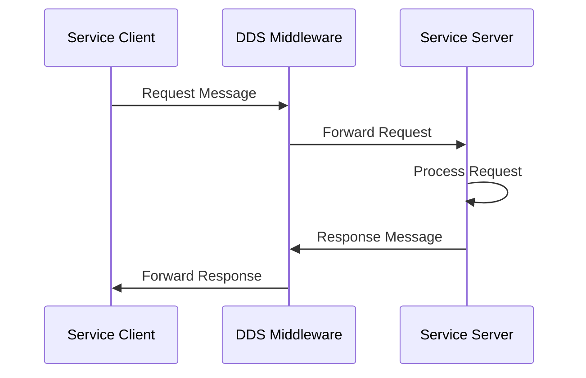
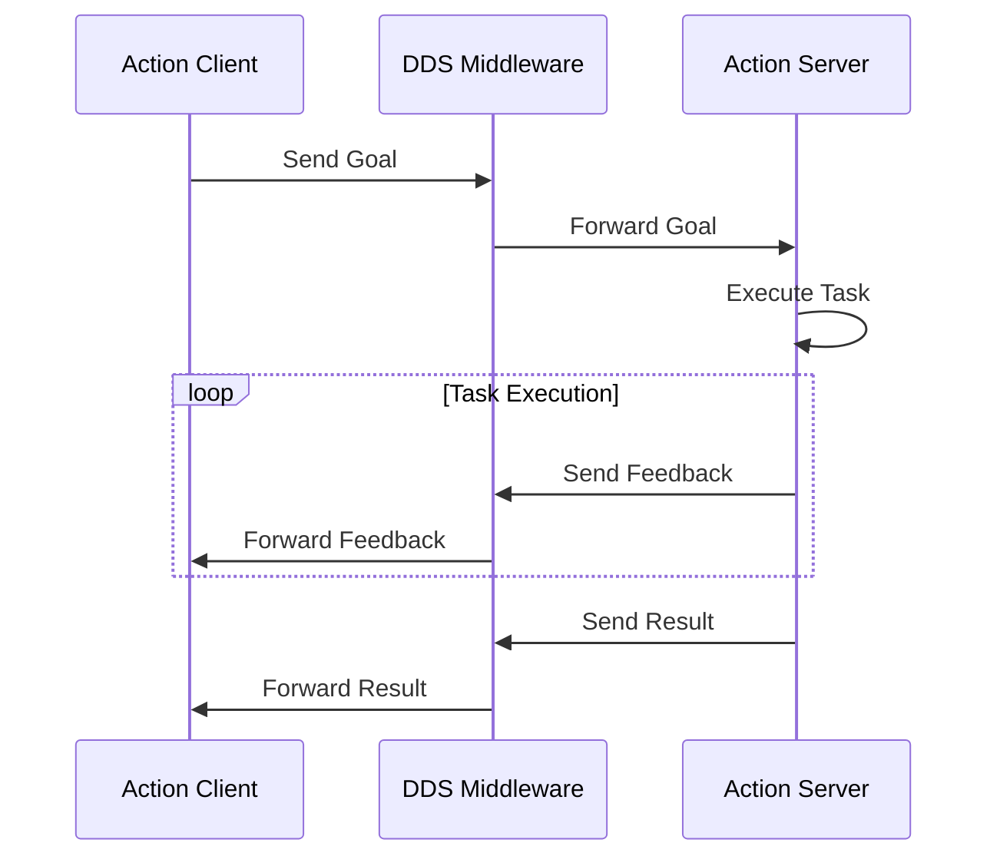

# 1.3.3: Services & Actions - Request-Response and Long-Running Tasks

## Introduction

In ROS 2, **Services** and **Actions** provide synchronous and asynchronous request-response communication patterns, complementing the publish-subscribe model of topics. While topics enable continuous data flow like a bloodstream, services and actions function more like targeted neural pathways for specific requests and complex operations.

This section explores the concepts of services for simple request-response interactions and actions for long-running tasks with feedback.

## Services: Synchronous Request-Response

### Service Architecture

Services in ROS 2 implement a **synchronous request-response** pattern:

- **Service Client**: Sends a request and waits for a response
- **Service Server**: Receives requests and sends responses
- **Service Interface**: Defines the request and response message types
- **DDS Middleware**: Handles the request-response communication



### Service Characteristics

Services have these key characteristics:

- **Synchronous**: Client waits for response before continuing
- **Request-Response**: One request generates one response
- **Reliable**: Request and response are guaranteed delivery
- **Blocking**: Client execution pauses during service call

## Service Implementation Examples

### Service Definition

Services are defined using `.srv` files:

```
# AddTwoInts.srv
int64 a
int64 b
---
int64 sum
```

### C++ Service Server Example

```cpp
#include <rclcpp/rclcpp.hpp>
#include <example_interfaces/srv/add_two_ints.hpp>

class ServiceServer : public rclcpp::Node {
public:
    ServiceServer() : Node("service_server") {
        // Create service server
        service_ = this->create_service<example_interfaces::srv::AddTwoInts>(
            "add_two_ints",
            [this](
                const std::shared_ptr<example_interfaces::srv::AddTwoInts::Request> request,
                std::shared_ptr<example_interfaces::srv::AddTwoInts::Response> response) {
                response->sum = request->a + request->b;
                RCLCPP_INFO(this->get_logger(),
                    "Incoming request: %ld + %ld = %ld",
                    request->a, request->b, response->sum);
            });
    }

private:
    rclcpp::Service<example_interfaces::srv::AddTwoInts>::SharedPtr service_;
};

int main(int argc, char * argv[]) {
    rclcpp::init(argc, argv);
    rclcpp::spin(std::make_shared<ServiceServer>());
    rclcpp::shutdown();
    return 0;
}
```

### C++ Service Client Example

```cpp
#include <rclcpp/rclcpp.hpp>
#include <example_interfaces/srv/add_two_ints.hpp>

class ServiceClient : public rclcpp::Node {
public:
    ServiceClient() : Node("service_client") {
        client_ = this->create_client<example_interfaces::srv::AddTwoInts>("add_two_ints");

        // Wait for service to be available
        while (!client_->wait_for_service(std::chrono::seconds(1))) {
            if (!rclcpp::ok()) {
                RCLCPP_ERROR(this->get_logger(), "Interrupted while waiting for service");
                return;
            }
            RCLCPP_INFO(this->get_logger(), "Service not available, waiting again...");
        }

        // Create async request
        auto request = std::make_shared<example_interfaces::srv::AddTwoInts::Request>();
        request->a = 2;
        request->b = 3;

        // Send async request
        auto future_result = client_->async_send_request(request);

        // Process response when available
        future_result.then([this](rclcpp::Client<example_interfaces::srv::AddTwoInts>::SharedFuture future) {
            auto result = future.get();
            RCLCPP_INFO(this->get_logger(), "Result: %ld", result->sum);
        });
    }

private:
    rclcpp::Client<example_interfaces::srv::AddTwoInts>::SharedPtr client_;
};
```

### Python Service Examples

```python
import rclpy
from rclpy.node import Node
from example_interfaces.srv import AddTwoInts

class ServiceServer(Node):
    def __init__(self):
        super().__init__('service_server')
        self.srv = self.create_service(
            AddTwoInts,
            'add_two_ints',
            self.add_two_ints_callback)

    def add_two_ints_callback(self, request, response):
        response.sum = request.a + request.b
        self.get_logger().info(f'Incoming request: {request.a} + {request.b} = {response.sum}')
        return response

class ServiceClient(Node):
    def __init__(self):
        super().__init__('service_client')
        self.cli = self.create_client(AddTwoInts, 'add_two_ints')

        while not self.cli.wait_for_service(timeout_sec=1.0):
            self.get_logger().info('Service not available, waiting again...')

        self.send_request()

    def send_request(self):
        request = AddTwoInts.Request()
        request.a = 2
        request.b = 3

        self.future = self.cli.call_async(request)
        self.future.add_done_callback(self.response_callback)

    def response_callback(self, future):
        result = future.result()
        self.get_logger().info(f'Result: {result.sum}')
```

## Actions: Asynchronous Long-Running Tasks

### Action Architecture

Actions provide a more sophisticated communication pattern for **long-running tasks** with feedback:

- **Goal**: Request for a long-running task
- **Feedback**: Periodic updates on task progress
- **Result**: Final outcome of the task
- **Goal Status**: Information about goal execution state



### Action Characteristics

Actions have these key characteristics:

- **Asynchronous**: Non-blocking communication
- **Progress Tracking**: Continuous feedback during execution
- **Goal Management**: Cancel, pause, and resume capabilities
- **Complex State**: Multiple intermediate states during execution

### Action Implementation Examples

#### Action Definition

Actions are defined using `.action` files:

```
# Fibonacci.action
int32 order
---
int32[] sequence
---
int32[] partial_sequence
```

#### C++ Action Server Example

```cpp
#include <rclcpp/rclcpp.hpp>
#include <rclcpp_action/rclcpp_action.hpp>
#include <example_interfaces/action/fibonacci.hpp>

class FibonacciActionServer : public rclcpp::Node {
public:
    using Fibonacci = example_interfaces::action::Fibonacci;
    using GoalHandleFibonacci = rclcpp_action::ServerGoalHandle<Fibonacci>;

    FibonacciActionServer() : Node("fibonacci_action_server") {
        using namespace std::placeholders;

        action_server_ = rclcpp_action::create_server<Fibonacci>(
            this,
            "fibonacci",
            std::bind(&FibonacciActionServer::handle_goal, this, _1, _2),
            std::bind(&FibonacciActionServer::handle_cancel, this, _1),
            std::bind(&FibonacciActionServer::handle_accepted, this, _1));
    }

private:
    rclcpp_action::ActionServer<Fibonacci>::SharedPtr action_server_;

    rclcpp_action::GoalResponse handle_goal(
        const rclcpp_action::GoalUUID & uuid,
        std::shared_ptr<const Fibonacci::Goal> goal) {
        RCLCPP_INFO(this->get_logger(), "Received goal request with order %d", goal->order);
        return rclcpp_action::GoalResponse::ACCEPT_AND_EXECUTE;
    }

    rclcpp_action::CancelResponse handle_cancel(
        const std::shared_ptr<GoalHandleFibonacci> goal_handle) {
        RCLCPP_INFO(this->get_logger(), "Received request to cancel goal");
        return rclcpp_action::CancelResponse::ACCEPT;
    }

    void handle_accepted(const std::shared_ptr<GoalHandleFibonacci> goal_handle) {
        using namespace std::placeholders;
        // This needs to return quickly to avoid blocking the executor
        std::thread{std::bind(&FibonacciActionServer::execute, this, _1), goal_handle}.detach();
    }

    void execute(const std::shared_ptr<GoalHandleFibonacci> goal_handle) {
        RCLCPP_INFO(this->get_logger(), "Executing goal");

        // Create messages for feedback and result
        auto feedback = std::make_shared<Fibonacci::Feedback>();
        auto result = std::make_shared<Fibonacci::Result>();

        // Initialize Fibonacci sequence
        auto order = goal_handle->get_goal()->order;
        feedback->sequence = {0};

        if (order == 0) {
            result->sequence = feedback->sequence;
            goal_handle->succeed(result);
            RCLCPP_INFO(this->get_logger(), "Goal succeeded");
            return;
        }

        if (order > 0) {
            feedback->sequence.push_back(1);
        }

        // Send feedback periodically
        auto sequence = feedback->sequence;
        for (int i = 1; i < order; ++i) {
            // Check if there is a cancel request
            if (goal_handle->is_canceling()) {
                result->sequence = sequence;
                goal_handle->canceled(result);
                RCLCPP_INFO(this->get_logger(), "Goal canceled");
                return;
            }

            // Update sequence
            sequence.push_back(sequence[i] + sequence[i - 1]);

            // Send feedback
            feedback->sequence = sequence;
            goal_handle->publish_feedback(feedback);

            RCLCPP_INFO(this->get_logger(), "Publishing feedback: %d", sequence.back());

            // Sleep to simulate work
            std::this_thread::sleep_for(std::chrono::milliseconds(500));
        }

        // Check if goal was canceled during execution
        if (rclcpp::ok()) {
            result->sequence = sequence;
            goal_handle->succeed(result);
            RCLCPP_INFO(this->get_logger(), "Goal succeeded");
        }
    }
};
```

#### C++ Action Client Example

```cpp
#include <rclcpp/rclcpp.hpp>
#include <rclcpp_action/rclcpp_action.hpp>
#include <example_interfaces/action/fibonacci.hpp>

class FibonacciActionClient : public rclcpp::Node {
public:
    using Fibonacci = example_interfaces::action::Fibonacci;
    using GoalHandleFibonacci = rclcpp_action::ClientGoalHandle<Fibonacci>;

    FibonacciActionClient() : Node("fibonacci_action_client") {
        this->client_ptr_ = rclcpp_action::create_client<Fibonacci>(
            this, "fibonacci");

        this->timer_ = this->create_wall_timer(
            std::chrono::milliseconds(500),
            std::bind(&FibonacciActionClient::send_goal, this));
    }

private:
    rclcpp_action::Client<Fibonacci>::SharedPtr client_ptr_;
    rclcpp::TimerBase::SharedPtr timer_;
    GoalHandleFibonacci::SharedPtr goal_handle_;

    void send_goal() {
        using namespace std::placeholders;

        this->timer_->cancel();

        if (!this->client_ptr_->wait_for_action_server(std::chrono::seconds(5))) {
            RCLCPP_ERROR(this->get_logger(), "Action server not available after waiting");
            return;
        }

        // Create goal
        auto goal_msg = Fibonacci::Goal();
        goal_msg.order = 10;

        // Set options
        auto send_goal_options = rclcpp_action::Client<Fibonacci>::SendGoalOptions();
        send_goal_options.goal_response_callback =
            std::bind(&FibonacciActionClient::goal_response_callback, this, _1);
        send_goal_options.feedback_callback =
            std::bind(&FibonacciActionClient::feedback_callback, this, _1, _2);
        send_goal_options.result_callback =
            std::bind(&FibonacciActionClient::result_callback, this, _1);

        RCLCPP_INFO(this->get_logger(), "Sending goal");

        // Send goal
        this->client_ptr_->async_send_goal(goal_msg, send_goal_options);
    }

    void goal_response_callback(const GoalHandleFibonacci::SharedPtr & goal_handle) {
        if (!goal_handle) {
            RCLCPP_ERROR(this->get_logger(), "Goal was rejected by server");
        } else {
            RCLCPP_INFO(this->get_logger(), "Goal accepted by server, waiting for result");
            this->goal_handle_ = goal_handle;
        }
    }

    void feedback_callback(
        GoalHandleFibonacci::SharedPtr,
        const std::shared_ptr<const Fibonacci::Feedback> feedback) {
        RCLCPP_INFO(
            this->get_logger(),
            "Feedback received: %" PRId64,
            feedback->sequence.back());
    }

    void result_callback(const GoalHandleFibonacci::WrappedResult & result) {
        switch (result.code) {
            case rclcpp_action::ResultCode::SUCCEEDED:
                RCLCPP_INFO(this->get_logger(), "Goal succeeded");
                break;
            case rclcpp_action::ResultCode::ABORTED:
                RCLCPP_ERROR(this->get_logger(), "Goal was aborted");
                return;
            case rclcpp_action::ResultCode::CANCELED:
                RCLCPP_ERROR(this->get_logger(), "Goal was canceled");
                return;
            default:
                RCLCPP_ERROR(this->get_logger(), "Unknown result code");
                return;
        }

        RCLCPP_INFO(this->get_logger(), "Result received:");
        for (auto number : result.result->sequence) {
            RCLCPP_INFO(this->get_logger(), "  %d", number);
        }
    }
};
```

## When to Use Services vs Actions vs Topics

### Service Use Cases

Use services for:

- **Simple request-response**: Calculations, queries, brief operations
- **Synchronous operations**: When the caller must wait for completion
- **State changes**: Setting parameters, triggering brief actions
- **Query operations**: Getting current state or information

### Action Use Cases

Use actions for:

- **Long-running operations**: Navigation, manipulation, complex tasks
- **Progress monitoring**: Tasks that take time and need feedback
- **Cancelable operations**: Tasks that can be interrupted
- **Stateful operations**: Tasks with multiple intermediate states

### Topic Use Cases

Use topics for:

- **Continuous data flow**: Sensor streams, status updates
- **One-to-many communication**: Broadcasting information
- **Asynchronous communication**: When sender and receiver operate independently
- **Real-time streaming**: Continuous data that needs to be processed

## Communication Pattern Comparison

| Pattern | Synchronous/Asynchronous | Use Case | Best For |
|---------|-------------------------|----------|----------|
| Topics | Asynchronous | Continuous data flow | Sensor streams, status updates |
| Services | Synchronous | Request-response | Calculations, queries, brief operations |
| Actions | Asynchronous | Long-running tasks | Navigation, manipulation, complex operations |

## Best Practices

### Service Best Practices

- Keep service calls brief (< 1 second if possible)
- Use services for operations that should complete quickly
- Handle service call failures gracefully
- Implement proper error handling in service servers

### Action Best Practices

- Use actions for operations that take more than a few seconds
- Provide meaningful feedback during execution
- Implement proper goal cancellation handling
- Use appropriate result reporting for successful completion

### General Best Practices

- Choose the right communication pattern for your use case
- Consider network and timing requirements
- Implement proper error handling and timeouts
- Document expected behavior for each communication interface

## Learning Objectives

By the end of this section, you should be able to:

- Implement service servers and clients for request-response communication
- Create action servers and clients for long-running tasks with feedback
- Choose the appropriate communication pattern (topic, service, or action) for different scenarios
- Design custom service and action interfaces
- Handle errors and edge cases in service and action implementations
- Understand the timing and synchronization implications of each pattern

## Quiz Questions

1. Which communication pattern is best suited for a navigation task that takes several minutes to complete?
   - A) Topic
   - B) Service
   - C) Action
   - D) Parameter

2. What is the main difference between a service and an action in ROS 2?
   - A) Services are faster than actions
   - B) Actions provide feedback and result, services provide only response
   - C) Services can be canceled, actions cannot
   - D) There is no difference between them

3. In the action communication pattern, what is sent during task execution to provide progress updates?
   - A) Result
   - B) Goal
   - C) Feedback
   - D) Request

## Coding Challenge

Create a complete action server and client that simulates a robot arm movement:
1. Define an action interface for moving the robot arm to a specific position
2. Implement the action server with realistic movement simulation
3. Add progress feedback showing the arm's position during movement
4. Implement proper goal cancellation handling
5. Create a client that sends movement goals and displays feedback

## Summary

Services and actions provide essential request-response communication patterns in ROS 2. Services are ideal for quick, synchronous operations, while actions are designed for complex, long-running tasks that require feedback and cancellation capabilities. Understanding when and how to use each pattern is crucial for designing effective robotic communication architectures.