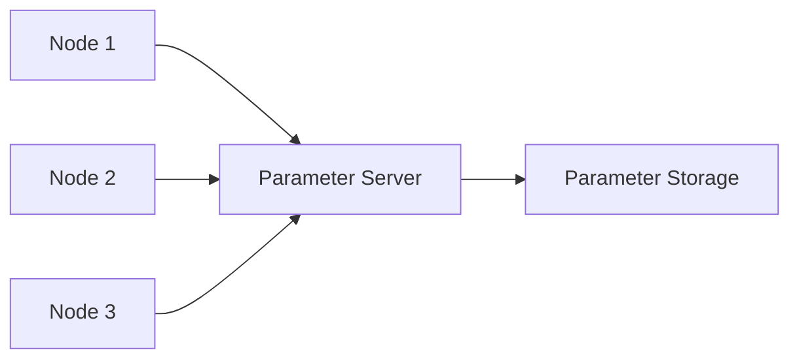

# 1.3.4: Parameters - The Robot's DNA

## Introduction

In ROS 2, **Parameters** serve as the configuration system that defines the "DNA" of a robot - the settings that determine how it behaves and what it can do. Just as genetic information controls biological traits, parameters control the behavior and configuration of robotic systems. Parameters provide a centralized way to store and manage configuration data that can be changed at runtime without requiring code recompilation.

This section explores the concept of parameters in ROS 2, their usage patterns, and how they enable flexible and adaptable robotic systems.

## Understanding Parameters

### Parameter Fundamentals

Parameters in ROS 2 are:

- **Key-Value Pairs**: Simple name-value storage system
- **Runtime Configurable**: Can be changed while the system is running
- **Persistent Across Sessions**: Stored in a central parameter server
- **Type-Safe**: Support for various data types (int, float, string, bool, array)
- **Namespace-Aware**: Parameters can be scoped to specific nodes or namespaces

### Parameter Types

ROS 2 supports several parameter types:

- **Basic Types**: Integer (`int`), Floating-point (`double`), String (`string`), Boolean (`bool`)
- **Array Types**: Arrays of basic types (`int[]`, `double[]`, `string[]`, `bool[]`)
- **Complex Types**: Nested structures (represented as JSON-like objects)

### Parameter Storage and Retrieval

Parameters are stored in a parameter server that is accessible to all nodes in the system:



## Parameter Usage Examples

### Setting Parameters in Code

#### C++ Parameter Examples

```cpp
#include <rclcpp/rclcpp.hpp>

class ParameterNode : public rclcpp::Node {
public:
    ParameterNode() : Node("parameter_node") {
        // Declare parameters with default values
        this->declare_parameter("robot_name", "unknown_robot");
        this->declare_parameter("max_speed", 1.0);
        this->declare_parameter("enable_sensors", true);
        this->declare_parameter("sensor_offsets", std::vector<double>{0.0, 0.0, 0.0});

        // Get parameter values
        std::string robot_name = this->get_parameter("robot_name").as_string();
        double max_speed = this->get_parameter("max_speed").as_double();
        bool enable_sensors = this->get_parameter("enable_sensors").as_bool();
        std::vector<double> sensor_offsets = this->get_parameter("sensor_offsets").as_double_array();

        RCLCPP_INFO(this->get_logger(), "Robot name: %s", robot_name.c_str());
        RCLCPP_INFO(this->get_logger(), "Max speed: %.2f", max_speed);
        RCLCPP_INFO(this->get_logger(), "Sensors enabled: %s", enable_sensors ? "true" : "false");
        RCLCPP_INFO(this->get_logger(), "Sensor offsets: [%f, %f, %f]",
                   sensor_offsets[0], sensor_offsets[1], sensor_offsets[2]);
    }
};
```

#### Python Parameter Examples

```python
import rclpy
from rclpy.node import Node

class ParameterNode(Node):
    def __init__(self):
        super().__init__('parameter_node')

        # Declare parameters with default values
        self.declare_parameter('robot_name', 'unknown_robot')
        self.declare_parameter('max_speed', 1.0)
        self.declare_parameter('enable_sensors', True)
        self.declare_parameter('sensor_offsets', [0.0, 0.0, 0.0])

        # Get parameter values
        robot_name = self.get_parameter('robot_name').value
        max_speed = self.get_parameter('max_speed').value
        enable_sensors = self.get_parameter('enable_sensors').value
        sensor_offsets = self.get_parameter('sensor_offsets').value

        self.get_logger().info(f'Robot name: {robot_name}')
        self.get_logger().info(f'Max speed: {max_speed:.2f}')
        self.get_logger().info(f'Sensors enabled: {enable_sensors}')
        self.get_logger().info(f'Sensor offsets: {sensor_offsets}')
```

### Parameter File Configuration

Parameters can also be loaded from configuration files (YAML format):

```yaml
# params.yaml
parameter_node:
  robot_name: "my_robot"
  max_speed: 2.5
  enable_sensors: true
  sensor_offsets: [0.1, 0.2, 0.3]
```

Loading parameters from file:

```cpp
// C++
auto node = rclcpp::Node::make_shared("parameter_node");
auto parameters_file = "params.yaml";
node->load_parameter_file(parameters_file);
```

```python
# Python
import os
from rclpy.parameter import Parameter
from rclpy.parameter import ParameterType

# Load parameters from YAML file
param_file = os.path.join(os.path.dirname(__file__), 'params.yaml')
# This would typically be handled by launch files or parameter servers
```

## Parameter Management and Best Practices

### Parameter Scoping and Namespaces

Parameters can be organized using namespaces for better organization:

```cpp
// C++
// Node parameters with namespace
this->declare_parameter("sensors.lidar.range", 10.0);
this->declare_parameter("sensors.camera.resolution.width", 1920);
this->declare_parameter("sensors.camera.resolution.height", 1080);

// Get parameters with namespace
double lidar_range = this->get_parameter("sensors.lidar.range").as_double();
```

```python
# Python
# Node parameters with namespace
self.declare_parameter('sensors.lidar.range', 10.0)
self.declare_parameter('sensors.camera.resolution.width', 1920)
self.declare_parameter('sensors.camera.resolution.height', 1080)

# Get parameters with namespace
lidar_range = self.get_parameter('sensors.lidar.range').value
```

### Parameter Change Callbacks

Nodes can register callbacks to react to parameter changes:

```cpp
// C++
void ParameterNode::parameter_callback() {
    // Register callback for parameter changes
    auto param_change_callback = [this](const std::vector<rclcpp::Parameter>& parameters) {
        for (const auto& param : parameters) {
            if (param.get_name() == "max_speed") {
                double new_speed = param.as_double();
                RCLCPP_INFO(this->get_logger(), "Max speed changed to: %.2f", new_speed);
                // Update node behavior based on new speed
            }
        }
        return rclcpp::ParameterEvent::Result::SUCCESS;
    };

    // Register the callback
    this->add_on_set_parameters_callback(param_change_callback);
}
```

### Parameter Validation

Implement parameter validation to ensure system stability:

```cpp
// C++
bool validate_parameters() {
    // Validate max speed is positive
    double max_speed = this->get_parameter("max_speed").as_double();
    if (max_speed <= 0) {
        RCLCPP_ERROR(this->get_logger(), "Invalid max_speed parameter: %f", max_speed);
        return false;
    }

    // Validate sensor offsets array length
    std::vector<double> offsets = this->get_parameter("sensor_offsets").as_double_array();
    if (offsets.size() != 3) {
        RCLCPP_ERROR(this->get_logger(), "Invalid sensor_offsets array size: %zu", offsets.size());
        return false;
    }

    return true;
}
```

## Advanced Parameter Features

### Parameter Lists and Metadata

Parameters can have associated metadata:

```cpp
// C++
// Declare parameter with metadata
auto param = rclcpp::ParameterValue(1.0);
auto descriptor = rcl_interfaces::msg::ParameterDescriptor();
descriptor.name = "max_speed";
descriptor.type = rcl_interfaces::msg::ParameterType::PARAMETER_DOUBLE;
descriptor.description = "Maximum robot movement speed in m/s";
descriptor.read_only = false;
descriptor.floating_point_range.push_back(rcl_interfaces::msg::FloatingPointRange{
    .from_value = 0.0, .to_value = 10.0, .step = 0.1
});

this->declare_parameter("max_speed", param, descriptor);
```

### Parameter Server Operations

The parameter server supports various operations:

- **Get Parameters**: Retrieve one or more parameters
- **Set Parameters**: Update parameter values
- **List Parameters**: Enumerate all parameters
- **Describe Parameters**: Get parameter metadata
- **Delete Parameters**: Remove parameters

### Parameter Persistence

Parameters can be saved and restored:

```cpp
// Save current parameters to file
rclcpp::ParameterMap current_params = this->get_parameters({});
// Save to YAML file format
```

## Parameter Use Cases in Robotics

### 1. Runtime Configuration

Parameters allow changing robot behavior without restarting:

```cpp
// Adjust robot speed based on environment
this->declare_parameter("speed_multiplier", 1.0);
double speed_mult = this->get_parameter("speed_multiplier").as_double();
```

### 2. Sensor Calibration

Calibration parameters for sensors:

```yaml
# sensor_calibration.yaml
sensor_node:
  lidar_offset_x: 0.1
  lidar_offset_y: 0.05
  camera_focal_length: 500.0
  imu_bias_x: 0.001
```

### 3. Mission Planning

Parameters for mission-specific settings:

```cpp
// Waypoint navigation parameters
this->declare_parameter("waypoint_tolerance", 0.1);
this->declare_parameter("max_waypoint_speed", 1.5);
this->declare_parameter("obstacle_avoidance_enabled", true);
```

### 4. Safety Limits

Safety parameters that can be adjusted for different environments:

```cpp
// Safety limits
this->declare_parameter("max_linear_velocity", 2.0);
this->declare_parameter("max_angular_velocity", 1.0);
this->declare_parameter("emergency_stop_distance", 0.5);
```

## Parameter Integration with Launch Files

Launch files can specify parameter values. Here's how parameters are typically specified in launch files:

```python
# In a Python launch file
from launch import LaunchDescription
from launch_ros.actions import Node

def generate_launch_description():
    return LaunchDescription([
        Node(
            package='my_package',
            executable='my_node',
            name='my_node',
            parameters=[{'robot_name': 'my_robot'}, {'max_speed': 2.0}]
        )
    ])
```

## Learning Objectives

By the end of this section, you should be able to:

- Understand the role of parameters in ROS 2 systems
- Declare and retrieve parameters in both C++ and Python
- Use parameter files to load configuration data
- Implement parameter validation and error handling
- Apply namespaces for organizing parameters
- Set up parameter change callbacks for dynamic configuration
- Use parameters for runtime configuration and system tuning

## Quiz Questions

1. What is the primary purpose of parameters in ROS 2?
   - A) To store sensor data
   - B) To provide runtime configuration for nodes
   - C) To implement communication between nodes
   - D) To manage node lifecycles

2. Which of the following parameter types is NOT supported in ROS 2?
   - A) int
   - B) float
   - C) array
   - D) class

3. How can parameters be changed after a node has started?
   - A) Through code recompilation
   - B) Using the parameter server
   - C) Through launch files only
   - D) By restarting the node

## Coding Challenge

Create a parameter-driven robot controller that:
1. Declares several parameters for robot configuration
2. Implements parameter validation
3. Sets up a callback to react to parameter changes
4. Uses parameters to modify robot behavior at runtime
5. Demonstrates parameter persistence across node restarts

## Summary

Parameters serve as the configuration "DNA" of robotic systems in ROS 2, providing a flexible way to manage settings that can be adjusted at runtime. Understanding parameter management is essential for creating adaptable and configurable robotic applications that can be tuned for different environments and use cases.