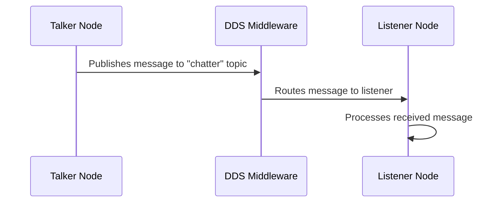

# Chapter 1.6: Talker-Listener Walkthrough

## Introduction

The talker-listener example is one of the most fundamental and widely-used examples in ROS 2 tutorials. It demonstrates the basic publish-subscribe communication pattern that forms the backbone of ROS 2 systems. This chapter provides a comprehensive walkthrough of implementing and using the talker-listener pattern, including integration with visualization tools like RViz2 and Foxglove.

This practical example illustrates core ROS 2 concepts while serving as a foundation for more complex communication patterns.

## Understanding the Talker-Listener Pattern

### What is Talker-Listener?

The talker-listener pattern consists of:
- **Talker Node**: Publishes messages to a topic
- **Listener Node**: Subscribes to the same topic and processes incoming messages

This pattern exemplifies the publish-subscribe communication model that makes ROS 2 powerful for distributed robotic systems.

### Basic Communication Flow



## Implementation from Scratch

### C++ Implementation

**src/talker.cpp:**
```cpp
#include <rclcpp/rclcpp.hpp>
#include <std_msgs/msg/string.hpp>
#include <sstream>

class Talker : public rclcpp::Node {
public:
    Talker() : Node("talker"), count_(0) {
        // Create publisher
        publisher_ = this->create_publisher<std_msgs::msg::String>("chatter", 10);

        // Create timer to publish messages
        timer_ = this->create_wall_timer(
            std::chrono::milliseconds(500),
            std::bind(&Talker::publish_message, this));
    }

private:
    void publish_message() {
        auto message = std_msgs::msg::String();
        std::ostringstream oss;
        oss << "Hello World: " << count_;
        message.data = oss.str();

        RCLCPP_INFO(this->get_logger(), "Publishing: '%s'", message.data.c_str());
        publisher_->publish(message);
        count_++;
    }

    rclcpp::Publisher<std_msgs::msg::String>::SharedPtr publisher_;
    rclcpp::TimerBase::SharedPtr timer_;
    size_t count_;
};

int main(int argc, char * argv[]) {
    rclcpp::init(argc, argv);
    rclcpp::spin(std::make_shared<Talker>());
    rclcpp::shutdown();
    return 0;
}
```

**src/listener.cpp:**
```cpp
#include <rclcpp/rclcpp.hpp>
#include <std_msgs/msg/string.hpp>

class Listener : public rclcpp::Node {
public:
    Listener() : Node("listener") {
        // Create subscriber
        subscription_ = this->create_subscription<std_msgs::msg::String>(
            "chatter", 10,
            [this](const std_msgs::msg::String::SharedPtr msg) {
                RCLCPP_INFO(this->get_logger(), "I heard: '%s'", msg->data.c_str());
            });
    }

private:
    rclcpp::Subscription<std_msgs::msg::String>::SharedPtr subscription_;
};

int main(int argc, char * argv[]) {
    rclcpp::init(argc, argv);
    rclcpp::spin(std::make_shared<Listener>());
    rclcpp::shutdown();
    return 0;
}
```

### Python Implementation

**src/talker.py:**
```python
#!/usr/bin/env python3

import rclpy
from rclpy.node import Node
from std_msgs.msg import String
import time

class Talker(Node):
    def __init__(self):
        super().__init__('talker')
        self.publisher_ = self.create_publisher(String, 'chatter', 10)
        timer_period = 0.5  # seconds
        self.timer = self.create_timer(timer_period, self.timer_callback)
        self.count = 0

    def timer_callback(self):
        msg = String()
        msg.data = f'Hello World: {self.count}'
        self.get_logger().info(f'Publishing: "{msg.data}"')
        self.publisher_.publish(msg)
        self.count += 1

def main(args=None):
    rclpy.init(args=args)
    talker = Talker()
    rclpy.spin(talker)
    talker.destroy_node()
    rclpy.shutdown()

if __name__ == '__main__':
    main()
```

**src/listener.py:**
```python
#!/usr/bin/env python3

import rclpy
from rclpy.node import Node
from std_msgs.msg import String

class Listener(Node):
    def __init__(self):
        super().__init__('listener')
        self.subscription = self.create_subscription(
            String,
            'chatter',
            self.listener_callback,
            10)
        self.subscription  # prevent unused variable warning

    def listener_callback(self, msg):
        self.get_logger().info(f'I heard: "{msg.data}"')

def main(args=None):
    rclpy.init(args=args)
    listener = Listener()
    rclpy.spin(listener)
    listener.destroy_node()
    rclpy.shutdown()

if __name__ == '__main__':
    main()
```

## CMakeLists.txt Configuration

For C++ implementation:

```cmake
cmake_minimum_required(VERSION 3.8)
project(talker_listener)

if(CMAKE_COMPILER_IS_GNUCXX OR CMAKE_CXX_COMPILER_ID MATCHES "Clang")
  add_compile_options(-Wall -Wextra -Wpedantic)
endif()

# find dependencies
find_package(ament_cmake REQUIRED)
find_package(rclcpp REQUIRED)
find_package(std_msgs REQUIRED)

# Create talker executable
add_executable(talker src/talker.cpp)
ament_target_dependencies(talker rclcpp std_msgs)

# Create listener executable
add_executable(listener src/listener.cpp)
ament_target_dependencies(listener rclcpp std_msgs)

# Install executables
install(TARGETS
  talker
  listener
  DESTINATION lib/${PROJECT_NAME})

# Install launch files
install(DIRECTORY
  launch
  DESTINATION share/${PROJECT_NAME})

ament_package()
```

## Launch File Configuration

**launch/talker_listener.launch.py:**
```python
from launch import LaunchDescription
from launch_ros.actions import Node

def generate_launch_description():
    return LaunchDescription([
        Node(
            package='talker_listener',
            executable='talker',
            name='talker',
            output='screen'
        ),
        Node(
            package='talker_listener',
            executable='listener',
            name='listener',
            output='screen'
        )
    ])
```

## Integration with RViz2

### Setting up RViz2 for Visualization

1. Launch RViz2:
```bash
rviz2
```

2. Configure RViz2 to visualize string messages:
   - Add "String" display type
   - Set topic to `/chatter`
   - Configure display properties

### Enhanced Visualization Example

Create a more sophisticated visualization setup:

**launch/rviz_talker_listener.launch.py:**
```python
from launch import LaunchDescription
from launch_ros.actions import Node
from launch.actions import ExecuteProcess

def generate_launch_description():
    return LaunchDescription([
        # Launch talker and listener
        Node(
            package='talker_listener',
            executable='talker',
            name='talker',
            output='screen'
        ),
        Node(
            package='talker_listener',
            executable='listener',
            name='listener',
            output='screen'
        ),
        # Launch RViz2 with preset configuration
        ExecuteProcess(
            cmd=['rviz2', '-d', '/path/to/talker_listener.rviz'],
            output='screen'
        )
    ])
```

## Integration with Foxglove Studio

Foxglove Studio provides advanced visualization capabilities:

### Installation

```bash
# Install Foxglove Studio
sudo apt install foxglove-studio
```

### Using Foxglove with ROS 2

1. Launch your talker-listener nodes
2. Start Foxglove Studio
3. Connect to your ROS 2 bridge
4. Subscribe to the `/chatter` topic for real-time visualization

### Foxglove Bridge Configuration

```bash
# Launch Foxglove bridge
ros2 run foxglove_bridge foxglove_bridge
```

## Advanced Talker-Listener Features

### 1. Parameterized Talker

Create a talker that accepts parameters:

```cpp
// C++ Parameterized Talker
class ParameterizedTalker : public rclcpp::Node {
public:
    ParameterizedTalker() : Node("parameterized_talker") {
        // Declare parameters
        this->declare_parameter("message_prefix", "Hello");
        this->declare_parameter("message_interval_ms", 500);

        // Get parameters
        std::string prefix = this->get_parameter("message_prefix").as_string();
        int interval = this->get_parameter("message_interval_ms").as_int();

        // Create publisher
        publisher_ = this->create_publisher<std_msgs::msg::String>("chatter", 10);

        // Create timer
        timer_ = this->create_wall_timer(
            std::chrono::milliseconds(interval),
            [this, prefix]() { this->publish_message(prefix); });
    }

private:
    void publish_message(const std::string& prefix) {
        auto message = std_msgs::msg::String();
        message.data = prefix + ": " + std::to_string(count_);
        RCLCPP_INFO(this->get_logger(), "Publishing: '%s'", message.data.c_str());
        publisher_->publish(message);
        count_++;
    }

    rclcpp::Publisher<std_msgs::msg::String>::SharedPtr publisher_;
    rclcpp::TimerBase::SharedPtr timer_;
    size_t count_ = 0;
};
```

### 2. Topic Filtering and Multiplexing

Create a system that filters and routes messages:

```cpp
// Topic multiplexer
class MessageRouter : public rclcpp::Node {
public:
    MessageRouter() : Node("message_router") {
        // Subscribe to main chatter topic
        subscription_ = this->create_subscription<std_msgs::msg::String>(
            "chatter", 10,
            [this](const std_msgs::msg::String::SharedPtr msg) {
                this->route_message(msg);
            });

        // Create filtered publishers
        filtered_publisher_ = this->create_publisher<std_msgs::msg::String>("filtered_chatter", 10);
        debug_publisher_ = this->create_publisher<std_msgs::msg::String>("debug_chatter", 10);
    }

private:
    void route_message(const std_msgs::msg::String::SharedPtr msg) {
        // Filter and route messages
        if (msg->data.find("important") != std::string::npos) {
            filtered_publisher_->publish(*msg);
        }

        // Debug message
        auto debug_msg = std_msgs::msg::String();
        debug_msg.data = "DEBUG: " + msg->data;
        debug_publisher_->publish(debug_msg);
    }

    rclcpp::Subscription<std_msgs::msg::String>::SharedPtr subscription_;
    rclcpp::Publisher<std_msgs::msg::String>::SharedPtr filtered_publisher_;
    rclcpp::Publisher<std_msgs::msg::String>::SharedPtr debug_publisher_;
};
```

## Troubleshooting Common Issues

### 1. Nodes Not Connecting

Problem: Nodes don't seem to communicate
Solution: Check:
- Topic names match exactly
- Nodes are running in the same ROS 2 domain
- No firewall blocking communication

### 2. No Messages Published

Problem: Publisher doesn't seem to publish
Solution: Check:
- Timer is properly created
- Publisher is correctly initialized
- Node is spinning properly

### 3. RViz2 Not Showing Data

Problem: Messages don't appear in RViz2
Solution: Check:
- Correct topic name in RViz2 configuration
- Message type matches display configuration
- Nodes are actually publishing data

## Testing Your Implementation

### Unit Testing

Create a simple test for the talker:

**test/test_talker.cpp:**
```cpp
#include <gtest/gtest.h>
#include <rclcpp/rclcpp.hpp>
#include <std_msgs/msg/string.hpp>

TEST(TalkerTest, test_publish_message) {
    // Test that talker can be instantiated
    rclcpp::init(0, nullptr);

    auto node = rclcpp::Node::make_shared("test_node");
    // Add actual test logic here

    rclcpp::shutdown();
}

int main(int argc, char ** argv) {
    ::testing::InitGoogleTest(&argc, argv);
    return RUN_ALL_TESTS();
}
```

### Integration Testing

Test the complete talker-listener interaction:
```bash
# Terminal 1: Run talker
ros2 run talker_listener talker

# Terminal 2: Run listener
ros2 run talker_listener listener

# Terminal 3: Monitor topics
ros2 topic list
ros2 topic echo /chatter
```

## Learning Objectives

By the end of this chapter, you should be able to:

- Implement talker and listener nodes in both C++ and Python
- Create launch files to run multiple nodes together
- Use RViz2 for visualizing message flow
- Integrate with Foxglove Studio for advanced visualization
- Apply parameterization to make nodes configurable
- Troubleshoot common communication issues
- Test and validate talker-listener implementations

## Quiz Questions

1. What is the primary communication pattern demonstrated in the talker-listener example?
   - A) Request-response
   - B) Publish-subscribe
   - C) Shared memory
   - D) Named pipes

2. Which ROS 2 command is used to run a node?
   - A) `ros2 run`
   - B) `ros2 launch`
   - C) `ros2 start`
   - D) `ros2 execute`

3. What tool can be used to visualize ROS 2 topics in real-time?
   - A) Gazebo
   - B) RViz2
   - C) Qt Creator
   - D) Visual Studio Code

## Coding Challenge

Extend the talker-listener example to:
1. Add a third node that acts as a message router
2. Implement parameterized talker that accepts message prefix and interval
3. Create a launch file that runs all three nodes
4. Configure RViz2 to visualize messages from all topics
5. Add proper error handling and logging

## Summary

The talker-listener example serves as the foundation for understanding ROS 2's communication system. By mastering this simple yet powerful pattern, you gain insight into how complex robotic systems can be built from interconnected nodes. The integration with visualization tools like RViz2 and Foxglove Studio provides valuable debugging and monitoring capabilities that are essential for real-world robotic development.