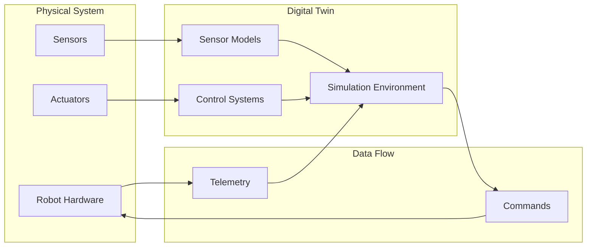

# 2.1 Understanding Digital Twins in Robotics

## Learning Objectives

By the end of this chapter, students will be able to:
- Define digital twin technology and its applications in robotics
- Compare digital twins with traditional simulation approaches
- Identify key benefits of using digital twins in robotics development
- Recognize real-world examples of digital twin implementations in industry
- Evaluate when to apply digital twin methodologies in robotics projects

## Content

This section introduces digital twin technology and its relevance to modern robotics. We'll explore how digital twins provide real-time synchronized representations of physical systems, enabling simulation, testing, and optimization before deploying to physical hardware. Students will learn about the core components of digital twins, including the physical system, the digital representation, and the data synchronization mechanisms.

### Key Concepts

- **Digital twin definition and architecture**: Digital twins are virtual replicas of physical systems that enable real-time monitoring, simulation, and optimization.
- **Benefits for robotics development**: Cost reduction, risk mitigation, and optimization through virtual testing.
- **Comparison with traditional simulation methods**: Unlike static simulations, digital twins provide bidirectional data flow and real-time synchronization.
- **Industry applications in robotics**: Manufacturing, autonomous systems, and humanoid robotics use digital twins extensively.

## :::tip Pro Tip

Digital twins are particularly valuable in robotics because they allow for rapid iteration and testing of complex scenarios without risking physical hardware.

## :::caution Common Pitfall

Assuming digital twins are just fancy simulations. Digital twins provide bidirectional data flow and real-time synchronization that traditional simulations lack.

## :::info Note

The concept of digital twins has gained significant traction in robotics since 2020, with major companies like NVIDIA, Microsoft, and Siemens investing heavily in digital twin technologies for robotics applications.

## Mermaid Diagram

## Quiz Questions

1. What is the primary benefit of using digital twins in robotics development?
   a) Reduced computational requirements
   b) Real-time synchronization between physical and digital systems
   c) Elimination of physical hardware requirements
   d) Simplified programming models

2. Which of the following is NOT a component of a digital twin architecture?
   a) Physical system representation
   b) Data synchronization layer
   c) Real-time visualization
   d) Manual control interface

3. How do digital twins differ from traditional simulation tools?
   a) They are less accurate
   b) They provide bidirectional data flow and real-time synchronization
   c) They are more expensive to implement
   d) They don't support sensor modeling

4. What is a key advantage of using digital twins for humanoid robot development?
   a) They eliminate the need for physical testing
   b) They allow for complex scenario testing without risk
   c) They reduce the need for software development
   d) They simplify hardware design

5. **Coding Challenge:** Create a conceptual diagram showing the data flow between a physical robot's sensors and a digital twin's simulation environment, including the synchronization mechanism.