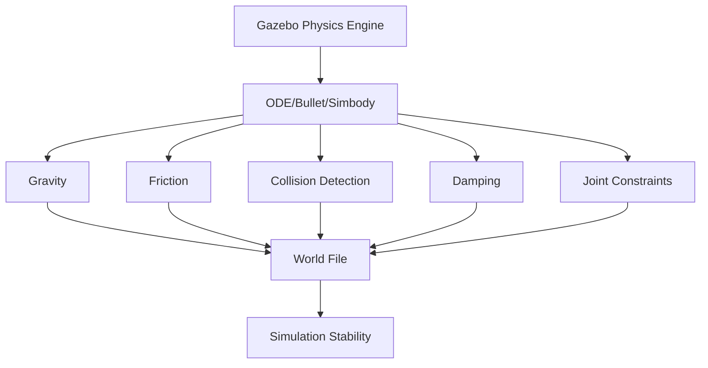

# 2.2 Gazebo Physics Simulation Fundamentals

## Learning Objectives

By the end of this chapter, students will be able to:
- Configure physics parameters in Gazebo for realistic simulation
- Implement gravity, friction, and collision properties
- Create and customize simulation worlds with proper physics
- Understand Gazebo's physics engine and its parameters
- Apply physics simulation to robot motion and interaction

## Content

This section covers the fundamentals of physics simulation in Gazebo, the popular open-source robotics simulator. Students will learn how to configure physics parameters, create realistic environments, and understand how Gazebo's physics engine handles collisions, gravity, and other physical properties. The focus will be on building simulation environments that accurately represent real-world physics.

### Key Concepts

- **Gazebo's physics engine (ODE, Bullet, Simbody)**: Different physics engines provide various capabilities and performance characteristics.
- **Physics parameters**: Gravity, friction, damping, and other parameters that affect simulation realism.
- **World file creation and configuration**: Understanding the structure of SDF files for defining simulation environments.
- **Collision detection and response**: How Gazebo handles interactions between objects.
- **Joint types and their physical properties**: Different joint configurations and their physical behaviors.

## Code Example

```xml
<!-- physics.sdf -->
<sdf version="1.6">
  <world name="default">
    <physics name="ignored" type="ode">
      <gravity>0 0 -9.8</gravity>
      <ode>
        <solver>
          <type>quick</type>
          <iters>10</iters>
          <precon_iters>0</precon_iters>
          <max_error>0.001</max_error>
        </solver>
        <constraints>
          <cfm>0.0</cfm>
          <erp>0.2</erp>
          <contact_max_correcting_vel>100.0</contact_max_correcting_vel>
          <contact_surface_layer>0.001</contact_surface_layer>
        </constraints>
      </ode>
    </physics>
  </world>
</sdf>
```

## :::tip Pro Tip

Start with default physics parameters and gradually tune them to match your specific requirements. Over-tuning can lead to unstable simulations.

## :::caution Common Pitfall

Ignoring the relationship between physics parameters and simulation stability. Too aggressive constraints can cause simulation instabilities.

## :::info Note

Gazebo's physics engine selection can significantly impact simulation performance and accuracy. ODE is typically the default and most stable, while Bullet offers better performance for complex scenarios.

## Mermaid Diagram



## Quiz Questions

1. What does ODE stand for in Gazebo's physics engine?
   a) Open Dynamics Engine
   b) Optimized Dynamics Engine
   c) Open Data Engine
   d) Ordered Dynamics Engine

2. Which parameter controls the strength of gravitational force in Gazebo?
   a) friction
   b) gravity
   c) damping
   d) solver

3. What is the effect of increasing the contact surface layer in Gazebo physics?
   a) Makes collisions more elastic
   b) Increases simulation speed
   c) Reduces collision accuracy
   d) Improves collision response accuracy

4. What is the recommended approach for configuring physics parameters in Gazebo?
   a) Start with default values and adjust as needed
   b) Use extreme values for better realism
   c) Set all parameters to maximum values
   d) Ignore physics parameters for faster simulation

5. **Coding Challenge:** Create a Gazebo world file with a custom physics configuration that simulates a robot moving on a rough terrain surface with specific friction coefficients.