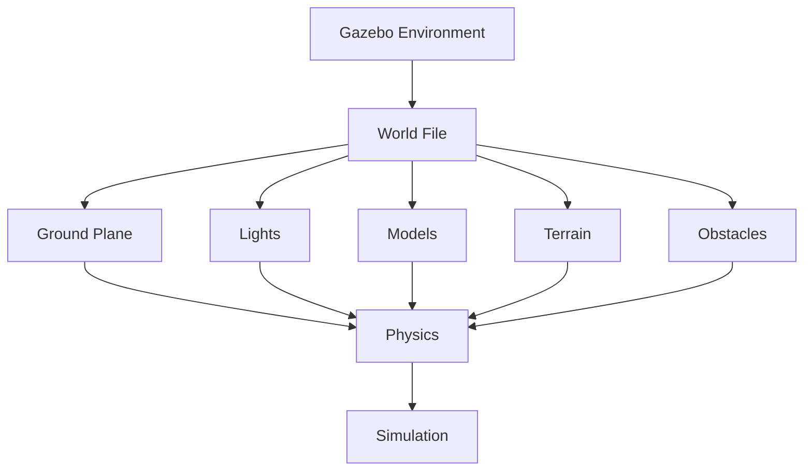

# 2.3 Creating Environments in Gazebo

## Learning Objectives

By the end of this chapter, students will be able to:
- Design and build custom simulation environments
- Implement realistic terrain and obstacles
- Configure lighting and visual properties in Gazebo worlds
- Import and use custom models in simulation environments
- Create reusable environment templates

## Content

This section teaches students how to create complex simulation environments in Gazebo. We'll explore world file creation, terrain modeling, obstacle placement, lighting configuration, and model importing. Students will learn to build environments that accurately represent real-world scenarios for robotics testing.

### Key Concepts

- **Gazebo world file structure and syntax**: Understanding the SDF format for defining environments.
- **Terrain creation and customization**: Building realistic terrain surfaces for robot navigation.
- **Lighting and visual effects**: Configuring visual properties for realistic rendering.
- **Model import and reuse**: Using existing models and creating custom ones.
- **Environment configuration best practices**: Optimizing environments for performance and realism.

## Code Example

```xml
<!-- environment.sdf -->
<sdf version="1.6">
  <world name="robotics_lab">
    <include>
      <uri>model://ground_plane</uri>
    </include>

    <light name="sun" type="directional">
      <cast_shadows>true</cast_shadows>
      <pose>0 0 10 0 0 0</pose>
      <diffuse>1 1 1 1</diffuse>
      <specular>0.5 0.5 0.5 1</specular>
      <attenuation>
        <range>1000</range>
        <constant>0.9</constant>
        <linear>0.01</linear>
        <quadratic>0.001</quadratic>
      </attenuation>
    </light>

    <model name="table">
      <pose>0 0 0.5 0 0 0</pose>
      <link name="table_link">
        <collision name="table_collision">
          <geometry>
            <box>
              <size>2 1 1</size>
            </box>
          </geometry>
        </collision>
        <visual name="table_visual">
          <geometry>
            <box>
              <size>2 1 1</size>
            </box>
          </geometry>
          <material>
            <ambient>0.5 0.5 0.5 1</ambient>
            <diffuse>0.8 0.8 0.8 1</diffuse>
          </material>
        </visual>
      </link>
    </model>
  </world>
</sdf>
```

## :::tip Pro Tip

Use simple shapes initially and gradually add complexity to your environments. This makes debugging easier and improves simulation performance.

## :::caution Common Pitfall

Creating overly complex environments that slow down simulation performance or cause instability.

## :::info Note

Gazebo provides a variety of built-in models that can be used to quickly create complex environments. These models can be found in the Gazebo Model Database and included in your world files.

## Mermaid Diagram



## Quiz Questions

1. What is the primary file format used for defining Gazebo worlds?
   a) URDF
   b) SDF
   c) YAML
   d) JSON

2. Which element defines lighting in a Gazebo world file?
   a) `<terrain>`
   b) `<light>`
   c) `<model>`
   d) `<physics>`

3. What is the purpose of the ground_plane model in Gazebo environments?
   a) Provides a sky background
   b) Creates a flat surface for robots to stand on
   c) Adds lighting effects
   d) Defines physics parameters

4. What is a recommended practice when creating complex Gazebo environments?
   a) Use as many complex models as possible
   b) Start with simple elements and add complexity gradually
   c) Use only default models
   d) Ignore performance considerations

5. **Coding Challenge:** Create a Gazebo world file that includes a robot workspace with tables, chairs, and obstacles arranged in a realistic office environment.