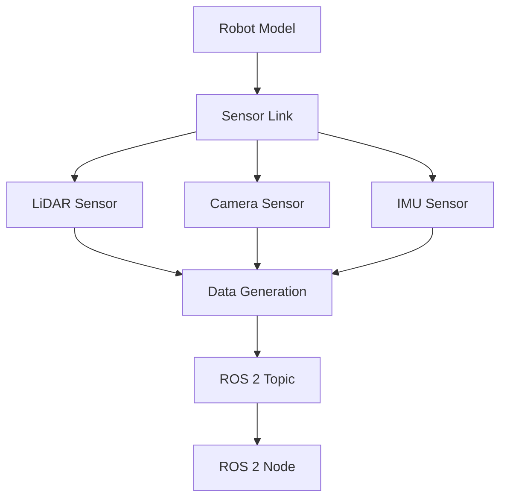

# 2.4 Sensor Simulation in Gazebo

## Learning Objectives

By the end of this chapter, students will be able to:
- Implement and configure various sensor types in Gazebo
- Simulate LiDAR, depth cameras, and IMU sensors
- Understand sensor data generation and transmission in simulations
- Configure sensor noise models for realistic simulation
- Integrate sensor data with ROS 2 nodes

## Content

This section focuses on sensor simulation in Gazebo, covering the implementation of common robotic sensors. Students will learn to configure and use LiDAR, depth cameras, and IMU sensors within Gazebo simulations, understanding how sensor data is generated and transmitted to ROS 2 nodes.

### Key Concepts

- **Sensor types available in Gazebo (LiDAR, camera, IMU, etc.)**: Different sensors with specific capabilities and use cases.
- **Sensor configuration parameters**: Settings that define sensor behavior and characteristics.
- **Noise models and realism settings**: Adding realistic noise to sensor data for more accurate simulation.
- **Data publishing to ROS 2 topics**: How sensor data flows from Gazebo to ROS 2.
- **Integration with robot models**: Attaching sensors to robot models for comprehensive simulation.

## Code Example

```xml
<!-- robot_with_sensors.urdf -->
<robot name="sensor_robot">
  <link name="base_link">
    <!-- Robot base -->
  </link>

  <sensor name="lidar_sensor" type="ray">
    <pose>0 0 0.1 0 0 0</pose>
    <ray>
      <scan>
        <horizontal>
          <samples>360</samples>
          <resolution>1.0</resolution>
          <min_angle>-1.57</min_angle>
          <max_angle>1.57</max_angle>
        </horizontal>
      </scan>
      <range>
        <min>0.1</min>
        <max>10.0</max>
        <resolution>0.01</resolution>
      </range>
    </ray>
    <plugin name="lidar_controller" filename="libgazebo_ros_laser.so">
      <topicName>/scan</topicName>
      <frameName>base_link</frameName>
    </plugin>
  </sensor>

  <sensor name="camera_sensor" type="camera">
    <pose>0 0 0.2 0 0 0</pose>
    <camera>
      <horizontal_fov>1.047</horizontal_fov>
      <image>
        <width>640</width>
        <height>480</height>
      </image>
      <clip>
        <near>0.1</near>
        <far>100</far>
      </clip>
    </camera>
    <plugin name="camera_controller" filename="libgazebo_ros_camera.so">
      <topicName>/camera/image_raw</topicName>
      <frameName>base_link</frameName>
    </plugin>
  </sensor>
</robot>
```

## :::tip Pro Tip

Start with basic sensor configurations and gradually add complexity. Understanding the fundamental parameters is crucial before adding noise models or advanced features.

## :::caution Common Pitfall

Overcomplicating sensor configurations early in the learning process. Focus on getting basic functionality working before adding advanced features.

## :::info Note

Sensor simulation in Gazebo provides realistic data that can be used to develop and test perception algorithms before deployment on physical robots. The simulated data closely matches real sensor characteristics.

## Mermaid Diagram



## Quiz Questions

1. What sensor type is used for generating point cloud data in Gazebo?
   a) Camera
   b) IMU
   c) Ray (LiDAR)
   d) Force Torque

2. Which plugin is responsible for publishing LiDAR data to ROS 2 topics in Gazebo?
   a) libgazebo_ros_camera.so
   b) libgazebo_ros_laser.so
   c) libgazebo_ros_imu.so
   d) libgazebo_ros_depth.so

3. What is the purpose of the `<noise>` element in sensor configuration?
   a) Controls sensor power consumption
   b) Adds realistic noise to sensor readings
   c) Sets sensor sensitivity
   d) Configures sensor range

4. What is the typical data format published by Gazebo's camera sensor?
   a) PointCloud2
   b) Image
   c) LaserScan
   d) Odometry

5. **Coding Challenge:** Configure a robot model with a LiDAR sensor that generates realistic point clouds and an IMU sensor that provides orientation data, both publishing to appropriate ROS 2 topics.