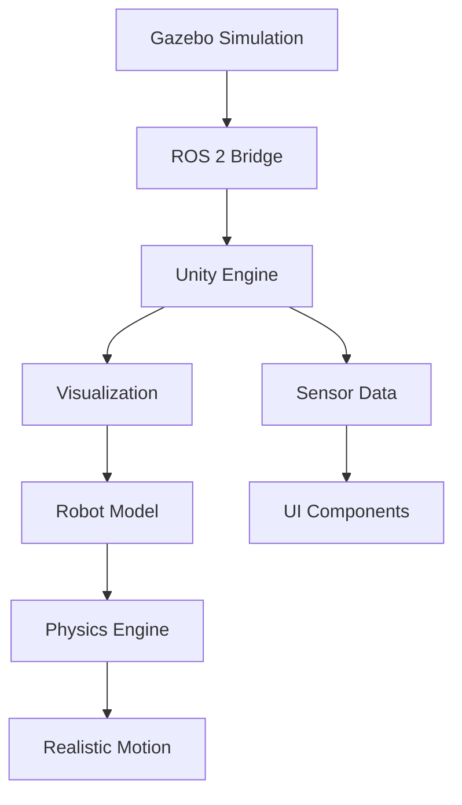

# 2.5 Unity Integration for High-Fidelity Visualization

## Learning Objectives

By the end of this chapter, students will be able to:
- Set up Unity projects for robotics visualization
- Import and configure robot models from URDF/SDF files
- Create interactive scenes with realistic physics
- Implement sensor data visualization in Unity
- Configure Unity-ROS integration for real-time data exchange

## Content

This section introduces students to using Unity for high-fidelity visualization of robotics simulations. We'll cover Unity project setup, robot model import, scene creation, and integration with ROS 2 for real-time data exchange. Students will learn to create immersive environments that accurately visualize robot behavior and sensor data.

### Key Concepts

- **Unity project setup for robotics visualization**: Configuring Unity for robotics applications and visualization.
- **Model import and conversion from URDF/SDF formats**: Converting robot models for use in Unity.
- **Scene creation and environment design**: Building immersive environments for robot visualization.
- **Unity-ROS integration using ROS# or similar tools**: Connecting Unity with ROS for data exchange.
- **Real-time sensor data visualization**: Displaying sensor data in Unity for enhanced understanding.

## Code Example

```csharp
// Unity script for robot control
using UnityEngine;
using RosSharp.RosBridgeClient;

public class RobotController : MonoBehaviour
{
    public string rosBridgeUrl = "ws://localhost:9090";
    public string robotTopic = "/robot/cmd_vel";

    private RosSocket rosSocket;
    private Twist twist;

    void Start()
    {
        // Connect to ROS Bridge
        rosSocket = new RosSocket(rosBridgeUrl);

        // Initialize twist message
        twist = new Twist();
    }

    void Update()
    {
        // Handle input for robot movement
        float horizontal = Input.GetAxis("Horizontal");
        float vertical = Input.GetAxis("Vertical");

        // Set linear and angular velocities
        twist.linear.x = vertical * 0.5f;
        twist.angular.z = horizontal * 0.5f;

        // Publish velocity command
        rosSocket.Publish(robotTopic, twist);
    }
}
```

## :::tip Pro Tip

Use Unity's built-in physics engine alongside Gazebo's physics for more realistic interactions when both environments are involved in the same simulation.

## :::caution Common Pitfall

Trying to replicate exact Gazebo physics in Unity without understanding the differences in physics engines and simulation timing.

## :::info Note

Unity-ROS integration enables real-time visualization of robot behavior and sensor data, providing an intuitive interface for monitoring and controlling robotic systems in simulation.

## Mermaid Diagram



## Quiz Questions

1. What is the primary purpose of Unity in robotics simulation?
   a) Physics computation
   b) High-fidelity visualization and interaction
   c) Sensor data processing
   d) Hardware control

2. Which Unity package is commonly used for ROS integration?
   a) ROS.NET
   b) ROS#
   c) ROS.Unity
   d) UnityROS

3. What is the typical workflow for integrating Gazebo with Unity?
   a) Export from Unity to Gazebo
   b) Use ROS bridge for data exchange
   c) Direct physics engine synchronization
   d) Manual data transfer

4. What type of data can be visualized in Unity from Gazebo simulations?
   a) Only robot positions
   b) Sensor data, robot movements, and environmental changes
   c) Only camera images
   d) Only joint angles

5. **Coding Challenge:** Create a Unity scene that imports a robot model from a URDF file and displays live sensor data from a Gazebo simulation using ROS# integration.