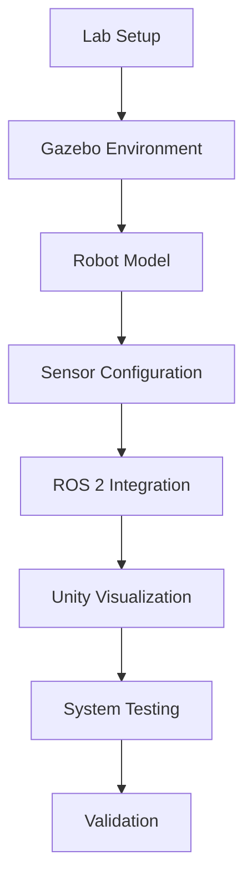

# 2.6 Hands-On Lab: Building a Complete Digital Twin

## Learning Objectives

By the end of this lab, students will be able to:
- Combine all learned concepts into a complete digital twin implementation
- Create a simulation environment with physics and sensors
- Configure robot models with realistic sensor suites
- Implement visualization in Unity
- Test and validate the complete digital twin system

## Content

This hands-on lab brings together all the concepts learned in the module. Students will build a complete digital twin system that includes a physics simulation environment in Gazebo, robot models with sensors, and visualization in Unity. The lab will demonstrate how all components work together in a real-world robotics development workflow.

### Lab Steps

1. **Create a Gazebo world with realistic physics**
   - Set up a basic environment with ground plane and lighting
   - Configure physics parameters for realistic simulation

2. **Implement a robot model with multiple sensors**
   - Create a simple robot model with LiDAR, camera, and IMU sensors
   - Configure sensor parameters for realistic data generation

3. **Configure sensor data publishing to ROS 2 topics**
   - Set up plugins to publish sensor data to appropriate ROS 2 topics
   - Verify data is being published correctly

4. **Set up a Unity project for visualization**
   - Import ROS# package for Unity-ROS communication
   - Create a basic scene to visualize the robot

5. **Integrate the simulation with Unity visualization**
   - Connect Unity to the ROS bridge
   - Visualize robot position and sensor data in Unity

6. **Test the complete digital twin system**
   - Run the complete system and verify all components work together
   - Validate that sensor data is correctly visualized

## :::tip Pro Tip

Break the lab into smaller steps and test each component individually before integrating everything together.

## :::caution Common Pitfall

Attempting to implement everything at once without testing individual components first.

## :::info Note

This lab demonstrates the complete workflow for developing a digital twin system, which is commonly used in industry for testing and validating robotic systems before physical deployment.

## Mermaid Diagram

## Quiz Questions

1. What is the primary goal of the hands-on lab?
   a) Create a simple robot model
   b) Build a complete digital twin system integrating all components
   c) Only focus on sensor simulation
   d) Only visualize in Unity

2. Which step should be completed first in the lab?
   a) Unity visualization setup
   b) Sensor configuration
   c) Gazebo environment creation
   d) ROS 2 integration

3. What is a key benefit of completing this hands-on lab?
   a) Learning only one aspect of robotics
   b) Understanding how all components work together
   c) Focusing only on visualization
   d) Avoiding sensor integration

4. What should be tested first in the integrated system?
   a) Full system integration
   b) Individual component functionality
   c) Sensor data visualization
   d) Unity rendering

5. **Coding Challenge:** Build a complete digital twin system that includes a Gazebo simulation environment, a robot with multiple sensors, and a Unity visualization, ensuring all components communicate properly.