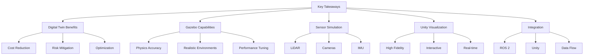

# 2.7 Key Takeaways and Future Directions

## Learning Objectives

By the end of this chapter, students will be able to:
- Summarize key concepts learned in the digital twin module
- Identify advanced applications of digital twins in robotics
- Evaluate the role of digital twins in future robotics development
- Understand how to extend digital twin systems for specific applications

## Content

This final section summarizes the key concepts covered in Module 2 and looks ahead to advanced applications of digital twins in robotics. Students will reflect on what they've learned and consider how digital twin technologies can be extended for more sophisticated robotics applications.

### Key Takeaways

- **Digital twins provide real-time synchronization between physical and digital systems**: This enables comprehensive testing and validation before physical deployment.
- **Gazebo offers powerful physics simulation capabilities for robotics testing**: With proper configuration, Gazebo can provide realistic simulation environments.
- **Sensor simulation in Gazebo enables comprehensive testing of robotic systems**: Simulated sensors allow for extensive testing without physical hardware.
- **Unity provides high-fidelity visualization for enhanced understanding and presentation**: Visual feedback helps in understanding robot behavior and sensor data.
- **Integration between simulation and visualization tools creates powerful development environments**: The complete digital twin ecosystem enables efficient development workflows.

### Advanced Applications

- **Multi-robot coordination in digital twins**: Simulating multiple robots working together in complex scenarios.
- **Human-robot interaction simulation**: Testing human-robot interfaces in safe virtual environments.
- **Predictive maintenance using digital twins**: Using digital twins to predict and prevent equipment failures.
- **Training and education applications**: Using digital twins for educational purposes and operator training.
- **Industrial automation and manufacturing**: Applying digital twins to manufacturing robotics systems.

### Future Directions

- **Enhanced realism in physics and sensor simulation**: More accurate modeling of real-world physics and sensor behavior.
- **Improved integration with cloud platforms**: Cloud-based digital twin systems for distributed development and testing.
- **Real-time collaborative digital twin environments**: Multiple users working together in shared digital twin spaces.
- **Machine learning integration for predictive analytics**: Using ML to enhance digital twin capabilities and predictions.
- **Edge computing for distributed digital twins**: Deploying digital twin systems across distributed computing resources.

## :::tip Pro Tip

Digital twin systems continue to evolve rapidly, with new capabilities and applications emerging regularly. Stay updated with the latest developments in simulation and visualization technologies.

## :::caution Common Pitfall

Assuming digital twins can completely replace physical testing. While digital twins are powerful tools, they should complement, not completely replace, physical testing.

## :::info Note

The digital twin concept has become increasingly important in robotics as systems become more complex and expensive to test in physical environments.

## Mermaid Diagram

## Quiz Questions

1. What is the primary benefit of using digital twins in robotics development?
   a) They are cheaper than physical robots
   b) They provide real-time synchronization between physical and digital systems
   c) They eliminate the need for physical testing
   d) They require no programming knowledge

2. Which of the following is NOT a key takeaway from this module?
   a) Gazebo provides realistic physics simulation
   b) Unity offers high-fidelity visualization
   c) Sensor simulation is only useful for testing
   d) Integration between tools enhances development workflow

3. What is a future direction for digital twin technology in robotics?
   a) Decreased realism in simulations
   b) Integration with cloud platforms
   c) Reduced sensor capabilities
   d) Elimination of physical testing

4. How can digital twins contribute to predictive maintenance in robotics?
   a) By reducing robot complexity
   b) By providing real-time monitoring and anomaly detection
   c) By eliminating sensor data
   d) By removing the need for repairs

5. **Coding Challenge:** Create a summary document that outlines how digital twin concepts can be applied to a specific robotics application of your choice.