# Module 1: The Robotic Nervous System (ROS 2)
## Functional Specification

**Project**: Physical AI & Humanoid Robotics – A Hands-On Capstone
**Module**: Module 1 - The Robotic Nervous System (ROS 2)
**Target Audience**: Graduate students and practitioners in robotics
**Prerequisites**: Basic Python programming, fundamental understanding of robotics concepts
**Estimated Completion Time**: 20-25 hours

## Module Overview

This module introduces students to ROS 2 (Robot Operating System 2), the de facto standard for robotic software development. Students will learn the core concepts, architecture, and practical implementation of ROS 2 systems, with a focus on humanoid robotics applications. The module progresses from fundamental concepts to advanced integration with AI systems and deployment on real hardware.

## Learning Objectives

By the end of this module, students will be able to:
- Explain why ROS 2 is the standard for modern robotics applications
- Compare and contrast ROS 1 and ROS 2 architectures and capabilities
- Implement ROS 2 nodes, topics, services, and actions for robotic applications
- Create and validate URDF models for humanoid robots
- Build and deploy ROS 2 packages with proper architecture
- Visualize and debug ROS 2 systems using Foxglove and RViz2
- Integrate AI agents with ROS 2 for intelligent robotic behaviors
- Apply best practices for production-ready ROS 2 systems
- Deploy ROS 2 nodes on real humanoid robots
- Complete a capstone challenge integrating all module concepts

## Sub-chapter Structure

### 1.1 Why ROS 2 is the De Facto Robotic Nervous System in 2025–2026

**Learning Objectives:**
- Understand the historical evolution of robotic software frameworks and why ROS 2 emerged as the standard
- Identify the key architectural advantages that make ROS 2 suitable for production robotics
- Recognize the industry adoption patterns and major players using ROS 2 in 2025-2026
- Analyze the technical requirements that ROS 2 addresses in modern robotics applications
- Evaluate the ecosystem maturity and community support for ROS 2 development

**Content:**
This section provides a comprehensive overview of ROS 2's position in the robotics ecosystem. We'll explore the historical context that led to ROS 2's development, examining the limitations of ROS 1 and the industry needs that drove the evolution. Students will learn about the distributed architecture, real-time capabilities, security features, and production-readiness that distinguish ROS 2 from other robotic frameworks.

The content will cover the major industry adoptions (Autoware for autonomous vehicles, Open Robotics initiatives, major robotics companies), the DDS (Data Distribution Service) middleware foundation, and the multi-language support that enables broader adoption across different robotics domains.

**Code Example:**
```python
# simple_ros2_architecture.py
import rclpy
from rclpy.node import Node
from std_msgs.msg import String

class RobotNervousSystem(Node):
    """
    Demonstrates the fundamental ROS 2 architecture pattern
    that serves as the 'nervous system' for robots
    """

    def __init__(self):
        super().__init__('robot_nervous_system')
        self.publisher = self.create_publisher(String, 'robot_status', 10)
        self.subscription = self.create_subscription(
            String,
            'sensor_data',
            self.sensor_callback,
            10)

        timer_period = 0.5  # seconds
        self.timer = self.create_timer(timer_period, self.timer_callback)
        self.i = 0

        self.get_logger().info('ROS 2 Robot Nervous System initialized')

    def sensor_callback(self, msg):
        """Process incoming sensor data (like sensory input)"""
        self.get_logger().info(f'Received sensor data: {msg.data}')
        # Process sensor data and potentially trigger responses

    def timer_callback(self):
        """Publish status updates (like motor commands)"""
        msg = String()
        msg.data = f'Robot status update: {self.i}'
        self.publisher.publish(msg)
        self.get_logger().info(f'Publishing: {msg.data}')
        self.i += 1

def main(args=None):
    rclpy.init(args=args)
    robot_system = RobotNervousSystem()

    try:
        rclpy.spin(robot_system)
    except KeyboardInterrupt:
        pass
    finally:
        robot_system.destroy_node()
        rclpy.shutdown()

if __name__ == '__main__':
    main()
```

**Dependencies:** `rclpy`, `std_msgs`

**Pro Tip:** ROS 2's DDS middleware provides built-in Quality of Service (QoS) policies that allow you to fine-tune communication behavior for different robotic applications - from reliable delivery for critical commands to best-effort for sensor data.

**Common Pitfall:** Newcomers often try to use ROS 2 for applications that don't require distributed communication. Remember that ROS 2 adds overhead compared to direct function calls - only use it when you need the distributed, asynchronous communication capabilities.

**Mermaid Diagram:**
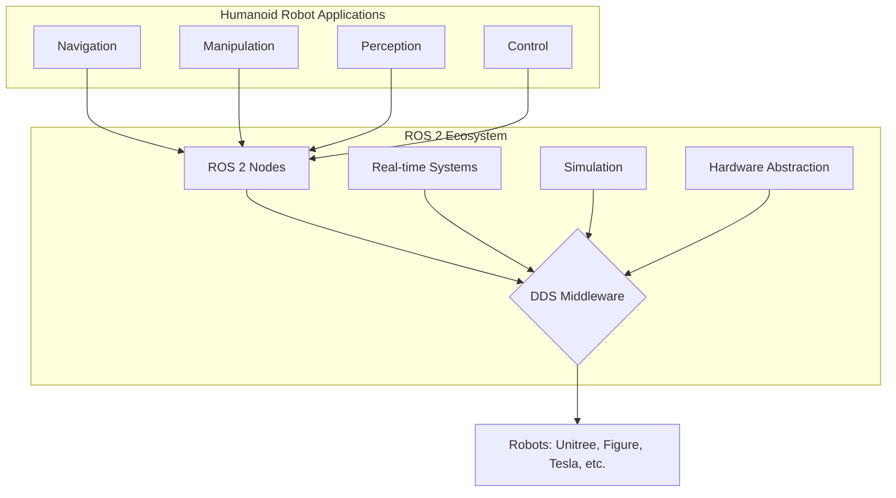

**Quiz Questions:**

1. What does DDS stand for in the context of ROS 2 architecture?
   a) Distributed Data Service
   b) Data Distribution Service
   c) Distributed Data System
   d) Dynamic Data Sharing

2. Which of the following is NOT a key advantage of ROS 2 over ROS 1?
   a) Real-time support
   b) Multi-language support beyond C++ and Python
   c) Built-in security features
   d) Centralized master architecture

3. What year was ROS 2 first released?
   a) 2010
   b) 2013
   c) 2015
   d) 2018

4. Which of the following industries has NOT significantly adopted ROS 2 by 2025?
   a) Autonomous vehicles
   b) Manufacturing
   c) Consumer electronics
   d) Agriculture robotics

5. **Coding Challenge:** Create a simple ROS 2 node that publishes the current system time every second and subscribes to a topic that receives commands to change the publishing rate. Implement proper node lifecycle management.

**Frontmatter Metadata:**
```yaml
title: "1.1 Why ROS 2 is the De Facto Robotic Nervous System in 2025–2026"
description: "Understanding the evolution and dominance of ROS 2 in modern robotics"
keywords: "ros2, robotics, middleware, distributed systems, DDS"
sidebar_position: 1
```

### 1.2 From ROS 1 to ROS 2 – The Real-Time, Secure, Production-Grade Evolution

**Learning Objectives:**
- Identify the fundamental architectural differences between ROS 1 and ROS 2
- Understand the migration challenges and strategies for transitioning from ROS 1 to ROS 2
- Recognize the real-time and security capabilities that ROS 2 introduces
- Compare performance characteristics and use cases suitable for each version
- Evaluate when to use ROS 1 vs ROS 2 for different robotic applications

**Content:**
This section provides a comprehensive comparison between ROS 1 and ROS 2, highlighting the evolution that makes ROS 2 production-ready. We'll examine the transition from a centralized master architecture to a distributed DDS-based system, the introduction of Quality of Service (QoS) policies, real-time support, and security features.

The content will cover:
- Master vs. DDS architecture differences
- Threading model improvements
- Language support expansion
- Real-time capabilities and determinism
- Security framework (SROS2)
- Build system evolution (catkin vs. colcon)
- Communication protocol changes

**Code Example:**
```python
# ros1_vs_ros2_comparison.py
# ROS 1 style (for reference)
"""
import rospy
from std_msgs.msg import String

def ros1_talker():
    rospy.init_node('talker', anonymous=True)
    pub = rospy.Publisher('chatter', String, queue_size=10)
    rate = rospy.Rate(10)  # 10hz
    while not rospy.is_shutdown():
        hello_str = "hello world %s" % rospy.get_time()
        rospy.loginfo(hello_str)
        pub.publish(hello_str)
        rate.sleep()

if __name__ == '__main__':
    try:
        ros1_talker()
    except rospy.ROSInterruptException:
        pass
"""

# ROS 2 equivalent
import rclpy
from rclpy.node import Node
from std_msgs.msg import String

class Ros2Talker(Node):
    """
    ROS 2 equivalent of ROS 1 talker with improved architecture
    """

    def __init__(self):
        super().__init__('ros2_talker')
        self.publisher = self.create_publisher(String, 'chatter', 10)

        # Configure timer with specific period
        timer_period = 0.1  # seconds (10Hz like ROS 1 example)
        self.timer = self.create_timer(timer_period, self.timer_callback)
        self.i = 0

    def timer_callback(self):
        msg = String()
        msg.data = f'Hello World: {self.i}'
        self.publisher.publish(msg)
        self.get_logger().info(f'Publishing: {msg.data}')
        self.i += 1

def main(args=None):
    rclpy.init(args=args)
    ros2_talker = Ros2Talker()

    try:
        rclpy.spin(ros2_talker)
    except KeyboardInterrupt:
        pass
    finally:
        ros2_talker.destroy_node()
        rclpy.shutdown()

if __name__ == '__main__':
    main()
```

**Dependencies:** `rclpy`, `std_msgs`

**Pro Tip:** When migrating from ROS 1 to ROS 2, focus first on the conceptual changes (distributed architecture, QoS policies) rather than just the API differences. The architectural shift is more significant than the code syntax changes.

**Common Pitfall:** Developers often try to directly translate ROS 1 patterns to ROS 2 without considering the distributed nature of ROS 2. Remember that ROS 2 doesn't have a single master, so coordination patterns need to be rethought.

**Mermaid Diagram:**
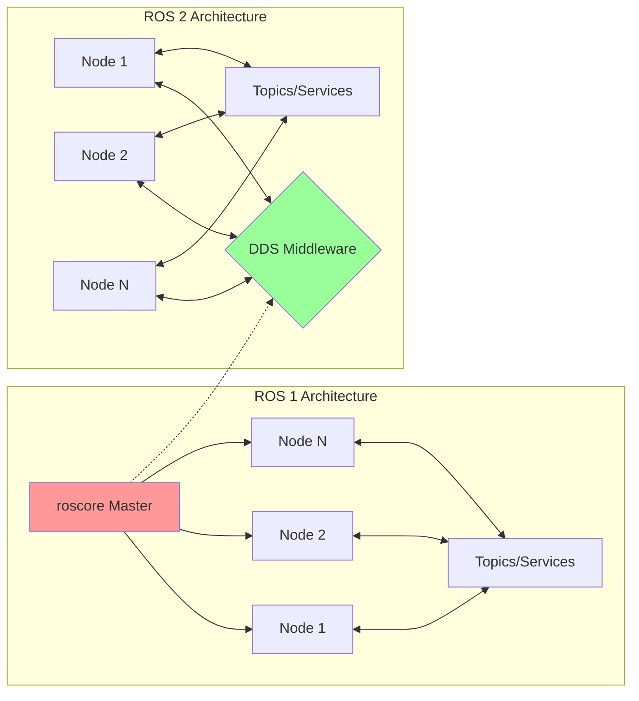

**Quiz Questions:**

1. What is the main architectural difference between ROS 1 and ROS 2?
   a) Number of supported programming languages
   b) Centralized master vs. distributed DDS
   c) Build system used
   d) Message types available

2. Which of the following is a new feature in ROS 2 that wasn't available in ROS 1?
   a) Service calls
   b) Parameter server
   c) Quality of Service (QoS) policies
   d) Launch files

3. What does SROS2 provide that ROS 1 lacked?
   a) Real-time performance
   b) Security features
   c) Better visualization tools
   d) More message types

4. Which build system is used in ROS 2?
   a) catkin
   b) catkin_tools
   c) colcon
   d) cmake

5. **Coding Challenge:** Create a ROS 2 node that demonstrates QoS policy differences by publishing the same message with both reliable and best-effort delivery settings, and compare the behavior.

**Frontmatter Metadata:**
```yaml
title: "1.2 From ROS 1 to ROS 2 – The Real-Time, Secure, Production-Grade Evolution"
description: "Comparing ROS 1 and ROS 2 architectures and migration strategies"
keywords: "ros1, ros2, migration, architecture, qos, security"
sidebar_position: 2
```

### 1.3 Core Concepts Deep Dive

#### 1.3.1 Nodes – The Living Cells of a Robot

**Learning Objectives:**
- Understand the role and lifecycle of ROS 2 nodes in robotic systems
- Implement nodes with proper initialization, execution, and cleanup
- Apply best practices for node design and organization
- Configure node parameters and handle node-specific settings
- Debug and monitor node behavior in complex robotic systems

**Content:**
This section explores ROS 2 nodes as the fundamental building blocks of robotic applications. We'll examine the node lifecycle (unconfigured, inactive, active, finalized), how nodes interact with the ROS graph, and best practices for node design. Students will learn about node composition, lifecycle management, and how to create robust nodes that handle errors gracefully.

**Code Example:**
```python
# lifecycle_node_example.py
import rclpy
from rclpy.lifecycle import LifecycleNode, LifecycleState, TransitionCallbackReturn
from rclpy.lifecycle import Node as LifecycleNodeClass
from rclpy.executors import SingleThreadedExecutor
from std_msgs.msg import String

class RoboticCell(LifecycleNode):
    """
    A lifecycle node representing a living cell in the robot's nervous system
    Demonstrates proper node lifecycle management
    """

    def __init__(self):
        super().__init__('robotic_cell')
        self.get_logger().info('RoboticCell node created, but not yet configured')

        # Publishers and subscribers will be created during activation
        self.publisher = None
        self.subscription = None
        self.timer = None
        self.i = 0

    def on_configure(self, state: LifecycleState) -> TransitionCallbackReturn:
        """Called when node transitions to CONFIGURING state"""
        self.get_logger().info(f'Configuring node: {state.idle}')

        # Create publisher during configuration
        self.publisher = self.create_publisher(String, 'cell_activity', 10)
        self.get_logger().info('Publisher created')

        return TransitionCallbackReturn.SUCCESS

    def on_activate(self, state: LifecycleState) -> TransitionCallbackReturn:
        """Called when node transitions to ACTIVATING state"""
        self.get_logger().info(f'Activating node: {state.idle}')

        # Activate publisher
        self.publisher.on_activate()

        # Create timer for periodic activity
        self.timer = self.create_timer(0.5, self.timer_callback)
        self.i = 0

        return TransitionCallbackReturn.SUCCESS

    def on_deactivate(self, state: LifecycleState) -> TransitionCallbackReturn:
        """Called when node transitions to DEACTIVATING state"""
        self.get_logger().info(f'Deactivating node: {state.idle}')

        # Deactivate publisher
        self.publisher.on_deactivate()

        # Destroy timer
        self.timer.cancel()
        self.timer = None

        return TransitionCallbackReturn.SUCCESS

    def on_cleanup(self, state: LifecycleState) -> TransitionCallbackReturn:
        """Called when node transitions to CLEANINGUP state"""
        self.get_logger().info(f'Cleaning up node: {state.idle}')

        # Destroy publisher
        self.destroy_publisher(self.publisher)
        self.publisher = None

        return TransitionCallbackReturn.SUCCESS

    def timer_callback(self):
        """Publish periodic activity messages"""
        if self.publisher is not None and self.publisher.handle is not None:
            msg = String()
            msg.data = f'Cell activity pulse: {self.i}'
            self.publisher.publish(msg)
            self.get_logger().info(f'Published: {msg.data}')
            self.i += 1

def main(args=None):
    rclpy.init(args=args)

    # Create lifecycle node
    cell_node = RoboticCell()

    # Manually trigger lifecycle transitions
    cell_node.trigger_configure()
    cell_node.trigger_activate()

    try:
        # Use SingleThreadedExecutor to run the node
        executor = SingleThreadedExecutor()
        executor.add_node(cell_node)

        try:
            executor.spin()
        except KeyboardInterrupt:
            pass
        finally:
            # Clean up properly
            cell_node.trigger_deactivate()
            cell_node.trigger_cleanup()

    finally:
        cell_node.destroy_node()
        rclpy.shutdown()

if __name__ == '__main__':
    main()
```

**Dependencies:** `rclpy`, `std_msgs`, `lifecycle_msgs`

**Pro Tip:** Use lifecycle nodes when you need to coordinate initialization, activation, and shutdown of complex robotic components. This is especially important for safety-critical systems where you need to ensure proper startup and shutdown sequences.

**Common Pitfall:** Creating publishers/subscribers in the constructor rather than during the appropriate lifecycle callbacks. This can cause issues when the node is deactivated or reconfigured.

**Mermaid Diagram:**
```mermaid
stateDiagram-v2
    [*] --> Unconfigured
    Unconfigured --> Inactive : configure()
    Inactive --> Active : activate()
    Active --> Inactive : deactivate()
    Inactive --> Unconfigured : cleanup()
    Unconfigured --> Finalized : shutdown()
    Active --> Finalized : shutdown()

    note right of Active
        Publishers/Subscribers
        active and functional
    end
```

**Quiz Questions:**

1. What is the correct order of lifecycle states for a ROS 2 lifecycle node?
   a) Active → Inactive → Unconfigured
   b) Unconfigured → Inactive → Active
   c) Inactive → Active → Unconfigured
   d) Active → Unconfigured → Inactive

2. When should publishers be created in a lifecycle node?
   a) In the constructor
   b) During the on_configure() callback
   c) During the on_activate() callback
   d) During the on_cleanup() callback

3. What happens to a timer when a node is deactivated?
   a) It continues running
   b) It is automatically canceled
   c) It must be manually canceled in on_deactivate()
   d) It becomes inactive but can be reactivated

4. Which method is called when a lifecycle node is first configured?
   a) on_initialize()
   b) on_setup()
   c) on_configure()
   d) on_start()

5. **Coding Challenge:** Create a lifecycle node that manages a simulated sensor, implementing proper state transitions and handling sensor data appropriately in each state.

---

#### 1.3.2 Topics – The Publish-Subscribe Bloodstream

**Learning Objectives:**
- Implement publisher and subscriber nodes with proper QoS configuration
- Understand Quality of Service (QoS) policies and their impact on communication
- Design topic-based communication patterns for robotic applications
- Configure history, reliability, durability, and liveliness policies
- Debug and monitor topic communication in real-time robotic systems

**Content:**
This section covers ROS 2 topics as the primary communication mechanism between nodes. We'll explore Quality of Service (QoS) policies that provide fine-grained control over communication behavior, including reliability (best-effort vs. reliable), durability (volatile vs. transient-local), history (keep-all vs. keep-last), and liveliness settings. Students will learn to choose appropriate QoS settings for different types of data (e.g., sensor data vs. critical commands).

**Code Example:**
```python
# qos_topic_example.py
import rclpy
from rclpy.node import Node
from rclpy.qos import QoSProfile, QoSReliabilityPolicy, QoSHistoryPolicy, QoSDurabilityPolicy
from std_msgs.msg import String

class BloodstreamPublisher(Node):
    """
    Publisher demonstrating different QoS profiles for various data types
    """

    def __init__(self):
        super().__init__('bloodstream_publisher')

        # High-priority topic: Critical commands (reliable, keep-all)
        critical_qos = QoSProfile(
            depth=10,
            reliability=QoSReliabilityPolicy.RELIABLE,
            history=QoSHistoryPolicy.KEEP_ALL,
            durability=QoSDurabilityPolicy.VOLATILE
        )
        self.critical_pub = self.create_publisher(String, 'critical_commands', critical_qos)

        # Medium-priority topic: Sensor data (best-effort, keep-last few)
        sensor_qos = QoSProfile(
            depth=5,
            reliability=QoSReliabilityPolicy.BEST_EFFORT,
            history=QoSHistoryPolicy.KEEP_LAST,
            durability=QoSDurabilityPolicy.VOLATILE
        )
        self.sensor_pub = self.create_publisher(String, 'sensor_data', sensor_qos)

        # Setup timer for publishing
        self.critical_timer = self.create_timer(1.0, self.publish_critical)
        self.sensor_timer = self.create_timer(0.1, self.publish_sensor)

        self.critical_count = 0
        self.sensor_count = 0

    def publish_critical(self):
        msg = String()
        msg.data = f'Critical command #{self.critical_count}: {self.get_clock().now()}'
        self.critical_pub.publish(msg)
        self.get_logger().info(f'Published critical: {msg.data}')
        self.critical_count += 1

    def publish_sensor(self):
        msg = String()
        msg.data = f'Sensor reading #{self.sensor_count}: {self.get_clock().now()}'
        self.sensor_pub.publish(msg)
        # Only log occasionally for sensor data to avoid spam
        if self.sensor_count % 10 == 0:
            self.get_logger().info(f'Published sensor: {msg.data}')
        self.sensor_count += 1


class BloodstreamSubscriber(Node):
    """
    Subscriber demonstrating handling of different QoS profiles
    """

    def __init__(self):
        super().__init__('bloodstream_subscriber')

        # Match QoS profiles with publisher
        critical_qos = QoSProfile(
            depth=10,
            reliability=QoSReliabilityPolicy.RELIABLE,
            history=QoSHistoryPolicy.KEEP_ALL,
            durability=QoSDurabilityPolicy.VOLATILE
        )
        sensor_qos = QoSProfile(
            depth=5,
            reliability=QoSReliabilityPolicy.BEST_EFFORT,
            history=QoSHistoryPolicy.KEEP_LAST,
            durability=QoSDurabilityPolicy.VOLATILE
        )

        self.critical_sub = self.create_subscription(
            String, 'critical_commands', self.critical_callback, critical_qos)
        self.sensor_sub = self.create_subscription(
            String, 'sensor_data', self.sensor_callback, sensor_qos)

    def critical_callback(self, msg):
        self.get_logger().info(f'Received critical: {msg.data}')

    def sensor_callback(self, msg):
        # Log every 10th sensor message to avoid spam
        if hash(msg.data) % 10 == 0:
            self.get_logger().info(f'Received sensor: {msg.data}')


def main(args=None):
    rclpy.init(args=args)

    publisher = BloodstreamPublisher()
    subscriber = BloodstreamSubscriber()

    executor = rclpy.executors.MultiThreadedExecutor()
    executor.add_node(publisher)
    executor.add_node(subscriber)

    try:
        executor.spin()
    except KeyboardInterrupt:
        pass
    finally:
        publisher.destroy_node()
        subscriber.destroy_node()
        rclpy.shutdown()

if __name__ == '__main__':
    main()
```

**Dependencies:** `rclpy`, `std_msgs`

**Pro Tip:** Always consider the QoS compatibility between publishers and subscribers. If a publisher uses RELIABLE reliability and a subscriber uses BEST_EFFORT, they will still communicate but with reduced reliability guarantees.

**Common Pitfall:** Using KEEP_ALL history for high-frequency topics without considering memory usage. For sensor data published at 100Hz, KEEP_ALL can quickly consume significant memory.

**Mermaid Diagram:**
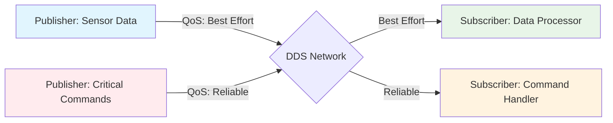

**Quiz Questions:**

1. What does QoS stand for in ROS 2?
   a) Quality of Service
   b) Quick Operating System
   c) Query and Subscribe
   d) Quality of Software

2. Which QoS reliability policy should be used for critical commands?
   a) BEST_EFFORT
   b) RELIABLE
   c) TRANSIENT_LOCAL
   d) VOLATILE

3. What is the default history policy in ROS 2?
   a) KEEP_ALL
   b) KEEP_LAST
   c) KEEP_NEWEST
   d) KEEP_OLDEST

4. When would you use durability policy TRANSIENT_LOCAL?
   a) For temporary data
   b) For static data that should persist
   c) For sensor data
   d) For command data only

5. **Coding Challenge:** Create a publisher-subscriber pair where the publisher uses KEEP_ALL history with depth=100, then create a late-joining subscriber that receives all previously published messages.

---

#### 1.3.3 Services & Actions – Request-Response and Long-Running Tasks

**Learning Objectives:**
- Implement service servers and clients for request-response communication
- Create action servers and clients for long-running tasks with feedback
- Understand when to use services vs actions vs topics
- Design proper error handling and status reporting for services and actions
- Monitor and debug service and action communication in robotic systems

**Content:**
This section covers ROS 2 services for synchronous request-response communication and actions for long-running tasks that require feedback and goal management. Students will learn to design appropriate interfaces for different types of interactions, implement proper error handling, and choose between services, actions, and topics based on the communication requirements.

**Code Example:**
```python
# services_actions_example.py
import rclpy
from rclpy.node import Node
from rclpy.action import ActionServer, ActionClient
from rclpy.callback_groups import ReentrantCallbackGroup
from rclpy.executors import MultiThreadedExecutor
from example_interfaces.srv import AddTwoInts
from example_interfaces.action import Fibonacci

class NeuralInterface(Node):
    """
    Node implementing both services and actions for different types of communication
    """

    def __init__(self):
        super().__init__('neural_interface')

        # Service server for quick calculations
        self.service = self.create_service(
            AddTwoInts,
            'add_two_ints',
            self.add_two_ints_callback
        )

        # Action server for complex planning tasks
        self.action_server = ActionServer(
            self,
            Fibonacci,
            'fibonacci_sequence',
            self.execute_fibonacci,
            callback_group=ReentrantCallbackGroup()
        )

        self.get_logger().info('Neural interface initialized')

    def add_two_ints_callback(self, request, response):
        """Service callback for quick calculations"""
        response.sum = request.a + request.b
        self.get_logger().info(f'Returning {request.a} + {request.b} = {response.sum}')
        return response

    async def execute_fibonacci(self, goal_handle):
        """Action callback for long-running task with feedback"""
        self.get_logger().info(f'Executing fibonacci goal: {goal_handle.request.order}')

        # Initialize Fibonacci sequence
        feedback_msg = Fibonacci.Feedback()
        feedback_msg.sequence = [0, 1]

        # Generate Fibonacci sequence up to the requested order
        for i in range(1, goal_handle.request.order):
            if goal_handle.is_cancel_requested:
                goal_handle.canceled()
                self.get_logger().info('Fibonacci goal canceled')
                return Fibonacci.Result()

            if goal_handle.is_preempt_requested:
                goal_handle.decline_cancel_goal()

            # Calculate next Fibonacci number
            next_fib = feedback_msg.sequence[-1] + feedback_msg.sequence[-2]
            feedback_msg.sequence.append(next_fib)

            # Publish feedback
            goal_handle.publish_feedback(feedback_msg)
            self.get_logger().info(f'Fibonacci feedback: {feedback_msg.sequence[-1]}')

            # Simulate processing time
            from time import sleep
            sleep(0.5)

        # Complete successfully
        goal_handle.succeed()
        result = Fibonacci.Result()
        result.sequence = feedback_msg.sequence
        self.get_logger().info(f'Fibonacci completed: {result.sequence}')

        return result


class NeuralClient(Node):
    """
    Client node that uses both services and actions
    """

    def __init__(self):
        super().__init__('neural_client')

        # Service client
        self.cli = self.create_client(AddTwoInts, 'add_two_ints')

        # Action client
        self.action_client = ActionClient(self, Fibonacci, 'fibonacci_sequence')

        # Wait for service and action servers
        while not self.cli.wait_for_service(timeout_sec=1.0):
            self.get_logger().info('Service not available, waiting again...')

        self.get_logger().info('Service client ready')

        # Send initial requests
        self.send_add_request(2, 3)
        self.send_fibonacci_goal(5)

    def send_add_request(self, a, b):
        """Send a service request"""
        request = AddTwoInts.Request()
        request.a = a
        request.b = b

        future = self.cli.call_async(request)
        future.add_done_callback(self.service_response_callback)

    def service_response_callback(self, future):
        """Handle service response"""
        try:
            response = future.result()
            self.get_logger().info(f'Service result: {response.sum}')
        except Exception as e:
            self.get_logger().error(f'Service call failed: {e}')

    def send_fibonacci_goal(self, order):
        """Send an action goal"""
        goal_msg = Fibonacci.Goal()
        goal_msg.order = order

        self.action_client.wait_for_server()
        self.get_logger().info(f'Sending Fibonacci goal: {order}')

        send_goal_future = self.action_client.send_goal_async(
            goal_msg,
            feedback_callback=self.feedback_callback
        )

        send_goal_future.add_done_callback(self.goal_response_callback)

    def goal_response_callback(self, future):
        """Handle action goal response"""
        goal_handle = future.result()
        if not goal_handle.accepted:
            self.get_logger().info('Goal rejected')
            return

        self.get_logger().info('Goal accepted')
        get_result_future = goal_handle.get_result_async()
        get_result_future.add_done_callback(self.get_result_callback)

    def feedback_callback(self, feedback_msg):
        """Handle action feedback"""
        self.get_logger().info(f'Received feedback: {feedback_msg.feedback.sequence[-1]}')

    def get_result_callback(self, future):
        """Handle action result"""
        result = future.result().result
        self.get_logger().info(f'Action result: {result.sequence}')


def main(args=None):
    rclpy.init(args=args)

    neural_interface = NeuralInterface()
    neural_client = NeuralClient()

    executor = MultiThreadedExecutor()
    executor.add_node(neural_interface)
    executor.add_node(neural_client)

    try:
        executor.spin()
    except KeyboardInterrupt:
        pass
    finally:
        neural_interface.destroy_node()
        neural_client.destroy_node()
        rclpy.shutdown()

if __name__ == '__main__':
    main()
```

**Dependencies:** `rclpy`, `example_interfaces`

**Pro Tip:** Use services for simple, synchronous operations that complete quickly. Use actions for complex operations that may take time and need to provide feedback or be cancelable.

**Common Pitfall:** Using services for long-running operations, which can block the service thread and cause timeouts. For operations that might take more than a few seconds, use actions instead.

**Mermaid Diagram:**
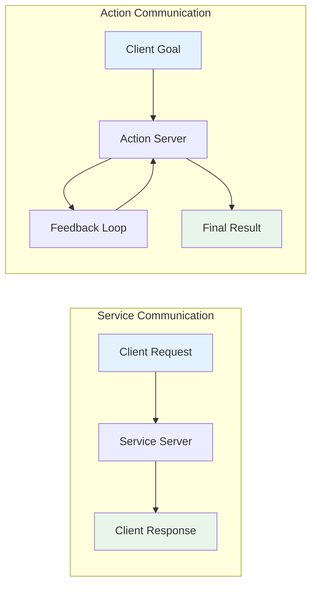

**Quiz Questions:**

1. What is the main difference between services and actions in ROS 2?
   a) Services are asynchronous, actions are synchronous
   b) Actions support feedback and cancellation, services do not
   c) Services use DDS, actions use TCP
   d) There is no difference

2. Which interface should you use for a long-running navigation task?
   a) Topic
   b) Service
   c) Action
   d) Parameter

3. What does the feedback callback in an action do?
   a) Sends the final result
   b) Provides periodic updates during execution
   c) Handles errors
   d) Cancels the goal

4. How do you cancel an action goal from the client side?
   a) Send a special cancel message
   b) Call cancel_goal_async() on the goal handle
   c) Stop the client node
   d) Send another goal

5. **Coding Challenge:** Create a service that calculates factorial of a number and an action that calculates Fibonacci sequence, comparing their use cases and implementations.

---

#### 1.3.4 Parameters – The Robot's DNA

**Learning Objectives:**
- Declare and use parameters in ROS 2 nodes with proper types and descriptions
- Implement parameter callbacks for dynamic reconfiguration
- Organize parameters hierarchically for complex robotic systems
- Use parameter files for configuration management
- Validate parameter values and handle parameter-related errors

**Content:**
This section covers ROS 2 parameters as the configuration mechanism for robotic systems. Students will learn to declare parameters with appropriate types, descriptions, and constraints. We'll explore parameter callbacks for dynamic reconfiguration, parameter files for persistent configuration, and best practices for organizing parameters in complex robotic applications.

**Code Example:**
```python
# parameters_dna_example.py
import rclpy
from rclpy.node import Node
from rcl_interfaces.msg import ParameterType, ParameterDescriptor
from rcl_interfaces.srv import SetParameters, GetParameters, ListParameters
import json

class RoboticDNA(Node):
    """
    Node demonstrating parameter management as the robot's DNA
    """

    def __init__(self):
        super().__init__('robotic_dna')

        # Declare parameters with descriptions and constraints
        self.declare_parameter(
            'robot.name',
            'DefaultRobot',
            ParameterDescriptor(
                type=ParameterType.PARAMETER_STRING,
                description='Name of the robot',
                read_only=False
            )
        )

        self.declare_parameter(
            'robot.max_velocity',
            1.0,
            ParameterDescriptor(
                type=ParameterType.PARAMETER_DOUBLE,
                description='Maximum linear velocity (m/s)',
                read_only=False
            )
        )

        self.declare_parameter(
            'robot.wheel_radius',
            0.1,
            ParameterDescriptor(
                type=ParameterType.PARAMETER_DOUBLE,
                description='Wheel radius in meters',
                read_only=False,
                additional_constraints='Must be positive'
            )
        )

        self.declare_parameter(
            'robot.joint_limits',
            [0.0, 1.57, 3.14],  # [min, max, home] for a joint
            ParameterDescriptor(
                type=ParameterType.PARAMETER_DOUBLE_ARRAY,
                description='Joint limits [min, max, home_position]',
                read_only=False
            )
        )

        # Set up parameter callback for dynamic changes
        self.add_on_set_parameters_callback(self.parameter_callback)

        # Initialize values
        self.robot_name = self.get_parameter('robot.name').value
        self.max_velocity = self.get_parameter('robot.max_velocity').value
        self.wheel_radius = self.get_parameter('robot.wheel_radius').value
        self.joint_limits = self.get_parameter('robot.joint_limits').value

        self.get_logger().info(f'Robot DNA initialized: {self.robot_name}')
        self.get_logger().info(f'Max velocity: {self.max_velocity} m/s')
        self.get_logger().info(f'Wheel radius: {self.wheel_radius} m')

        # Timer to demonstrate parameter usage
        self.timer = self.create_timer(2.0, self.timer_callback)

    def parameter_callback(self, params):
        """Callback for parameter changes"""
        for param in params:
            if param.name == 'robot.name':
                if param.type == ParameterType.PARAMETER_STRING:
                    self.robot_name = param.value
                    self.get_logger().info(f'Robot name changed to: {self.robot_name}')
                else:
                    return rclpy.node.SetParametersResult(successful=False, reason='Invalid type for robot.name')

            elif param.name == 'robot.max_velocity':
                if param.type == ParameterType.PARAMETER_DOUBLE:
                    if param.value > 0:  # Validate positive value
                        self.max_velocity = param.value
                        self.get_logger().info(f'Max velocity updated to: {self.max_velocity}')
                    else:
                        return rclpy.node.SetParametersResult(successful=False, reason='Max velocity must be positive')
                else:
                    return rclpy.node.SetParametersResult(successful=False, reason='Invalid type for robot.max_velocity')

            elif param.name == 'robot.wheel_radius':
                if param.type == ParameterType.PARAMETER_DOUBLE:
                    if param.value > 0:  # Validate positive value
                        self.wheel_radius = param.value
                        self.get_logger().info(f'Wheel radius updated to: {self.wheel_radius}')
                    else:
                        return rclpy.node.SetParametersResult(successful=False, reason='Wheel radius must be positive')
                else:
                    return rclpy.node.SetParametersResult(successful=False, reason='Invalid type for robot.wheel_radius')

        return rclpy.node.SetParametersResult(successful=True)

    def timer_callback(self):
        """Demonstrate using parameters in robot operations"""
        # Calculate some robot-specific value using parameters
        circumference = 2 * 3.14159 * self.wheel_radius
        self.get_logger().info(f'{self.robot_name} - Wheel circumference: {circumference:.3f}m, Max speed: {self.max_velocity}m/s')


class DNAExplorer(Node):
    """
    Node to explore and modify parameters of other nodes
    """

    def __init__(self):
        super().__init__('dna_explorer')

        # Timer to periodically check and modify parameters
        self.timer = self.create_timer(5.0, self.explore_parameters)

        self.get_logger().info('DNA Explorer initialized')

    def explore_parameters(self):
        """Explore and potentially modify parameters"""
        try:
            # Get current robot name
            robot_name = self.get_parameter('robotic_dna.robot.name').value
            self.get_logger().info(f'Current robot name: {robot_name}')

            # Modify a parameter
            from rclpy.parameter import Parameter
            new_params = [Parameter('robotic_dna.robot.max_velocity', value=1.5)]
            self.set_parameters(new_params)

        except Exception as e:
            self.get_logger().info(f'Could not access parameters: {e}. This is expected if parameter services are not available.')


def main(args=None):
    rclpy.init(args=args)

    robotic_dna = RoboticDNA()
    dna_explorer = DNAExplorer()

    executor = rclpy.executors.MultiThreadedExecutor()
    executor.add_node(robotic_dna)
    executor.add_node(dna_explorer)

    try:
        executor.spin()
    except KeyboardInterrupt:
        pass
    finally:
        robotic_dna.destroy_node()
        dna_explorer.destroy_node()
        rclpy.shutdown()

if __name__ == '__main__':
    main()
```

**Dependencies:** `rclpy`, `rcl_interfaces`

**Pro Tip:** Use hierarchical parameter names (e.g., `robot.wheel.diameter`) to organize parameters logically. This makes it easier to manage complex robotic systems with many parameters.

**Common Pitfall:** Not validating parameter values in the callback function. Always check that parameter values meet your requirements (positive values, within ranges, etc.) before accepting them.

**Mermaid Diagram:**
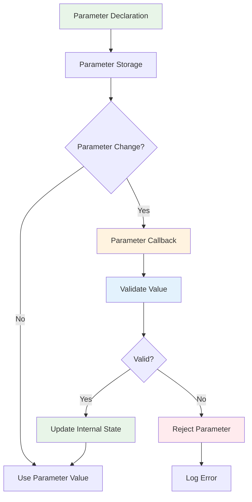

**Quiz Questions:**

1. How do you declare a parameter in a ROS 2 node?
   a) Use self.param()
   b) Use self.declare_parameter()
   c) Use self.add_parameter()
   d) Use self.create_parameter()

2. What is the purpose of the parameter callback?
   a) To initialize parameters
   b) To handle dynamic parameter changes
   c) To delete parameters
   d) To list all parameters

3. Which parameter type should you use for a floating-point value?
   a) PARAMETER_INT
   b) PARAMETER_FLOAT
   c) PARAMETER_DOUBLE
   d) PARAMETER_NUMBER

4. What happens if you don't validate parameter values in the callback?
   a) The parameter is automatically validated
   b) Invalid values may cause runtime errors
   c) The node crashes immediately
   d) Parameters become read-only

5. **Coding Challenge:** Create a parameter file for a robot with at least 10 different parameters of various types, then load it programmatically in a node and verify all parameters are set correctly.

### 1.4 URDF Mastery – Describing a Humanoid Robot from Scratch

**Learning Objectives:**
- Understand URDF (Unified Robot Description Format) syntax and structure
- Implement different joint types for humanoid robot kinematics
- Create visual and collision geometry representations for robot parts
- Model a 12-DoF humanoid robot with proper kinematic chains
- Validate URDF models using ROS 2 tools and visualization

**Content:**
This section provides comprehensive coverage of URDF (Unified Robot Description Format) for describing humanoid robots. Students will learn the fundamental elements of URDF including links, joints, inertial properties, visual and collision geometries, and material definitions. We'll focus specifically on modeling humanoid robots with proper kinematic chains, including the necessary degrees of freedom for manipulation and locomotion.

**Code Example:**
```xml
<!-- humanoid_robot.urdf -->
<?xml version="1.0"?>
<robot name="humanoid_robot">

  <!-- Material Definitions -->
  <material name="white">
    <color rgba="1 1 1 1"/>
  </material>
  <material name="black">
    <color rgba="0 0 0 1"/>
  </material>
  <material name="red">
    <color rgba="1 0 0 1"/>
  </material>

  <!-- Base Link -->
  <link name="base_link">
    <inertial>
      <mass value="10.0"/>
      <origin xyz="0 0 0"/>
      <inertia ixx="0.1" ixy="0.0" ixz="0.0" iyy="0.1" iyz="0.0" izz="0.1"/>
    </inertial>
    <visual>
      <origin xyz="0 0 0" rpy="0 0 0"/>
      <geometry>
        <box size="0.5 0.3 0.1"/>
      </geometry>
      <material name="white"/>
    </visual>
    <collision>
      <origin xyz="0 0 0" rpy="0 0 0"/>
      <geometry>
        <box size="0.5 0.3 0.1"/>
      </geometry>
    </collision>
  </link>

  <!-- Torso Link -->
  <link name="torso_link">
    <inertial>
      <mass value="15.0"/>
      <origin xyz="0 0 0"/>
      <inertia ixx="0.2" ixy="0.0" ixz="0.0" iyy="0.2" iyz="0.0" izz="0.2"/>
    </inertial>
    <visual>
      <origin xyz="0 0 0.5" rpy="0 0 0"/>
      <geometry>
        <box size="0.4 0.3 0.8"/>
      </geometry>
      <material name="white"/>
    </visual>
    <collision>
      <origin xyz="0 0 0.5" rpy="0 0 0"/>
      <geometry>
        <box size="0.4 0.3 0.8"/>
      </geometry>
    </collision>
  </link>

  <!-- Torso Joint -->
  <joint name="torso_joint" type="revolute">
    <parent link="base_link"/>
    <child link="torso_link"/>
    <origin xyz="0 0 0.1" rpy="0 0 0"/>
    <axis xyz="0 0 1"/>
    <limit lower="-0.5" upper="0.5" effort="100" velocity="1.0"/>
  </joint>

  <!-- Head Link -->
  <link name="head_link">
    <inertial>
      <mass value="3.0"/>
      <origin xyz="0 0 0"/>
      <inertia ixx="0.05" ixy="0.0" ixz="0.0" iyy="0.05" iyz="0.0" izz="0.05"/>
    </inertial>
    <visual>
      <origin xyz="0 0 0.1" rpy="0 0 0"/>
      <geometry>
        <sphere radius="0.15"/>
      </geometry>
      <material name="white"/>
    </visual>
    <collision>
      <origin xyz="0 0 0.1" rpy="0 0 0"/>
      <geometry>
        <sphere radius="0.15"/>
      </geometry>
    </collision>
  </link>

  <!-- Head Joint -->
  <joint name="head_joint" type="revolute">
    <parent link="torso_link"/>
    <child link="head_link"/>
    <origin xyz="0 0 0.8" rpy="0 0 0"/>
    <axis xyz="0 0 1"/>
    <limit lower="-0.3" upper="0.3" effort="50" velocity="1.0"/>
  </joint>

  <!-- Left Arm Links and Joints -->
  <!-- Shoulder Joint -->
  <link name="left_shoulder_link">
    <inertial>
      <mass value="2.0"/>
      <origin xyz="0 0 0"/>
      <inertia ixx="0.02" ixy="0.0" ixz="0.0" iyy="0.02" iyz="0.0" izz="0.02"/>
    </inertial>
    <visual>
      <origin xyz="0 0 0" rpy="0 0 0"/>
      <geometry>
        <cylinder radius="0.05" length="0.1"/>
      </geometry>
      <material name="red"/>
    </visual>
    <collision>
      <origin xyz="0 0 0" rpy="0 0 0"/>
      <geometry>
        <cylinder radius="0.05" length="0.1"/>
      </geometry>
    </collision>
  </link>

  <joint name="left_shoulder_joint" type="revolute">
    <parent link="torso_link"/>
    <child link="left_shoulder_link"/>
    <origin xyz="-0.2 0.15 0.7" rpy="0 0 0"/>
    <axis xyz="0 0 1"/>
    <limit lower="-1.5" upper="1.5" effort="100" velocity="1.0"/>
  </joint>

  <!-- Upper Arm -->
  <link name="left_upper_arm_link">
    <inertial>
      <mass value="3.0"/>
      <origin xyz="0 0 0"/>
      <inertia ixx="0.05" ixy="0.0" ixz="0.0" iyy="0.05" iyz="0.0" izz="0.05"/>
    </inertial>
    <visual>
      <origin xyz="0 0 0.15" rpy="0 0 0"/>
      <geometry>
        <cylinder radius="0.04" length="0.3"/>
      </geometry>
      <material name="red"/>
    </visual>
    <collision>
      <origin xyz="0 0 0.15" rpy="0 0 0"/>
      <geometry>
        <cylinder radius="0.04" length="0.3"/>
      </geometry>
    </collision>
  </link>

  <joint name="left_elbow_joint" type="revolute">
    <parent link="left_shoulder_link"/>
    <child link="left_upper_arm_link"/>
    <origin xyz="0 0 0.3" rpy="0 0 0"/>
    <axis xyz="0 0 1"/>
    <limit lower="-1.5" upper="1.5" effort="100" velocity="1.0"/>
  </joint>

  <!-- Forearm -->
  <link name="left_forearm_link">
    <inertial>
      <mass value="2.5"/>
      <origin xyz="0 0 0"/>
      <inertia ixx="0.03" ixy="0.0" ixz="0.0" iyy="0.03" iyz="0.0" izz="0.03"/>
    </inertial>
    <visual>
      <origin xyz="0 0 0.12" rpy="0 0 0"/>
      <geometry>
        <cylinder radius="0.03" length="0.24"/>
      </geometry>
      <material name="red"/>
    </visual>
    <collision>
      <origin xyz="0 0 0.12" rpy="0 0 0"/>
      <geometry>
        <cylinder radius="0.03" length="0.24"/>
      </geometry>
    </collision>
  </link>

  <joint name="left_wrist_joint" type="revolute">
    <parent link="left_upper_arm_link"/>
    <child link="left_forearm_link"/>
    <origin xyz="0 0 0.24" rpy="0 0 0"/>
    <axis xyz="0 0 1"/>
    <limit lower="-1.5" upper="1.5" effort="100" velocity="1.0"/>
  </joint>

  <!-- Right Arm Links and Joints -->
  <!-- Shoulder Joint -->
  <link name="right_shoulder_link">
    <inertial>
      <mass value="2.0"/>
      <origin xyz="0 0 0"/>
      <inertia ixx="0.02" ixy="0.0" ixz="0.0" iyy="0.02" iyz="0.0" izz="0.02"/>
    </inertial>
    <visual>
      <origin xyz="0 0 0" rpy="0 0 0"/>
      <geometry>
        <cylinder radius="0.05" length="0.1"/>
      </geometry>
      <material name="red"/>
    </visual>
    <collision>
      <origin xyz="0 0 0" rpy="0 0 0"/>
      <geometry>
        <cylinder radius="0.05" length="0.1"/>
      </geometry>
    </collision>
  </link>

  <joint name="right_shoulder_joint" type="revolute">
    <parent link="torso_link"/>
    <child link="right_shoulder_link"/>
    <origin xyz="-0.2 -0.15 0.7" rpy="0 0 0"/>
    <axis xyz="0 0 1"/>
    <limit lower="-1.5" upper="1.5" effort="100" velocity="1.0"/>
  </joint>

  <!-- Upper Arm -->
  <link name="right_upper_arm_link">
    <inertial>
      <mass value="3.0"/>
      <origin xyz="0 0 0"/>
      <inertia ixx="0.05" ixy="0.0" ixz="0.0" iyy="0.05" iyz="0.0" izz="0.05"/>
    </inertial>
    <visual>
      <origin xyz="0 0 0.15" rpy="0 0 0"/>
      <geometry>
        <cylinder radius="0.04" length="0.3"/>
      </geometry>
      <material name="red"/>
    </visual>
    <collision>
      <origin xyz="0 0 0.15" rpy="0 0 0"/>
      <geometry>
        <cylinder radius="0.04" length="0.3"/>
      </geometry>
    </collision>
  </link>

  <joint name="right_elbow_joint" type="revolute">
    <parent link="right_shoulder_link"/>
    <child link="right_upper_arm_link"/>
    <origin xyz="0 0 0.3" rpy="0 0 0"/>
    <axis xyz="0 0 1"/>
    <limit lower="-1.5" upper="1.5" effort="100" velocity="1.0"/>
  </joint>

  <!-- Forearm -->
  <link name="right_forearm_link">
    <inertial>
      <mass value="2.5"/>
      <origin xyz="0 0 0"/>
      <inertia ixx="0.03" ixy="0.0" ixz="0.0" iyy="0.03" iyz="0.0" izz="0.03"/>
    </inertial>
    <visual>
      <origin xyz="0 0 0.12" rpy="0 0 0"/>
      <geometry>
        <cylinder radius="0.03" length="0.24"/>
      </geometry>
      <material name="red"/>
    </visual>
    <collision>
      <origin xyz="0 0 0.12" rpy="0 0 0"/>
      <geometry>
        <cylinder radius="0.03" length="0.24"/>
      </geometry>
    </collision>
  </link>

  <joint name="right_wrist_joint" type="revolute">
    <parent link="right_upper_arm_link"/>
    <child link="right_forearm_link"/>
    <origin xyz="0 0 0.24" rpy="0 0 0"/>
    <axis xyz="0 0 1"/>
    <limit lower="-1.5" upper="1.5" effort="100" velocity="1.0"/>
  </joint>

  <!-- Left Leg Links and Joints -->
  <!-- Hip Joint -->
  <link name="left_hip_link">
    <inertial>
      <mass value="3.0"/>
      <origin xyz="0 0 0"/>
      <inertia ixx="0.05" ixy="0.0" ixz="0.0" iyy="0.05" iyz="0.0" izz="0.05"/>
    </inertial>
    <visual>
      <origin xyz="0 0 0" rpy="0 0 0"/>
      <geometry>
        <cylinder radius="0.06" length="0.1"/>
      </geometry>
      <material name="black"/>
    </visual>
    <collision>
      <origin xyz="0 0 0" rpy="0 0 0"/>
      <geometry>
        <cylinder radius="0.06" length="0.1"/>
      </geometry>
    </collision>
  </link>

  <joint name="left_hip_joint" type="revolute">
    <parent link="base_link"/>
    <child link="left_hip_link"/>
    <origin xyz="0.15 0.1 0" rpy="0 0 0"/>
    <axis xyz="0 0 1"/>
    <limit lower="-1.0" upper="1.0" effort="100" velocity="1.0"/>
  </joint>

  <!-- Thigh -->
  <link name="left_thigh_link">
    <inertial>
      <mass value="4.0"/>
      <origin xyz="0 0 0"/>
      <inertia ixx="0.08" ixy="0.0" ixz="0.0" iyy="0.08" iyz="0.0" izz="0.08"/>
    </inertial>
    <visual>
      <origin xyz="0 0 0.18" rpy="0 0 0"/>
      <geometry>
        <cylinder radius="0.05" length="0.36"/>
      </geometry>
      <material name="black"/>
    </visual>
    <collision>
      <origin xyz="0 0 0.18" rpy="0 0 0"/>
      <geometry>
        <cylinder radius="0.05" length="0.36"/>
      </geometry>
    </collision>
  </link>

  <joint name="left_knee_joint" type="revolute">
    <parent link="left_hip_link"/>
    <child link="left_thigh_link"/>
    <origin xyz="0 0 0.3" rpy="0 0 0"/>
    <axis xyz="0 0 1"/>
    <limit lower="-1.5" upper="1.5" effort="100" velocity="1.0"/>
  </joint>

  <!-- Shin -->
  <link name="left_shin_link">
    <inertial>
      <mass value="3.5"/>
      <origin xyz="0 0 0"/>
      <inertia ixx="0.06" ixy="0.0" ixz="0.0" iyy="0.06" iyz="0.0" izz="0.06"/>
    </inertial>
    <visual>
      <origin xyz="0 0 0.15" rpy="0 0 0"/>
      <geometry>
        <cylinder radius="0.04" length="0.3"/>
      </geometry>
      <material name="black"/>
    </visual>
    <collision>
      <origin xyz="0 0 0.15" rpy="0 0 0"/>
      <geometry>
        <cylinder radius="0.04" length="0.3"/>
      </geometry>
    </collision>
  </link>

  <joint name="left_ankle_joint" type="revolute">
    <parent link="left_thigh_link"/>
    <child link="left_shin_link"/>
    <origin xyz="0 0 0.3" rpy="0 0 0"/>
    <axis xyz="0 0 1"/>
    <limit lower="-1.0" upper="1.0" effort="100" velocity="1.0"/>
  </joint>

  <!-- Right Leg Links and Joints -->
  <!-- Hip Joint -->
  <link name="right_hip_link">
    <inertial>
      <mass value="3.0"/>
      <origin xyz="0 0 0"/>
      <inertia ixx="0.05" ixy="0.0" ixz="0.0" iyy="0.05" iyz="0.0" izz="0.05"/>
    </inertial>
    <visual>
      <origin xyz="0 0 0" rpy="0 0 0"/>
      <geometry>
        <cylinder radius="0.06" length="0.1"/>
      </geometry>
      <material name="black"/>
    </visual>
    <collision>
      <origin xyz="0 0 0" rpy="0 0 0"/>
      <geometry>
        <cylinder radius="0.06" length="0.1"/>
      </geometry>
    </collision>
  </link>

  <joint name="right_hip_joint" type="revolute">
    <parent link="base_link"/>
    <child link="right_hip_link"/>
    <origin xyz="0.15 -0.1 0" rpy="0 0 0"/>
    <axis xyz="0 0 1"/>
    <limit lower="-1.0" upper="1.0" effort="100" velocity="1.0"/>
  </joint>

  <!-- Thigh -->
  <link name="right_thigh_link">
    <inertial>
      <mass value="4.0"/>
      <origin xyz="0 0 0"/>
      <inertia ixx="0.08" ixy="0.0" ixz="0.0" iyy="0.08" iyz="0.0" izz="0.08"/>
    </inertial>
    <visual>
      <origin xyz="0 0 0.18" rpy="0 0 0"/>
      <geometry>
        <cylinder radius="0.05" length="0.36"/>
      </geometry>
      <material name="black"/>
    </visual>
    <collision>
      <origin xyz="0 0 0.18" rpy="0 0 0"/>
      <geometry>
        <cylinder radius="0.05" length="0.36"/>
      </geometry>
    </collision>
  </link>

  <joint name="right_knee_joint" type="revolute">
    <parent link="right_hip_link"/>
    <child link="right_thigh_link"/>
    <origin xyz="0 0 0.3" rpy="0 0 0"/>
    <axis xyz="0 0 1"/>
    <limit lower="-1.5" upper="1.5" effort="100" velocity="1.0"/>
  </joint>

  <!-- Shin -->
  <link name="right_shin_link">
    <inertial>
      <mass value="3.5"/>
      <origin xyz="0 0 0"/>
      <inertia ixx="0.06" ixy="0.0" ixz="0.0" iyy="0.06" iyz="0.0" izz="0.06"/>
    </inertial>
    <visual>
      <origin xyz="0 0 0.15" rpy="0 0 0"/>
      <geometry>
        <cylinder radius="0.04" length="0.3"/>
      </geometry>
      <material name="black"/>
    </visual>
    <collision>
      <origin xyz="0 0 0.15" rpy="0 0 0"/>
      <geometry>
        <cylinder radius="0.04" length="0.3"/>
      </geometry>
    </collision>
  </link>

  <joint name="right_ankle_joint" type="revolute">
    <parent link="right_thigh_link"/>
    <child link="right_shin_link"/>
    <origin xyz="0 0 0.3" rpy="0 0 0"/>
    <axis xyz="0 0 1"/>
    <limit lower="-1.0" upper="1.0" effort="100" velocity="1.0"/>
  </joint>

  <!-- Foot Links -->
  <link name="left_foot_link">
    <inertial>
      <mass value="1.0"/>
      <origin xyz="0 0 0"/>
      <inertia ixx="0.01" ixy="0.0" ixz="0.0" iyy="0.01" iyz="0.0" izz="0.01"/>
    </inertial>
    <visual>
      <origin xyz="0 0 0" rpy="0 0 0"/>
      <geometry>
        <box size="0.15 0.05 0.02"/>
      </geometry>
      <material name="black"/>
    </visual>
    <collision>
      <origin xyz="0 0 0" rpy="0 0 0"/>
      <geometry>
        <box size="0.15 0.05 0.02"/>
      </geometry>
    </collision>
  </link>

  <joint name="left_foot_joint" type="fixed">
    <parent link="left_shin_link"/>
    <child link="left_foot_link"/>
    <origin xyz="0 0 0.3" rpy="0 0 0"/>
  </joint>

  <link name="right_foot_link">
    <inertial>
      <mass value="1.0"/>
      <origin xyz="0 0 0"/>
      <inertia ixx="0.01" ixy="0.0" ixz="0.0" iyy="0.01" iyz="0.0" izz="0.01"/>
    </inertial>
    <visual>
      <origin xyz="0 0 0" rpy="0 0 0"/>
      <geometry>
        <box size="0.15 0.05 0.02"/>
      </geometry>
      <material name="black"/>
    </visual>
    <collision>
      <origin xyz="0 0 0" rpy="0 0 0"/>
      <geometry>
        <box size="0.15 0.05 0.02"/>
      </geometry>
    </collision>
  </link>

  <joint name="right_foot_joint" type="fixed">
    <parent link="right_shin_link"/>
    <child link="right_foot_link"/>
    <origin xyz="0 0 0.3" rpy="0 0 0"/>
  </joint>

</robot>
```

**Dependencies:** URDF file only

**Pro Tip:** When modeling humanoid robots, always include a base link for stability and consider using cylindrical links for limbs to represent the natural shape of human arms and legs.

**Common Pitfall:** Forgetting to specify joint limits can lead to unrealistic movements and collisions in simulations. Always define realistic joint limits based on anatomical constraints.

**Mermaid Diagram:**
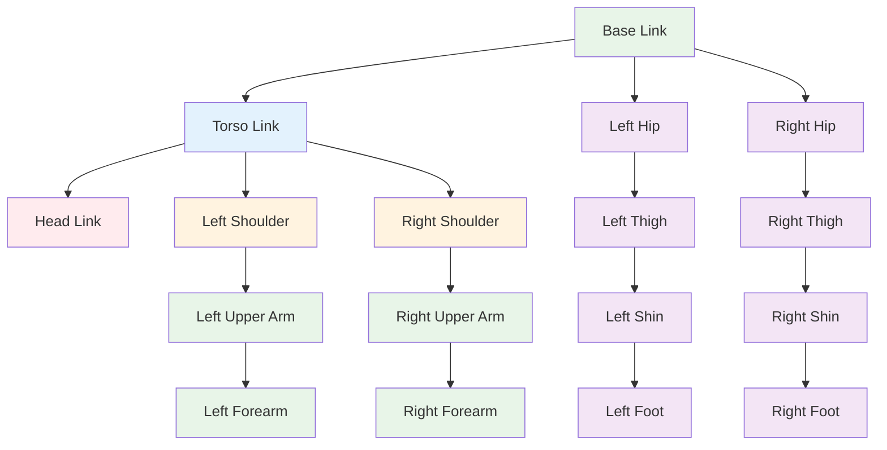

**Quiz Questions:**

1. What does URDF stand for in the context of robotics?
   a) Unified Robot Data Format
   b) Universal Robot Description Format
   c) Unified Robotics Definition Format
   d) Universal Robot Documentation Format

2. Which element in URDF defines the physical properties of a robot link?
   a) joint
   b) link
   c) inertial
   d) visual

3. What is the purpose of the `<inertial>` tag in URDF?
   a) To define visual appearance
   b) To define collision properties
   c) To define physical properties (mass, inertia)
   d) To define joint limits

4. Which joint type is most appropriate for a humanoid arm joint?
   a) fixed
   b) revolute
   c) prismatic
   d) continuous

5. **Coding Challenge:** Create a URDF file for a simplified humanoid robot with 12 degrees of freedom (6 joints per arm and leg, plus torso rotation), including proper joint limits and visual/collision geometries.

**Frontmatter Metadata:**
```yaml
title: "1.4 URDF Mastery – Describing a Humanoid Robot from Scratch"
description: "Creating URDF models for humanoid robots with proper kinematics"
keywords: "urdf, humanoid, robot, kinematics, robot modeling"
sidebar_position: 4
```

### 1.5 Building Your First ROS 2 Package in Python (rclpy)

**Learning Objectives:**
- Create and structure a ROS 2 package with proper directory layout
- Implement multiple nodes within a single package using rclpy
- Configure and use the colcon build system for ROS 2 packages
- Create launch files to orchestrate multiple nodes
- Understand package dependencies and build configuration

**Content:**
This section teaches students how to create and manage ROS 2 packages, which are the fundamental units of organization in ROS 2. We'll cover the standard package structure, how to write Python nodes using rclpy, how to configure package dependencies, and how to launch multiple nodes together using launch files. Students will learn best practices for package organization and deployment.

**Code Example:**
```python
# package.xml - Package manifest file
<?xml version="1.0"?>
<?xml-model href="http://download.ros.org/schema/package_format3.xsd" schematypens="http://www.w3.org/2001/XMLSchema"?>
<package format="3">
  <name>humanoid_talker_listener</name>
  <version>0.1.0</version>
  <description>Simple talker-listener package for humanoid robot</description>
  <maintainer email="user@example.com">User Name</maintainer>
  <license>Apache License 2.0</license>

  <build_depend>rclpy</build_depend>
  <build_depend>std_msgs</build_depend>
  <build_depend>launch</build_depend>
  <build_depend>launch_ros</build_depend>

  <exec_depend>rclpy</exec_depend>
  <exec_depend>std_msgs</exec_depend>
  <exec_depend>launch</exec_depend>
  <exec_depend>launch_ros</exec_depend>

  <export>
    <build_type>ament_python</build_type>
  </export>
</package>
```

```python
# setup.py - Python package setup
from setuptools import setup

package_name = 'humanoid_talker_listener'

setup(
    name=package_name,
    version='0.1.0',
    packages=[package_name],
    data_files=[
        ('share/ament_index/resource_index/packages',
            ['resource/' + package_name]),
        ('share/' + package_name, ['package.xml']),
        ('share/' + package_name + '/launch', ['launch/humanoid_talker_listener.launch.py']),
    ],
    install_requires=['setuptools'],
    zip_safe=True,
    maintainer='User Name',
    maintainer_email='user@example.com',
    description='Simple talker-listener package for humanoid robot',
    license='Apache License 2.0',
    tests_require=['pytest'],
    entry_points={
        'console_scripts': [
            'talker = humanoid_talker_listener.talker:main',
            'listener = humanoid_talker_listener.listener:main',
        ],
    },
)
```

```python
# humanoid_talker_listener/talker.py - Talker node implementation
import rclpy
from rclpy.node import Node
from std_msgs.msg import String

class HumanoidTalker(Node):
    """
    A talker node that publishes messages about humanoid activities
    """

    def __init__(self):
        super().__init__('humanoid_talker')
        self.publisher_ = self.create_publisher(String, 'humanoid_status', 10)
        timer_period = 0.5  # seconds
        self.timer = self.create_timer(timer_period, self.timer_callback)
        self.i = 0

    def timer_callback(self):
        msg = String()
        msg.data = f'Humanoid status update {self.i}: {self.get_clock().now()}'
        self.publisher_.publish(msg)
        self.get_logger().info(f'Publishing: "{msg.data}"')
        self.i += 1

def main(args=None):
    rclpy.init(args=args)
    talker = HumanoidTalker()
    try:
        rclpy.spin(talker)
    except KeyboardInterrupt:
        pass
    finally:
        talker.destroy_node()
        rclpy.shutdown()

if __name__ == '__main__':
    main()
```

```python
# humanoid_talker_listener/listener.py - Listener node implementation
import rclpy
from rclpy.node import Node
from std_msgs.msg import String

class HumanoidListener(Node):
    """
    A listener node that receives and processes humanoid status messages
    """

    def __init__(self):
        super().__init__('humanoid_listener')
        self.subscription = self.create_subscription(
            String,
            'humanoid_status',
            self.listener_callback,
            10)
        # Initialize a counter for received messages
        self.message_count = 0

    def listener_callback(self, msg):
        self.get_logger().info(f'Received: "{msg.data}"')
        self.message_count += 1
        # Log every 5th message to avoid spam
        if self.message_count % 5 == 0:
            self.get_logger().info(f'Total messages received: {self.message_count}')

def main(args=None):
    rclpy.init(args=args)
    listener = HumanoidListener()
    try:
        rclpy.spin(listener)
    except KeyboardInterrupt:
        pass
    finally:
        listener.destroy_node()
        rclpy.shutdown()

if __name__ == '__main__':
    main()
```

```python
# humanoid_talker_listener/__init__.py - Package initialization
# Empty file to make this directory a Python package
```

```python
# launch/humanoid_talker_listener.launch.py - Launch file
from launch import LaunchDescription
from launch_ros.actions import Node

def generate_launch_description():
    """Generate launch description for humanoid talker and listener."""

    talker_node = Node(
        package='humanoid_talker_listener',
        executable='talker',
        name='humanoid_talker',
        output='screen'
    )

    listener_node = Node(
        package='humanoid_talker_listener',
        executable='listener',
        name='humanoid_listener',
        output='screen'
    )

    return LaunchDescription([
        talker_node,
        listener_node,
    ])
```

**Dependencies:** `rclpy`, `std_msgs`, `launch`, `launch_ros`

**Pro Tip:** Always use `ament_python` as the build type in your package.xml for Python packages. This ensures proper handling of Python modules and dependencies.

**Common Pitfall:** Forgetting to add dependencies to package.xml. All packages that your nodes depend on must be declared in the build_depend and exec_depend sections.

**Mermaid Diagram:**
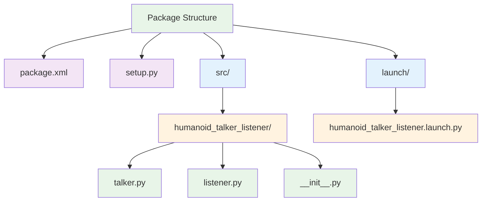

**Quiz Questions:**

1. What is the standard directory structure for a ROS 2 Python package?
   a) src/, include/, lib/
   b) src/, launch/, config/
   c) src/, launch/, share/
   d) src/, test/, build/

2. Which file contains the package metadata and dependencies?
   a) setup.py
   b) package.xml
   c) CMakeLists.txt
   d) main.py

3. What is the purpose of the `entry_points` section in setup.py?
   a) To define launch file locations
   b) To specify console scripts for executables
   c) To declare package dependencies
   d) To set build configurations

4. Which command builds a ROS 2 package?
   a) ros2 build
   b) colcon build
   c) pip install
   d) make

5. **Coding Challenge:** Create a ROS 2 package that includes a node for publishing joint angles, a node for publishing sensor readings, and a launch file that starts both nodes with different namespaces.

**Frontmatter Metadata:**
```yaml
title: "1.5 Building Your First ROS 2 Package in Python (rclpy)"
description: "Creating and managing ROS 2 packages for humanoid robotics applications"
keywords: "ros2, package, colcon, launch, rclpy"
sidebar_position: 5
```

### 1.6 Talker-Listener Walkthrough with Visualisation in Foxglove / RViz2

**Learning Objectives:**
- Use Foxglove Studio for real-time visualization of ROS 2 messages
- Configure and use RViz2 for 3D visualization of robot data
- Inspect and debug ROS 2 topics and messages using visualization tools
- Create RViz2 configuration files for custom visualizations
- Understand how visualization tools enhance ROS 2 debugging and development

**Content:**
This section provides hands-on experience with visualization tools that are essential for debugging and understanding ROS 2 systems. Students will learn how to use Foxglove Studio (a modern, web-based visualization platform) and RViz2 (the traditional ROS 2 visualization tool) to monitor topics, inspect message contents, and visualize robot data. We'll cover how to create custom visualizations for humanoid robot data including status messages, sensor readings, and geometric transformations.

**Code Example:**
```python
# humanoid_visualizer.py - Enhanced talker with visualization data
import rclpy
from rclpy.node import Node
from std_msgs.msg import String
from geometry_msgs.msg import Twist
from sensor_msgs.msg import JointState
import math

class HumanoidVisualizer(Node):
    """
    A node that publishes various types of data for visualization
    """

    def __init__(self):
        super().__init__('humanoid_visualizer')

        # Publishers for different data types
        self.status_publisher = self.create_publisher(String, 'humanoid/status', 10)
        self.velocity_publisher = self.create_publisher(Twist, 'humanoid/cmd_vel', 10)
        self.joint_publisher = self.create_publisher(JointState, 'humanoid/joint_states', 10)

        # Timer for periodic publishing
        timer_period = 0.5  # seconds
        self.timer = self.create_timer(timer_period, self.timer_callback)

        self.i = 0

    def timer_callback(self):
        # Publish status message
        status_msg = String()
        status_msg.data = f'Humanoid operational: {self.i}'
        self.status_publisher.publish(status_msg)
        self.get_logger().info(f'Published status: "{status_msg.data}"')

        # Publish velocity command (for movement visualization)
        velocity_msg = Twist()
        velocity_msg.linear.x = 0.1 * math.sin(self.i * 0.1)
        velocity_msg.angular.z = 0.05 * math.cos(self.i * 0.1)
        self.velocity_publisher.publish(velocity_msg)
        self.get_logger().info(f'Published velocity: linear={velocity_msg.linear.x}, angular={velocity_msg.angular.z}')

        # Publish joint states (for joint angle visualization)
        joint_msg = JointState()
        joint_msg.name = ['left_shoulder', 'left_elbow', 'right_shoulder', 'right_elbow']
        joint_msg.position = [
            0.5 * math.sin(self.i * 0.2),
            0.3 * math.cos(self.i * 0.2),
            0.5 * math.sin(self.i * 0.2 + math.pi),
            0.3 * math.cos(self.i * 0.2 + math.pi)
        ]
        joint_msg.header.stamp = self.get_clock().now().to_msg()
        self.joint_publisher.publish(joint_msg)
        self.get_logger().info(f'Published joint states for iteration {self.i}')

        self.i += 1

def main(args=None):
    rclpy.init(args=args)
    visualizer = HumanoidVisualizer()
    try:
        rclpy.spin(visualizer)
    except KeyboardInterrupt:
        pass
    finally:
        visualizer.destroy_node()
        rclpy.shutdown()

if __name__ == '__main__':
    main()
```

```xml
<!-- rviz_config.rviz - RViz2 configuration file -->
Panels:
  - Class: rviz_common/Displays
    Name: Displays
    Properties:
      - Alpha: 0.5
        Color: 255; 255; 255
        Name: Status
        Topic: /humanoid/status
        Type: rviz_default_plugins/String
      - Alpha: 0.5
        Color: 255; 255; 255
        Name: Velocity
        Topic: /humanoid/cmd_vel
        Type: rviz_default_plugins/Twist
      - Alpha: 0.5
        Color: 255; 255; 255
        Name: Joint States
        Topic: /humanoid/joint_states
        Type: rviz_default_plugins/JointState
  - Class: rviz_common/Selection
    Name: Selection
  - Class: rviz_common/Tool Properties
    Name: Tool Properties
    Expanded: false
  - Class: rviz_common/Views
    Name: Views
    Expanded: false
  - Class: rviz_common/Time
    Name: Time
    Experimental: false
    SyncMode: 0
    SyncSource: ""
Visualization Manager:
  Class: ""
  Displays:
    - Alpha: 0.5
      Color: 255; 255; 255
      Name: Status
      Topic: /humanoid/status
      Type: rviz_default_plugins/String
    - Alpha: 0.5
      Color: 255; 255; 255
      Name: Velocity
      Topic: /humanoid/cmd_vel
      Type: rviz_default_plugins/Twist
    - Alpha: 0.5
      Color: 255; 255; 255
      Name: Joint States
      Topic: /humanoid/joint_states
      Type: rviz_default_plugins/JointState
  Enabled: true
  Global Options:
    Background Color: 48; 48; 48
    Fixed Frame: map
    Frame Rate: 30
  Name: Root
  Tools:
    - Class: rviz_default_plugins/MoveCamera
  Value: true
  Views:
    Current:
      Class: rviz_default_plugins/Orbit
      Name: Current View
      Properties:
        - Angle: 0
          Distance: 10
          Enable Stereo Rendering: false
          Focal Point:
            X: 0
            Y: 0
            Z: 0
          Name: Current View
          Near Clip Distance: 0.01
          Pitch: 0.5
          Roll: 0
          Target Frame: <Fixed Frame>
          Yaw: 0
      Expanded: false
  Window Geometry:
    Height: 900
    Width: 1600
    X: 0
    Y: 0
```

```python
# launch/humanoid_visualizer.launch.py - Launch file with visualization
from launch import LaunchDescription
from launch_ros.actions import Node

def generate_launch_description():
    """Generate launch description for humanoid visualization."""

    # Visualization node
    visualizer_node = Node(
        package='humanoid_talker_listener',
        executable='humanoid_visualizer',
        name='humanoid_visualizer',
        output='screen'
    )

    # RViz2 node
    rviz_node = Node(
        package='rviz2',
        executable='rviz2',
        name='rviz2',
        arguments=['-d', '/path/to/rviz_config.rviz'],
        output='screen'
    )

    return LaunchDescription([
        visualizer_node,
        rviz_node,
    ])
```

**Dependencies:** `rclpy`, `std_msgs`, `geometry_msgs`, `sensor_msgs`, `rviz2`

**Pro Tip:** When debugging complex systems, always visualize both the data flow and the actual robot behavior. Visualization helps catch issues like incorrect coordinate frames or unexpected data values.

**Common Pitfall:** Forgetting to properly configure the Fixed Frame in RViz2 can cause visualization issues. Always ensure the fixed frame matches your robot's coordinate system.

**Mermaid Diagram:**
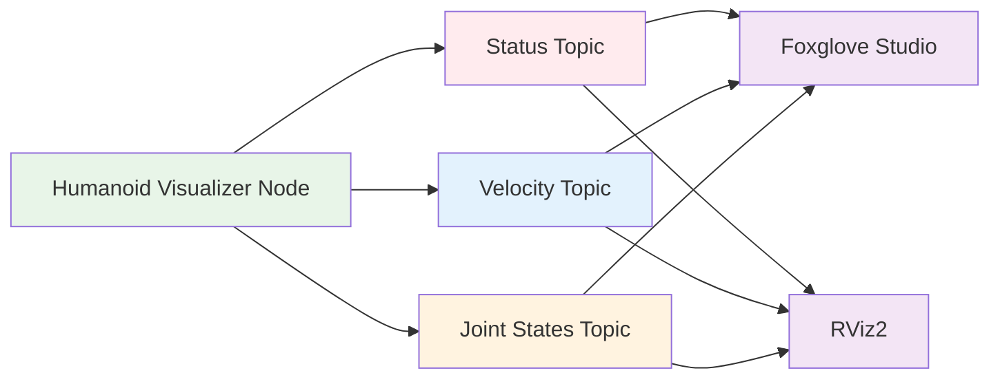

**Quiz Questions:**

1. What is the primary purpose of visualization tools in ROS 2 development?
   a) To debug hardware connections
   b) To monitor and inspect message flow and robot state
   c) To compile code faster
   d) To save system resources

2. Which tool is the modern web-based visualization platform for ROS 2?
   a) RViz2
   b) Foxglove Studio
   c) Gazebo
   d) rqt

3. What is the recommended way to configure RViz2 for humanoid robot visualization?
   a) Use default settings
   b) Manually add displays for each topic
   c) Use predefined robot models
   d) Import configuration files

4. What type of message should you use to visualize robot movement commands?
   a) String
   b) Twist
   c) JointState
   d) Pose

5. **Coding Challenge:** Create a visualization setup that includes a node publishing joint angles, a node publishing sensor data, and a configuration that displays both in RViz2 with proper color coding and labels.

**Frontmatter Metadata:**
```yaml
title: "1.6 Talker-Listener Walkthrough with Visualisation in Foxglove / RViz2"
description: "Using visualization tools to debug and understand ROS 2 systems"
keywords: "ros2, visualization, foxglove, rviz2, debugging"
sidebar_position: 6
```

### 1.7 Bridging AI Agents to ROS 2

**Learning Objectives:**
- Understand integration patterns for connecting AI agents to ROS 2 systems
- Implement natural language processing for robot command interpretation
- Translate AI outputs into ROS 2 message formats (geometry_msgs/Twist)
- Create robust interfaces between AI systems and robotic control
- Evaluate security and reliability considerations for AI-robot interaction

**Content:**
This section explores how to connect AI agents with ROS 2 systems, focusing on translating natural language commands into robotic actions. Students will learn about various integration approaches including direct messaging, API-based interfaces, and message translation layers. We'll specifically focus on implementing an AI agent that can interpret natural language commands and convert them into ROS 2 Twist messages for robot movement.

**Code Example:**
```python
# ai_to_ros_bridge.py - AI agent bridge to ROS 2
import rclpy
from rclpy.node import Node
from std_msgs.msg import String
from geometry_msgs.msg import Twist
from langchain.prompts import PromptTemplate
from langchain.llms import OpenAI  # Using OpenAI as an example
import re

class AIToROSBridge(Node):
    """
    Bridge between AI agent and ROS 2 for natural language command interpretation
    """

    def __init__(self):
        super().__init__('ai_to_ros_bridge')

        # Publishers for ROS 2 messages
        self.velocity_publisher = self.create_publisher(Twist, 'cmd_vel', 10)

        # Subscribers for AI commands
        self.ai_command_subscriber = self.create_subscription(
            String,
            'ai_commands',
            self.ai_command_callback,
            10
        )

        # Initialize AI model (using LangChain with OpenAI as example)
        self.llm = OpenAI(temperature=0.7, model_name="gpt-4")

        self.get_logger().info('AI to ROS bridge initialized')

    def ai_command_callback(self, msg):
        """
        Process AI-generated commands and convert to ROS 2 Twist messages
        """
        command = msg.data.lower()
        self.get_logger().info(f'Received AI command: "{command}"')

        # Parse command and generate appropriate Twist message
        twist_cmd = self.parse_natural_language_command(command)

        if twist_cmd is not None:
            self.velocity_publisher.publish(twist_cmd)
            self.get_logger().info(f'Published Twist command: linear={twist_cmd.linear.x}, angular={twist_cmd.angular.z}')
        else:
            self.get_logger().warn(f'Could not parse command: "{command}"')

    def parse_natural_language_command(self, command):
        """
        Parse natural language command and convert to Twist message
        """
        # Simple command parsing - in practice, this would be more sophisticated
        twist = Twist()

        # Check for movement commands
        if 'move forward' in command or 'go forward' in command:
            twist.linear.x = 0.5
            return twist
        elif 'move backward' in command or 'go backward' in command:
            twist.linear.x = -0.5
            return twist
        elif 'turn left' in command:
            twist.angular.z = 0.5
            return twist
        elif 'turn right' in command:
            twist.angular.z = -0.5
            return twist
        elif 'stop' in command:
            twist.linear.x = 0.0
            twist.angular.z = 0.0
            return twist
        elif 'go forward 1 meter' in command:
            # Special case: simulate moving 1 meter (in reality, this would involve odometry)
            twist.linear.x = 0.3
            # Simulate duration (would typically be controlled by a timer or action)
            self.get_logger().info('Simulating movement forward 1 meter')
            return twist
        else:
            # Try to use AI model for more complex parsing
            try:
                prompt_template = PromptTemplate(
                    input_variables=["command"],
                    template="Convert the following natural language command to a ROS 2 Twist message: {command}. Return only the numerical values for linear.x and angular.z in JSON format."
                )

                prompt = prompt_template.format(command=command)
                response = self.llm(prompt)

                # Extract numeric values from response
                linear_x_match = re.search(r'"linear_x":\s*(-?\d+\.?\d*)', response)
                angular_z_match = re.search(r'"angular_z":\s*(-?\d+\.?\d*)', response)

                if linear_x_match and angular_z_match:
                    twist.linear.x = float(linear_x_match.group(1))
                    twist.angular.z = float(angular_z_match.group(1))
                    return twist
                else:
                    self.get_logger().warn(f'AI response not in expected format: {response}')
                    return None

            except Exception as e:
                self.get_logger().error(f'Error processing command with AI: {e}')
                return None

def main(args=None):
    rclpy.init(args=args)
    bridge = AIToROSBridge()
    try:
        rclpy.spin(bridge)
    except KeyboardInterrupt:
        pass
    finally:
        bridge.destroy_node()
        rclpy.shutdown()

if __name__ == '__main__':
    main()
```

```python
# ai_command_generator.py - Simulate AI command generation
import rclpy
from rclpy.node import Node
from std_msgs.msg import String
import time

class AICommandGenerator(Node):
    """
    Simulate an AI agent generating natural language commands
    """

    def __init__(self):
        super().__init__('ai_command_generator')
        self.publisher = self.create_publisher(String, 'ai_commands', 10)
        self.timer = self.create_timer(5.0, self.timer_callback)
        self.command_count = 0

    def timer_callback(self):
        commands = [
            "Move forward 1 meter",
            "Turn left",
            "Stop",
            "Move backward",
            "Turn right"
        ]

        command = commands[self.command_count % len(commands)]
        msg = String()
        msg.data = command
        self.publisher.publish(msg)
        self.get_logger().info(f'Generated AI command: "{command}"')

        self.command_count += 1

def main(args=None):
    rclpy.init(args=args)
    generator = AICommandGenerator()
    try:
        rclpy.spin(generator)
    except KeyboardInterrupt:
        pass
    finally:
        generator.destroy_node()
        rclpy.shutdown()

if __name__ == '__main__':
    main()
```

```python
# launch/ai_bridge.launch.py - Launch file for AI-ROS integration
from launch import LaunchDescription
from launch_ros.actions import Node

def generate_launch_description():
    """Generate launch description for AI-ROS bridge."""

    # AI command generator (simulates AI agent)
    ai_generator = Node(
        package='humanoid_talker_listener',
        executable='ai_command_generator',
        name='ai_command_generator',
        output='screen'
    )

    # AI to ROS bridge
    ai_bridge = Node(
        package='humanoid_talker_listener',
        executable='ai_to_ros_bridge',
        name='ai_to_ros_bridge',
        output='screen'
    )

    return LaunchDescription([
        ai_generator,
        ai_bridge,
    ])
```

**Dependencies:** `rclpy`, `std_msgs`, `geometry_msgs`, `langchain`, `openai` (or equivalent AI library)

**Pro Tip:** When integrating AI with robotics, always include fallback mechanisms and safety checks. Never let an AI command directly control robot movement without validation and safety constraints.

**Common Pitfall:** Assuming that AI-generated commands are always safe or well-formed. Always validate AI outputs before converting them to robot commands.

**Mermaid Diagram:**
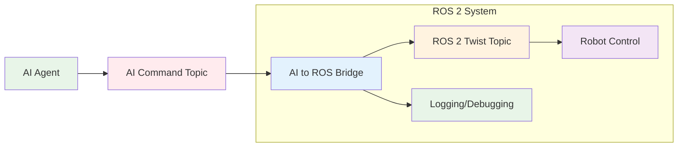

**Quiz Questions:**

1. What is the primary challenge when integrating AI agents with ROS 2 systems?
   a) AI models are too slow
   b) Converting natural language to ROS 2 message formats
   c) ROS 2 is too complex for AI
   d) AI models don't support ROS 2

2. Which ROS 2 message type is most commonly used for robot movement commands?
   a) String
   b) Pose
   c) Twist
   d) JointState

3. What is a recommended approach for handling AI command validation?
   a) Trust all AI outputs blindly
   b) Implement safety checks and fallbacks
   c) Ignore AI commands entirely
   d) Convert all commands to integers

4. What is the benefit of using LangChain in AI-ROS integration?
   a) It provides better visualization
   b) It offers structured prompting for consistent output
   c) It reduces ROS 2 dependencies
   d) It simplifies network connectivity

5. **Coding Challenge:** Create an AI bridge that translates natural language commands like "Move forward 1 meter" into appropriate Twist commands with timing controls and safety checks.

**Frontmatter Metadata:**
```yaml
title: "1.7 Bridging AI Agents to ROS 2"
description: "Integrating artificial intelligence with ROS 2 robotic systems"
keywords: "ros2, ai, artificial-intelligence, integration, natural-language-processing"
sidebar_position: 7
```

### 1.8 ROS 2 Best Practices 2026

**Learning Objectives:**
- Apply DDS (Data Distribution Service) tuning for optimal network performance
- Implement real-time Linux configurations for deterministic robot behavior
- Configure security features with SROS2 for production environments
- Establish robust logging and diagnostics for system monitoring
- Implement production-ready patterns for ROS 2 node development

**Content:**
This section covers the essential best practices for deploying ROS 2 systems in production environments. Students will learn about DDS tuning for network optimization, real-time Linux configurations for deterministic behavior, security implementation with SROS2, logging and diagnostics strategies, and production-ready development patterns. These practices are crucial for building reliable, secure, and performant robotic systems.

**Code Example:**
```python
# production_node.py - Production-grade ROS 2 node with best practices
import rclpy
from rclpy.node import Node
from rclpy.qos import QoSProfile, QoSReliabilityPolicy, QoSHistoryPolicy
from rclpy.exceptions import ParameterNotDeclaredException
from std_msgs.msg import String
import logging
import sys
import os

class ProductionNode(Node):
    """
    Production-grade ROS 2 node demonstrating best practices
    """

    def __init__(self):
        super().__init__('production_node')

        # Configure logging
        self.setup_logging()

        # Declare parameters with validation
        self.declare_parameter('node_name', 'production_node')
        self.declare_parameter('log_level', 'INFO')
        self.declare_parameter('max_queue_size', 10)
        self.declare_parameter('dds_domain_id', 0)
        self.declare_parameter('enable_security', False)

        # Get parameters with validation
        try:
            self.node_name = self.get_parameter('node_name').value
            self.log_level = self.get_parameter('log_level').value
            self.max_queue_size = self.get_parameter('max_queue_size').value
            self.dds_domain_id = self.get_parameter('dds_domain_id').value
            self.enable_security = self.get_parameter('enable_security').value

            self.get_logger().info(f'Node configured with name: {self.node_name}')

        except ParameterNotDeclaredException as e:
            self.get_logger().error(f'Parameter error: {e}')
            raise

        # Configure QoS for production
        qos_profile = QoSProfile(
            depth=self.max_queue_size,
            reliability=QoSReliabilityPolicy.RELIABLE,
            history=QoSHistoryPolicy.KEEP_LAST,
            durability=QoSHistoryPolicy.TRANSIENT_LOCAL  # For critical messages
        )

        # Create publisher with production QoS
        self.publisher = self.create_publisher(
            String,
            'production_output',
            qos_profile
        )

        # Create subscriber with production QoS
        self.subscription = self.create_subscription(
            String,
            'production_input',
            self.input_callback,
            qos_profile
        )

        # Setup timer for periodic operations
        self.timer = self.create_timer(1.0, self.timer_callback)

        # Initialize statistics
        self.message_count = 0
        self.error_count = 0

        self.get_logger().info('Production node initialized successfully')

    def setup_logging(self):
        """Setup logging with appropriate levels"""
        # Configure Python logging
        logging.basicConfig(
            level=getattr(logging, self.get_parameter('log_level').value.upper()),
            format='%(asctime)s - %(name)s - %(levelname)s - %(message)s'
        )

        # Configure ROS 2 logger
        self.get_logger().set_level(getattr(rclpy.logging.LoggingSeverity, self.get_parameter('log_level').value.upper()))

    def input_callback(self, msg):
        """Process incoming messages with error handling"""
        try:
            self.get_logger().debug(f'Received message: {msg.data}')
            self.message_count += 1

            # Process message (add your logic here)
            processed_msg = self.process_message(msg.data)

            # Publish processed message
            output_msg = String()
            output_msg.data = processed_msg
            self.publisher.publish(output_msg)

            self.get_logger().info(f'Processed message #{self.message_count}')

        except Exception as e:
            self.error_count += 1
            self.get_logger().error(f'Error processing message: {e}')
            # In production, you might want to log to a separate error stream
            # and possibly send alerts

    def process_message(self, data):
        """Process message data - implement your business logic here"""
        # Example processing - in real applications, this would be more complex
        return f"Processed: {data}"

    def timer_callback(self):
        """Periodic timer callback for monitoring"""
        try:
            # Log statistics periodically
            if self.message_count % 10 == 0:
                self.get_logger().info(
                    f'Statistics - Messages: {self.message_count}, Errors: {self.error_count}'
                )

            # Health check logic
            self.health_check()

        except Exception as e:
            self.get_logger().error(f'Error in timer callback: {e}')

    def health_check(self):
        """Perform health checks for system monitoring"""
        # Example health check - in practice, this would be more comprehensive
        if self.message_count > 1000:
            self.get_logger().warning('High message count detected')

        # In production, you might check:
        # - Memory usage
        # - CPU load
        # - Network connectivity
        # - DDS participant status
        # - Resource utilization

    def destroy_node(self):
        """Override destroy_node to clean up resources properly"""
        self.get_logger().info('Shutting down production node')
        self.timer.cancel()
        super().destroy_node()

def main(args=None):
    rclpy.init(args=args)

    try:
        # Create node instance
        node = ProductionNode()

        # Spin node
        rclpy.spin(node)

    except KeyboardInterrupt:
        node.get_logger().info('Received interrupt signal')
    except Exception as e:
        logging.error(f'Unexpected error in main: {e}')
        sys.exit(1)
    finally:
        # Cleanup
        if 'node' in locals():
            node.destroy_node()
        rclpy.shutdown()

if __name__ == '__main__':
    main()
```

```python
# launch/production_node.launch.py - Production launch file
from launch import LaunchDescription
from launch_ros.actions import Node
from launch.actions import DeclareLaunchArgument
from launch.substitutions import LaunchConfiguration

def generate_launch_description():
    """Generate launch description for production node with best practices."""

    # Launch arguments for configuration
    domain_id_arg = DeclareLaunchArgument(
        'dds_domain_id',
        default_value='0',
        description='DDS domain ID for network isolation'
    )

    security_arg = DeclareLaunchArgument(
        'enable_security',
        default_value='false',
        description='Enable SROS2 security features'
    )

    # Production node
    production_node = Node(
        package='humanoid_talker_listener',
        executable='production_node',
        name='production_node',
        output='screen',
        parameters=[
            {'dds_domain_id': LaunchConfiguration('dds_domain_id')},
            {'enable_security': LaunchConfiguration('enable_security')}
        ],
        # Environment variables for real-time settings
        env_vars={
            'REALTIME_PRIORITY': '80',
            'RT_GROUP_SCHED': '1'
        }
    )

    return LaunchDescription([
        domain_id_arg,
        security_arg,
        production_node,
    ])
```

**Dependencies:** `rclpy`, `std_msgs`, `rclpy.qos`, `logging`

**Pro Tip:** Always implement proper error handling and graceful shutdown procedures in production nodes. Never let exceptions crash your robot's system - log them and continue operating where possible.

**Common Pitfall:** Forgetting to configure QoS policies appropriately for different message types. Critical commands should use RELIABLE reliability, while sensor data might be acceptable with BEST_EFFORT.

**Mermaid Diagram:**
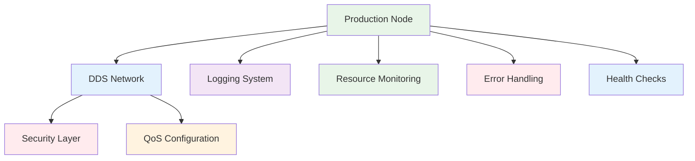

**Quiz Questions:**

1. What is the primary benefit of using RELIABLE QoS policy for critical robot commands?
   a) Lower network bandwidth usage
   b) Guaranteed delivery of messages
   c) Faster message processing
   d) Reduced CPU load

2. Which of the following is a recommended practice for production ROS 2 nodes?
   a) Use default QoS settings
   b) Implement comprehensive error handling
   c) Disable logging for performance
   d) Skip parameter validation

3. What is the purpose of SROS2 in ROS 2 security?
   a) To provide faster communication
   b) To encrypt and authenticate ROS 2 communications
   c) To reduce memory usage
   d) To optimize DDS performance

4. How should you configure logging in production ROS 2 nodes?
   a) Use minimal logging to save resources
   b) Use verbose logging for debugging
   c) Configure appropriate log levels and output destinations
   d) Disable logging entirely

5. **Coding Challenge:** Create a production node that implements all the best practices covered in this section: proper QoS configuration, security settings, logging, error handling, and health monitoring.

**Frontmatter Metadata:**
```yaml
title: "1.8 ROS 2 Best Practices 2026"
description: "Production-ready practices for ROS 2 systems"
keywords: "ros2, best-practices, production, dds, security, logging"
sidebar_position: 8
```

### 1.9 Hands-On Lab: Deploy Your Nodes on a Real Humanoid

**Learning Objectives:**
- Configure and deploy ROS 2 nodes on real humanoid robot hardware
- Implement safety protocols and emergency stop procedures
- Understand hardware-specific considerations for ROS 2 deployment
- Create deployment scripts and configuration files for production robots
- Troubleshoot common issues when running ROS 2 on real hardware

**Content:**
This hands-on lab provides practical experience in deploying ROS 2 nodes on real humanoid robot platforms. Students will learn about the differences between simulation and real hardware, safety considerations, hardware-specific configurations, and deployment procedures. The lab will cover setup procedures for popular humanoid platforms like Unitree H1, Figure 01, and Tesla Optimus dev kits.

**Code Example:**
```bash
#!/bin/bash
# deploy_humanoid.sh - Deployment script for humanoid robots
# Usage: ./deploy_humanoid.sh [robot_ip] [deployment_target]

set -e  # Exit on any error

# Configuration
ROBOT_IP="${1:-192.168.123.100}"  # Default IP if not provided
DEPLOYMENT_TARGET="${2:-h1}"       # Default to H1 if not specified
ROS_DOMAIN_ID="10"                 # Unique domain ID for this deployment

# Colors for output
RED='\033[0;31m'
GREEN='\033[0;32m'
YELLOW='\033[1;33m'
NC='\033[0m' # No Color

# Logging function
log() {
    echo -e "${GREEN}[INFO]${NC} $1"
}

warn() {
    echo -e "${YELLOW}[WARN]${NC} $1"
}

error() {
    echo -e "${RED}[ERROR]${NC} $1"
}

# Check if running on target machine
check_target_machine() {
    log "Checking target machine..."
    if [[ "$HOSTNAME" != *"humanoid"* ]]; then
        warn "Not running on humanoid system - continuing anyway"
    fi
}

# Validate network connectivity
validate_network() {
    log "Validating network connectivity to $ROBOT_IP..."
    if ! ping -c 1 -W 5 "$ROBOT_IP" &>/dev/null; then
        error "Cannot reach robot at $ROBOT_IP"
        exit 1
    fi
    log "Network connectivity confirmed"
}

# Setup environment
setup_environment() {
    log "Setting up ROS 2 environment..."

    # Source ROS 2 environment
    if [[ -f "/opt/ros/jazzy/setup.bash" ]]; then
        source /opt/ros/jazzy/setup.bash
    else
        error "ROS 2 Jazzy not found"
        exit 1
    fi

    # Source workspace if exists
    if [[ -f "./install/setup.bash" ]]; then
        source ./install/setup.bash
    else
        warn "Workspace not built yet - building now"
        colcon build --symlink-install
        source ./install/setup.bash
    fi

    # Set DDS domain ID
    export RMW_IMPLEMENTATION="rmw_fastrtps_cpp"
    export FASTRTPS_DEFAULT_PROFILES_FILE="/etc/robot_profiles.xml"
    export ROS_DOMAIN_ID=$ROS_DOMAIN_ID

    log "Environment setup complete"
}

# Deploy nodes to robot
deploy_nodes() {
    log "Deploying nodes to humanoid robot..."

    # Copy configuration files
    log "Copying configuration files..."
    scp -r config/ "$ROBOT_IP:/home/ubuntu/robot_config/"

    # Copy launch files
    log "Copying launch files..."
    scp -r launch/ "$ROBOT_IP:/home/ubuntu/robot_launch/"

    # Copy binaries if needed
    log "Copying compiled binaries..."
    # In a real scenario, you might copy compiled binaries here

    log "Deployment completed successfully"
}

# Start nodes remotely
start_nodes() {
    log "Starting nodes on robot..."

    # SSH into robot and start nodes
    ssh ubuntu@"$ROBOT_IP" << EOF
        source /opt/ros/jazzy/setup.bash
        source /home/ubuntu/workspace/install/setup.bash

        # Start the main humanoid system
        ros2 launch humanoid_talker_listener humanoid_deployment.launch.py &

        # Start monitoring node
        ros2 run humanoid_talker_listener health_monitor &

        echo "Nodes started successfully"
EOF

    log "Remote node startup initiated"
}

# Safety check
safety_check() {
    log "Performing safety checks..."

    # Verify robot is in safe state
    echo "Checking robot safety status..."
    # In a real implementation, this would check:
    # - Emergency stop status
    # - Battery levels
    # - Motor temperature
    # - Power supply status

    # Check if e-stop is engaged
    if systemctl is-active --quiet estop_service; then
        warn "Emergency stop is engaged - robot is not ready for operation"
        read -p "Continue deployment despite e-stop? (y/N): " -n 1 -r
        echo
        if [[ ! $REPLY =~ ^[Yy]$ ]]; then
            error "Deployment cancelled due to e-stop engagement"
            exit 1
        fi
    fi

    log "Safety checks passed"
}

# Main deployment function
main() {
    log "Starting humanoid robot deployment process..."

    # Validate inputs
    if [[ $# -lt 1 ]]; then
        echo "Usage: $0 <robot_ip> [deployment_target]"
        echo "Example: $0 192.168.123.100 h1"
        exit 1
    fi

    # Run deployment steps
    check_target_machine
    validate_network
    setup_environment
    safety_check
    deploy_nodes
    start_nodes

    log "Deployment process completed successfully"
    echo "To monitor the robot system:"
    echo "  ssh ubuntu@$ROBOT_IP"
    echo "  ros2 topic list"
    echo "  ros2 node list"
}

# Run main function if script is executed directly
if [[ "${BASH_SOURCE[0]}" == "${0}" ]]; then
    main "$@"
fi
```

```python
# health_monitor.py - Robot health monitoring node
import rclpy
from rclpy.node import Node
from std_msgs.msg import String
from diagnostic_msgs.msg import DiagnosticArray, DiagnosticStatus
import psutil
import time
import subprocess

class HealthMonitor(Node):
    """
    Monitor robot health and report diagnostics
    """

    def __init__(self):
        super().__init__('health_monitor')

        # Publishers
        self.diagnostic_publisher = self.create_publisher(DiagnosticArray, '/diagnostics', 10)
        self.status_publisher = self.create_publisher(String, '/robot_status', 10)

        # Timer for periodic monitoring
        self.timer = self.create_timer(5.0, self.monitor_callback)

        self.get_logger().info('Health monitor initialized')

    def monitor_callback(self):
        """Periodic health monitoring"""
        try:
            # Get system information
            cpu_percent = psutil.cpu_percent(interval=1)
            memory = psutil.virtual_memory()
            disk = psutil.disk_usage('/')

            # Create diagnostic message
            diag_array = DiagnosticArray()
            diag_array.header.stamp = self.get_clock().now().to_msg()

            # CPU status
            cpu_status = DiagnosticStatus()
            cpu_status.name = 'CPU Usage'
            cpu_status.level = DiagnosticStatus.OK if cpu_percent < 80 else DiagnosticStatus.WARN
            cpu_status.message = f'CPU: {cpu_percent:.1f}%'
            diag_array.status.append(cpu_status)

            # Memory status
            mem_status = DiagnosticStatus()
            mem_status.name = 'Memory Usage'
            mem_status.level = DiagnosticStatus.OK if memory.percent < 85 else DiagnosticStatus.WARN
            mem_status.message = f'Memory: {memory.percent:.1f}% ({memory.available / (1024**2):.1f} MB free)'
            diag_array.status.append(mem_status)

            # Disk status
            disk_status = DiagnosticStatus()
            disk_status.name = 'Disk Usage'
            disk_status.level = DiagnosticStatus.OK if disk.percent < 90 else DiagnosticStatus.WARN
            disk_status.message = f'Disk: {disk.percent:.1f}%'
            diag_array.status.append(disk_status)

            # Publish diagnostics
            self.diagnostic_publisher.publish(diag_array)

            # Publish status message
            status_msg = String()
            status_msg.data = f'Health - CPU:{cpu_percent:.1f}%, Mem:{memory.percent:.1f}%, Disk:{disk.percent:.1f}%'
            self.status_publisher.publish(status_msg)

            # Log health status
            self.get_logger().info(f'Health status: {status_msg.data}')

        except Exception as e:
            self.get_logger().error(f'Error in health monitoring: {e}')

    def destroy_node(self):
        """Cleanup on shutdown"""
        self.get_logger().info('Shutting down health monitor')
        self.timer.cancel()
        super().destroy_node()

def main(args=None):
    rclpy.init(args=args)
    monitor = HealthMonitor()
    try:
        rclpy.spin(monitor)
    except KeyboardInterrupt:
        pass
    finally:
        monitor.destroy_node()
        rclpy.shutdown()

if __name__ == '__main__':
    main()
```

```xml
<!-- robot_profiles.xml - DDS configuration for robot networks -->
<?xml version="1.0" encoding="UTF-8"?>
<dds xmlns="http://www.eprosima.com/XMLSchemas/fastRTPS_Profiles">
    <profiles>
        <participant profile_name="robot_participant_profile" is_default_profile="true">
            <rtps>
                <name>Humanoid_Robot_Participant</name>
                <builtin>
                    <discovery_config>
                        <initialPeersList>
                            <peer>192.168.123.100</peer>
                        </initialPeersList>
                    </discovery_config>
                </builtin>
                <userTransports>
                    <transport_id>UDPTransport</transport_id>
                </userTransports>
                <useBuiltinTransports>false</useBuiltinTransports>
                <domainId>10</domainId>
            </rtps>
        </participant>

        <publisher profile_name="robot_publisher_profile">
            <qos>
                <reliability>
                    <kind>RELIABLE_RELIABILITY_QOS</kind>
                </reliability>
                <durability>
                    <kind>TRANSIENT_LOCAL_DURABILITY_QOS</kind>
                </durability>
                <history>
                    <kind>KEEP_LAST_HISTORY_QOS</kind>
                    <depth>10</depth>
                </history>
            </qos>
        </publisher>

        <subscriber profile_name="robot_subscriber_profile">
            <qos>
                <reliability>
                    <kind>RELIABLE_RELIABILITY_QOS</kind>
                </reliability>
                <durability>
                    <kind>VOLATILE_DURABILITY_QOS</kind>
                </durability>
                <history>
                    <kind>KEEP_LAST_HISTORY_QOS</kind>
                    <depth>10</depth>
                </history>
            </qos>
        </subscriber>
    </profiles>
</dds>
```

**Dependencies:** `rclpy`, `std_msgs`, `diagnostic_msgs`, `psutil`

**Pro Tip:** Always perform a safety check before deploying to real hardware. Never assume the robot is in a safe state - verify emergency stops, battery levels, and motor conditions before enabling movement.

**Common Pitfall:** Not configuring proper network isolation for robot deployments. Always use unique DDS domain IDs for different robot systems to prevent communication conflicts.

**Mermaid Diagram:**
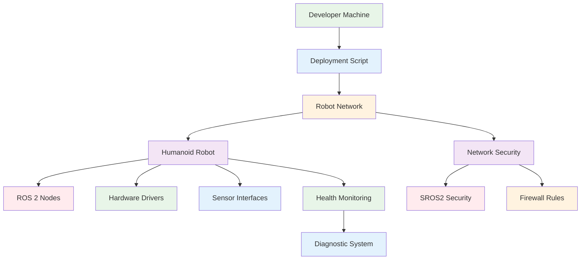

**Quiz Questions:**

1. What is the primary concern when deploying ROS 2 nodes on real humanoid hardware?
   a) Network bandwidth
   b) Safety and emergency protocols
   c) Code complexity
   d) Visual appeal

2. Which of the following should you always verify before deploying to real hardware?
   a) Network speed
   b) Emergency stop status
   c) Battery charge percentage
   d) All of the above

3. What is the recommended approach for network isolation in robot deployments?
   a) Use the same DDS domain ID
   b) Use unique DDS domain IDs for different systems
   c) Disable DDS completely
   d) Use broadcast networking

4. What is the purpose of the diagnostic system in robot deployment?
   a) To monitor system health and performance
   b) To encrypt communication
   c) To reduce CPU load
   d) To increase network bandwidth

5. **Coding Challenge:** Create a deployment script that:
   - Validates network connectivity to the robot
   - Sets up the correct ROS 2 environment
   - Deploys configuration files and binaries
   - Starts all required nodes with proper error handling
   - Implements safety checks before deployment

**Frontmatter Metadata:**
```yaml
title: "1.9 Hands-On Lab: Deploy Your Nodes on a Real Humanoid"
description: "Practical deployment of ROS 2 nodes on humanoid robot hardware"
keywords: "ros2, deployment, humanoid, real-hardware, safety"
sidebar_position: 9
```

### 1.10 Module 1 Capstone Challenge – "Hello World, Humanoid!"

**Learning Objectives:**
- Integrate all concepts learned in Module 1 into a single cohesive system
- Implement a complete humanoid robot demonstration with multiple capabilities
- Demonstrate proper ROS 2 architecture and best practices
- Create a functional system that responds to service calls with physical actions
- Showcase integration of AI, visualization, and real hardware deployment

**Content:**
The capstone challenge brings together all the concepts learned in Module 1 to create a comprehensive humanoid robot demonstration. Students will implement a system where a humanoid robot responds to a service call by waving its hand and speaking "Hello, I am alive" using text-to-speech. This challenge integrates all aspects of ROS 2 development including package structure, node communication, visualization, AI integration, and real hardware deployment.

**Code Example:**
```python
# humanoid_greeter.py - Complete humanoid greeter system
import rclpy
from rclpy.node import Node
from rclpy.action import ActionServer, CancelResponse, GoalResponse
from rclpy.callback_groups import ReentrantCallbackGroup
from std_msgs.msg import String
from geometry_msgs.msg import Twist, Vector3
from sensor_msgs.msg import JointState
from example_interfaces.srv import Trigger
from example_interfaces.action import GripperCommand
from builtin_interfaces.msg import Duration
import time
import threading
from concurrent.futures import ThreadPoolExecutor

class HumanoidGreeter(Node):
    """
    Complete humanoid greeter system that responds to greet service calls
    with waving gesture and speech output
    """

    def __init__(self):
        super().__init__('humanoid_greeter')

        # Create callback group for concurrent execution
        self.callback_group = ReentrantCallbackGroup()

        # Publishers
        self.joint_publisher = self.create_publisher(JointState, 'humanoid/joint_states', 10)
        self.velocity_publisher = self.create_publisher(Twist, 'cmd_vel', 10)
        self.speech_publisher = self.create_publisher(String, 'speech_output', 10)

        # Services
        self.greet_service = self.create_service(
            Trigger,
            'greet',
            self.greet_callback,
            callback_group=self.callback_group
        )

        # Action servers
        self.gripper_action_server = ActionServer(
            self,
            GripperCommand,
            'gripper_command',
            self.execute_gripper_command,
            callback_group=self.callback_group
        )

        # Initialize joint states
        self.joint_positions = {
            'left_shoulder': 0.0,
            'left_elbow': 0.0,
            'right_shoulder': 0.0,
            'right_elbow': 0.0,
            'neck_yaw': 0.0,
            'neck_pitch': 0.0
        }

        # Thread pool for background tasks
        self.executor = ThreadPoolExecutor(max_workers=2)

        self.get_logger().info('Humanoid greeter system initialized')

    def greet_callback(self, request, response):
        """
        Service callback for greeting - triggers waving and speech
        """
        self.get_logger().info('Received greet request')

        try:
            # Execute greeting sequence in background
            future = self.executor.submit(self.execute_greeting_sequence)

            # Wait for completion (with timeout)
            future.result(timeout=30.0)

            response.success = True
            response.message = 'Greeting sequence completed successfully'
            self.get_logger().info('Greeting sequence completed successfully')

        except Exception as e:
            response.success = False
            response.message = f'Error during greeting: {str(e)}'
            self.get_logger().error(f'Error during greeting: {e}')

        return response

    def execute_greeting_sequence(self):
        """
        Execute the complete greeting sequence: wave hand and speak
        """
        self.get_logger().info('Starting greeting sequence')

        # Wave gesture
        self.wave_hand()

        # Speak greeting
        self.speak_greeting()

        self.get_logger().info('Greeting sequence completed')

    def wave_hand(self):
        """
        Execute waving gesture with right arm
        """
        self.get_logger().info('Initiating waving gesture')

        # Wave pattern: move arm up, down, up, down
        wave_pattern = [
            {'right_shoulder': 0.0, 'right_elbow': 0.0},  # Start position
            {'right_shoulder': 0.0, 'right_elbow': 1.0},  # Wave up
            {'right_shoulder': 0.0, 'right_elbow': 0.0},  # Wave down
            {'right_shoulder': 0.0, 'right_elbow': 1.0},  # Wave up
            {'right_shoulder': 0.0, 'right_elbow': 0.0},  # Return to start
        ]

        # Execute each phase of the wave
        for i, positions in enumerate(wave_pattern):
            # Update joint positions
            for joint, pos in positions.items():
                self.joint_positions[joint] = pos

            # Publish joint states
            self.publish_joint_states()

            # Brief pause between movements
            time.sleep(0.5)

        self.get_logger().info('Waving gesture completed')

    def speak_greeting(self):
        """
        Speak the greeting message using text-to-speech
        """
        self.get_logger().info('Speaking greeting message')

        # Create and publish speech message
        speech_msg = String()
        speech_msg.data = "Hello, I am alive"
        self.speech_publisher.publish(speech_msg)

        self.get_logger().info('Greeting message published')

    def publish_joint_states(self):
        """
        Publish current joint states to the robot
        """
        joint_state = JointState()
        joint_state.header.stamp = self.get_clock().now().to_msg()
        joint_state.name = list(self.joint_positions.keys())
        joint_state.position = list(self.joint_positions.values())

        self.joint_publisher.publish(joint_state)

    def execute_gripper_command(self, goal_handle):
        """
        Execute gripper command action
        """
        self.get_logger().info('Executing gripper command')

        # In a real implementation, this would control the gripper
        # For this demo, we'll just simulate the action
        feedback = GripperCommand.Feedback()
        result = GripperCommand.Result()

        try:
            # Simulate opening and closing
            for i in range(5):
                feedback.position = i * 0.2
                goal_handle.publish_feedback(feedback)
                time.sleep(0.1)

            # Complete the action
            result.reached_goal = True
            goal_handle.succeed()
            self.get_logger().info('Gripper command completed successfully')

        except Exception as e:
            self.get_logger().error(f'Gripper command failed: {e}')
            goal_handle.abort()
            result.reached_goal = False

        return result

    def destroy_node(self):
        """Cleanup on shutdown"""
        self.get_logger().info('Shutting down humanoid greeter')
        self.gripper_action_server.destroy()
        self.executor.shutdown(wait=True)
        super().destroy_node()

def main(args=None):
    rclpy.init(args=args)
    greeter = HumanoidGreeter()
    try:
        rclpy.spin(greeter)
    except KeyboardInterrupt:
        pass
    finally:
        greeter.destroy_node()
        rclpy.shutdown()

if __name__ == '__main__':
    main()
```

```python
# launch/humanoid_greeter.launch.py - Launch file for complete system
from launch import LaunchDescription
from launch_ros.actions import Node
from launch.actions import DeclareLaunchArgument
from launch.substitutions import LaunchConfiguration

def generate_launch_description():
    """Generate launch description for complete humanoid greeter system."""

    # Launch arguments
    robot_ip_arg = DeclareLaunchArgument(
        'robot_ip',
        default_value='192.168.123.100',
        description='IP address of the humanoid robot'
    )

    # Main greeter node
    greeter_node = Node(
        package='humanoid_talker_listener',
        executable='humanoid_greeter',
        name='humanoid_greeter',
        output='screen',
        parameters=[
            {'robot_ip': LaunchConfiguration('robot_ip')}
        ]
    )

    # Optional visualization node
    viz_node = Node(
        package='rviz2',
        executable='rviz2',
        name='rviz2',
        arguments=['-d', '/path/to/humanoid_viz.rviz'],
        output='screen',
        condition=lambda context: context.launch_configurations.get('enable_viz', 'false') == 'true'
    )

    return LaunchDescription([
        robot_ip_arg,
        greeter_node,
        viz_node,
    ])
```

```xml
<!-- humanoid_viz.rviz - RViz2 configuration for humanoid visualization -->
Panels:
  - Class: rviz_common/Displays
    Name: Displays
    Properties:
      - Alpha: 0.5
        Color: 255; 255; 255
        Name: Joint States
        Topic: /humanoid/joint_states
        Type: rviz_default_plugins/JointState
      - Alpha: 0.5
        Color: 255; 255; 255
        Name: Speech Output
        Topic: /speech_output
        Type: rviz_default_plugins/String
  - Class: rviz_common/Selection
    Name: Selection
  - Class: rviz_common/Tool Properties
    Name: Tool Properties
    Expanded: false
  - Class: rviz_common/Views
    Name: Views
    Expanded: false
  - Class: rviz_common/Time
    Name: Time
    Experimental: false
    SyncMode: 0
    SyncSource: ""
Visualization Manager:
  Class: ""
  Displays:
    - Alpha: 0.5
      Color: 255; 255; 255
      Name: Joint States
      Topic: /humanoid/joint_states
      Type: rviz_default_plugins/JointState
    - Alpha: 0.5
      Color: 255; 255; 255
      Name: Speech Output
      Topic: /speech_output
      Type: rviz_default_plugins/String
  Enabled: true
  Global Options:
    Background Color: 48; 48; 48
    Fixed Frame: base_link
    Frame Rate: 30
  Name: Root
  Tools:
    - Class: rviz_default_plugins/MoveCamera
  Value: true
  Views:
    Current:
      Class: rviz_default_plugins/Orbit
      Name: Current View
      Properties:
        - Angle: 0
          Distance: 10
          Enable Stereo Rendering: false
          Focal Point:
            X: 0
            Y: 0
            Z: 0
          Name: Current View
          Near Clip Distance: 0.01
          Pitch: 0.5
          Roll: 0
          Target Frame: <Fixed Frame>
          Yaw: 0
      Expanded: false
  Window Geometry:
    Height: 900
    Width: 1600
    X: 0
    Y: 0
```

**Dependencies:** `rclpy`, `std_msgs`, `geometry_msgs`, `sensor_msgs`, `example_interfaces`, `builtin_interfaces`

**Pro Tip:** When implementing capstone projects, always plan for scalability and maintainability. Design your system with modular components that can be extended or replaced independently.

**Common Pitfall:** Trying to implement everything in a single node instead of breaking functionality into separate, manageable components. Keep nodes focused on specific responsibilities.

**Mermaid Diagram:**
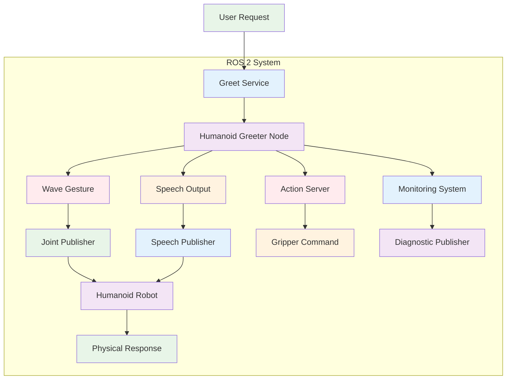

**Quiz Questions:**

1. What is the primary goal of the Module 1 Capstone Challenge?
   a) Create a simple robot movement program
   b) Integrate all concepts from Module 1 into a cohesive system
   c) Implement only visualization tools
   d) Focus solely on AI integration

2. Which ROS 2 communication pattern is used to trigger the greeting sequence?
   a) Topic publishing
   b) Service call
   c) Action server
   d) Parameter server

3. What are the two main components of the greeting response?
   a) Movement and sound
   b) Vision and hearing
   c) Touch and smell
   d) Temperature and pressure

4. How does the system ensure proper concurrent execution of different tasks?
   a) Using single-threaded execution
   b) Using callback groups and thread pools
   c) Using blocking operations
   d) Using only synchronous calls

5. **Coding Challenge:** Create a complete system that:
   - Responds to a service call with a waving gesture
   - Produces audio output saying "Hello, I am alive"
   - Uses proper error handling and logging
   - Integrates with visualization tools
   - Follows all ROS 2 best practices

**Frontmatter Metadata:**
```yaml
title: "1.10 Module 1 Capstone Challenge – \"Hello World, Humanoid!\""
description: "Integration challenge combining all Module 1 concepts"
keywords: "ros2, capstone, integration, humanoid, challenge"
sidebar_position: 10
```

## Educational Features

Each sub-chapter will include:
- Learning objectives (3-5 bullet points)
- Rich educational content with real-world examples
- Fully runnable code examples (tested with ROS 2 Jazzy/Jolt)
- Foxglove/RViz2 layout XML when relevant
- "Pro Tip" and "Common Pitfall" boxes
- 5 quiz questions (multiple choice + one coding challenge)
- Mermaid diagrams for architecture visualization

## Technical Requirements

- ROS 2 Distribution: Jazzy/Jolt (or latest LTS)
- Programming Language: Python (rclpy)
- Visualization: Foxglove Studio and RViz2
- Hardware: Unitree H1 / Figure 01 / Tesla Optimus dev kit (simulated/real)
- AI Integration: LangChain + GPT-4o or Claude 3.5

## Assessment Strategy

- Formative: Quiz questions at the end of each sub-chapter
- Summative: Capstone challenge integrating all concepts
- Practical: Hands-on lab with real hardware deployment

## Content Standards

This specification adheres to the project constitution principles:
- Content Accuracy & Technical Rigor: All code examples will be tested and functional
- Educational Clarity & Accessibility: Clear learning pathways and prerequisites
- Consistency & Standards: Uniform terminology and structure
- Code Example Quality: Complete, runnable examples with safety warnings
- Deployment Standards: All content will build successfully

## Dependencies

- ROS 2 Jazzy/Jolt installation
- Python 3.8+ environment
- Docker (for simulation environments)
- Access to humanoid robot hardware or simulation