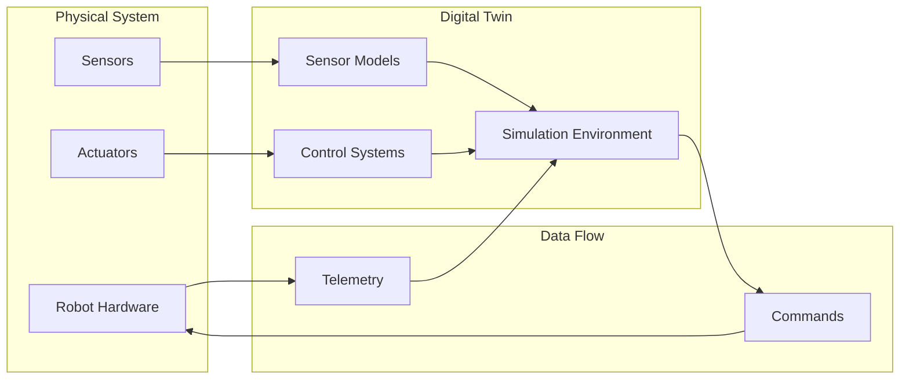
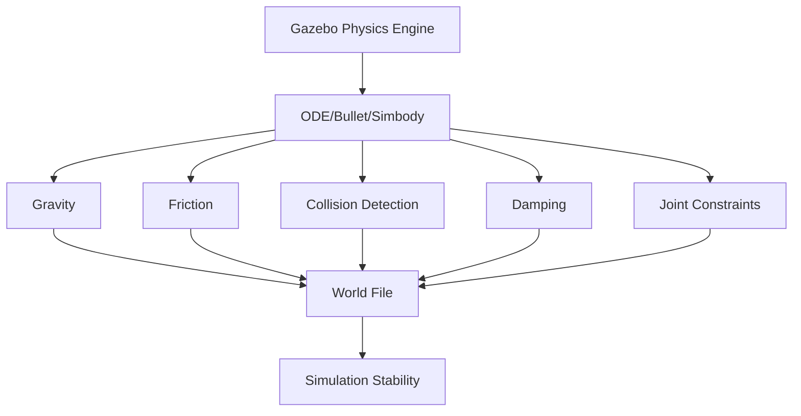
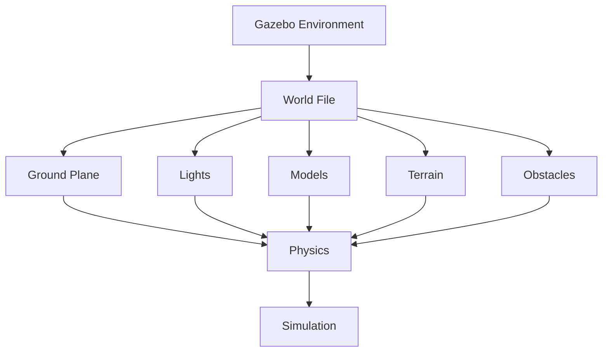
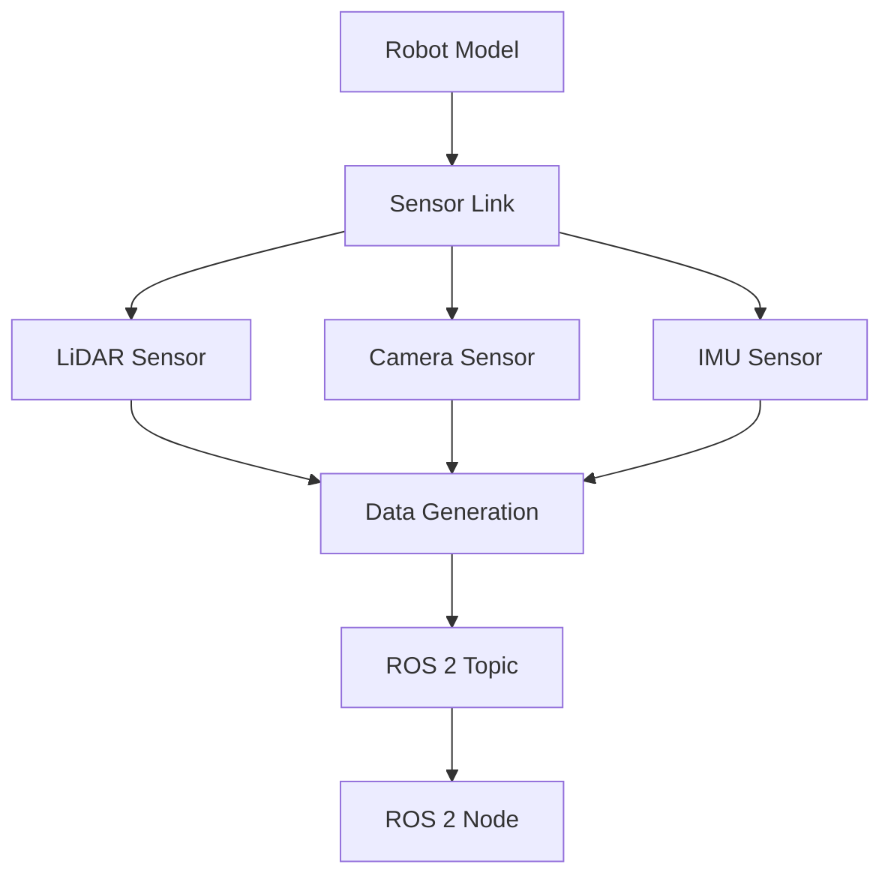
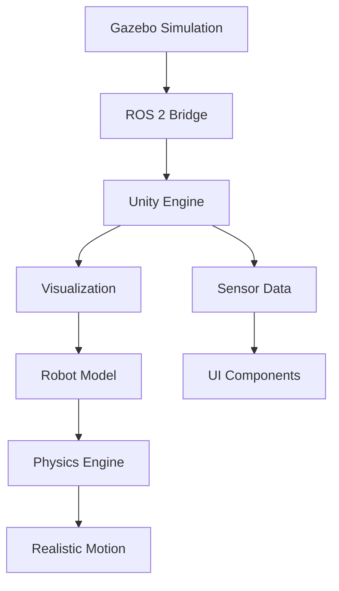
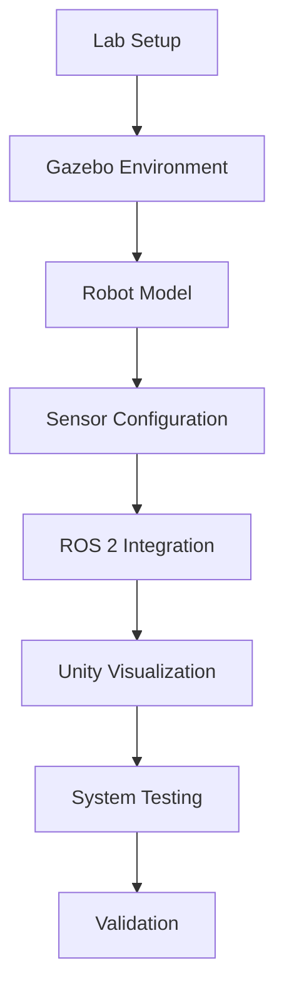
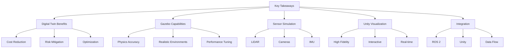

# Module 2: The Digital Twin (Gazebo & Unity)

## Functional Specification

**Project**: Physical AI & Humanoid Robotics – A Hands-On Capstone
**Module**: Module 2 - The Digital Twin (Gazebo & Unity)
**Target Audience**: Graduate students and practitioners in robotics
**Prerequisites**: Basic understanding of ROS 2 concepts, familiarity with Python programming, knowledge of URDF modeling
**Estimated Completion Time**: 25-30 hours

## Module Overview

This module introduces students to digital twin technology in robotics, focusing on physics simulation, environment creation, sensor simulation, and high-fidelity visualization. Students will learn to create realistic simulation environments using Gazebo and visualize robot interactions using Unity. The module emphasizes practical applications of digital twins in robotics development, from basic physics simulation to advanced sensor modeling and visualization.

## Learning Objectives

By the end of this module, students will be able to:
- Explain the purpose and benefits of digital twins in robotics development
- Configure and run physics simulations in Gazebo with realistic physics parameters
- Create and customize robot models with proper URDF/SDF definitions
- Simulate various sensor types (LiDAR, depth cameras, IMU) in Gazebo
- Set up and configure Unity projects for robotics visualization
- Import and interact with robot models in Unity environments
- Implement sensor data integration between Gazebo and Unity
- Apply digital twin concepts to real-world robotics problems

## Sub-chapter Structure

### 2.1 Understanding Digital Twins in Robotics
**Learning Objectives:**
- Define digital twin technology and its applications in robotics
- Compare digital twins with traditional simulation approaches
- Identify key benefits of using digital twins in robotics development
- Recognize real-world examples of digital twin implementations in industry
- Evaluate when to apply digital twin methodologies in robotics projects

**Content:**
This section introduces digital twin technology and its relevance to modern robotics. We'll explore how digital twins provide real-time synchronized representations of physical systems, enabling simulation, testing, and optimization before deploying to physical hardware. Students will learn about the core components of digital twins, including the physical system, the digital representation, and the data synchronization mechanisms.

**Key Concepts:**
- Digital twin definition and architecture
- Benefits for robotics development (cost reduction, risk mitigation, optimization)
- Comparison with traditional simulation methods
- Industry applications in robotics (manufacturing, autonomous systems, humanoid robotics)

**Pro Tip:** Digital twins are particularly valuable in robotics because they allow for rapid iteration and testing of complex scenarios without risking physical hardware.

**Common Pitfall:** Assuming digital twins are just fancy simulations. Digital twins provide bidirectional data flow and real-time synchronization that traditional simulations lack.

**Mermaid Diagram:**


**Quiz Questions:**
1. What is the primary benefit of using digital twins in robotics development?
   a) Reduced computational requirements
   b) Real-time synchronization between physical and digital systems
   c) Elimination of physical hardware requirements
   d) Simplified programming models

2. Which of the following is NOT a component of a digital twin architecture?
   a) Physical system representation
   b) Data synchronization layer
   c) Real-time visualization
   d) Manual control interface

3. How do digital twins differ from traditional simulation tools?
   a) They are less accurate
   b) They provide bidirectional data flow and real-time synchronization
   c) They are more expensive to implement
   d) They don't support sensor modeling

4. What is a key advantage of using digital twins for humanoid robot development?
   a) They eliminate the need for physical testing
   b) They allow for complex scenario testing without risk
   c) They reduce the need for software development
   d) They simplify hardware design

5. **Coding Challenge:** Create a conceptual diagram showing the data flow between a physical robot's sensors and a digital twin's simulation environment, including the synchronization mechanism.

**Frontmatter Metadata:**
```yaml
title: "2.1 Understanding Digital Twins in Robotics"
description: "Introduction to digital twin technology and its applications in robotics"
keywords: "digital twin, simulation, robotics, physics, environment"
sidebar_position: 1
```

### 2.2 Gazebo Physics Simulation Fundamentals
**Learning Objectives:**
- Configure physics parameters in Gazebo for realistic simulation
- Implement gravity, friction, and collision properties
- Create and customize simulation worlds with proper physics
- Understand Gazebo's physics engine and its parameters
- Apply physics simulation to robot motion and interaction

**Content:**
This section covers the fundamentals of physics simulation in Gazebo, the popular open-source robotics simulator. Students will learn how to configure physics parameters, create realistic environments, and understand how Gazebo's physics engine handles collisions, gravity, and other physical properties. The focus will be on building simulation environments that accurately represent real-world physics.

**Key Concepts:**
- Gazebo's physics engine (ODE, Bullet, Simbody)
- Physics parameters: gravity, friction, damping
- World file creation and configuration
- Collision detection and response
- Joint types and their physical properties

**Code Example:**
```xml
<!-- physics.sdf -->
<sdf version="1.6">
  <world name="default">
    <physics name="ignored" type="ode">
      <gravity>0 0 -9.8</gravity>
      <ode>
        <solver>
          <type>quick</type>
          <iters>10</iters>
          <precon_iters>0</precon_iters>
          <max_error>0.001</max_error>
        </solver>
        <constraints>
          <cfm>0.0</cfm>
          <erp>0.2</erp>
          <contact_max_correcting_vel>100.0</contact_max_correcting_vel>
          <contact_surface_layer>0.001</contact_surface_layer>
        </constraints>
      </ode>
    </physics>
  </world>
</sdf>
```

**Dependencies:** Gazebo, SDF files

**Pro Tip:** Start with default physics parameters and gradually tune them to match your specific requirements. Over-tuning can lead to unstable simulations.

**Common Pitfall:** Ignoring the relationship between physics parameters and simulation stability. Too aggressive constraints can cause simulation instabilities.

**Mermaid Diagram:**


**Quiz Questions:**
1. What does ODE stand for in Gazebo's physics engine?
   a) Open Dynamics Engine
   b) Optimized Dynamics Engine
   c) Open Data Engine
   d) Ordered Dynamics Engine

2. Which parameter controls the strength of gravitational force in Gazebo?
   a) friction
   b) gravity
   c) damping
   d) solver

3. What is the effect of increasing the contact surface layer in Gazebo physics?
   a) Makes collisions more elastic
   b) Increases simulation speed
   c) Reduces collision accuracy
   d) Improves collision response accuracy

4. What is the recommended approach for configuring physics parameters in Gazebo?
   a) Start with default values and adjust as needed
   b) Use extreme values for better realism
   c) Set all parameters to maximum values
   d) Ignore physics parameters for faster simulation

5. **Coding Challenge:** Create a Gazebo world file with a custom physics configuration that simulates a robot moving on a rough terrain surface with specific friction coefficients.

**Frontmatter Metadata:**
```yaml
title: "2.2 Gazebo Physics Simulation Fundamentals"
description: "Learn to configure physics parameters in Gazebo for realistic robotics simulation"
keywords: "gazebo, physics, simulation, gravity, collision"
sidebar_position: 2
```

### 2.3 Creating Environments in Gazebo
**Learning Objectives:**
- Design and build custom simulation environments
- Implement realistic terrain and obstacles
- Configure lighting and visual properties in Gazebo worlds
- Import and use custom models in simulation environments
- Create reusable environment templates

**Content:**
This section teaches students how to create complex simulation environments in Gazebo. We'll explore world file creation, terrain modeling, obstacle placement, lighting configuration, and model importing. Students will learn to build environments that accurately represent real-world scenarios for robotics testing.

**Key Concepts:**
- Gazebo world file structure and syntax
- Terrain creation and customization
- Lighting and visual effects
- Model import and reuse
- Environment configuration best practices

**Code Example:**
```xml
<!-- environment.sdf -->
<sdf version="1.6">
  <world name="robotics_lab">
    <include>
      <uri>model://ground_plane</uri>
    </include>

    <light name="sun" type="directional">
      <cast_shadows>true</cast_shadows>
      <pose>0 0 10 0 0 0</pose>
      <diffuse>1 1 1 1</diffuse>
      <specular>0.5 0.5 0.5 1</specular>
      <attenuation>
        <range>1000</range>
        <constant>0.9</constant>
        <linear>0.01</linear>
        <quadratic>0.001</quadratic>
      </attenuation>
    </light>

    <model name="table">
      <pose>0 0 0.5 0 0 0</pose>
      <link name="table_link">
        <collision name="table_collision">
          <geometry>
            <box>
              <size>2 1 1</size>
            </box>
          </geometry>
        </collision>
        <visual name="table_visual">
          <geometry>
            <box>
              <size>2 1 1</size>
            </box>
          </geometry>
          <material>
            <ambient>0.5 0.5 0.5 1</ambient>
            <diffuse>0.8 0.8 0.8 1</diffuse>
          </material>
        </visual>
      </link>
    </model>
  </world>
</sdf>
```

**Dependencies:** Gazebo, SDF files

**Pro Tip:** Use simple shapes initially and gradually add complexity to your environments. This makes debugging easier and improves simulation performance.

**Common Pitfall:** Creating overly complex environments that slow down simulation performance or cause instability.

**Mermaid Diagram:**


**Quiz Questions:**
1. What is the primary file format used for defining Gazebo worlds?
   a) URDF
   b) SDF
   c) YAML
   d) JSON

2. Which element defines lighting in a Gazebo world file?
   a) <terrain>
   b) <light>
   c) <model>
   d) <physics>

3. What is the purpose of the ground_plane model in Gazebo environments?
   a) Provides a sky background
   b) Creates a flat surface for robots to stand on
   c) Adds lighting effects
   d) Defines physics parameters

4. What is a recommended practice when creating complex Gazebo environments?
   a) Use as many complex models as possible
   b) Start with simple elements and add complexity gradually
   c) Use only default models
   d) Ignore performance considerations

5. **Coding Challenge:** Create a Gazebo world file that includes a robot workspace with tables, chairs, and obstacles arranged in a realistic office environment.

**Frontmatter Metadata:**
```yaml
title: "2.3 Creating Environments in Gazebo"
description: "Design and build custom simulation environments in Gazebo"
keywords: "gazebo, environment, world, terrain, lighting"
sidebar_position: 3
```

### 2.4 Sensor Simulation in Gazebo
**Learning Objectives:**
- Implement and configure various sensor types in Gazebo
- Simulate LiDAR, depth cameras, and IMU sensors
- Understand sensor data generation and transmission in simulations
- Configure sensor noise models for realistic simulation
- Integrate sensor data with ROS 2 nodes

**Content:**
This section focuses on sensor simulation in Gazebo, covering the implementation of common robotic sensors. Students will learn to configure and use LiDAR, depth cameras, and IMU sensors within Gazebo simulations, understanding how sensor data is generated and transmitted to ROS 2 nodes.

**Key Concepts:**
- Sensor types available in Gazebo (LiDAR, camera, IMU, etc.)
- Sensor configuration parameters
- Noise models and realism settings
- Data publishing to ROS 2 topics
- Integration with robot models

**Code Example:**
```xml
<!-- robot_with_sensors.urdf -->
<robot name="sensor_robot">
  <link name="base_link">
    <!-- Robot base -->
  </link>

  <sensor name="lidar_sensor" type="ray">
    <pose>0 0 0.1 0 0 0</pose>
    <ray>
      <scan>
        <horizontal>
          <samples>360</samples>
          <resolution>1.0</resolution>
          <min_angle>-1.57</min_angle>
          <max_angle>1.57</max_angle>
        </horizontal>
      </scan>
      <range>
        <min>0.1</min>
        <max>10.0</max>
        <resolution>0.01</resolution>
      </range>
    </ray>
    <plugin name="lidar_controller" filename="libgazebo_ros_laser.so">
      <topicName>/scan</topicName>
      <frameName>base_link</frameName>
    </plugin>
  </sensor>

  <sensor name="camera_sensor" type="camera">
    <pose>0 0 0.2 0 0 0</pose>
    <camera>
      <horizontal_fov>1.047</horizontal_fov>
      <image>
        <width>640</width>
        <height>480</height>
      </image>
      <clip>
        <near>0.1</near>
        <far>100</far>
      </clip>
    </camera>
    <plugin name="camera_controller" filename="libgazebo_ros_camera.so">
      <topicName>/camera/image_raw</topicName>
      <frameName>base_link</frameName>
    </plugin>
  </sensor>
</robot>
```

**Dependencies:** Gazebo, ROS 2, sensor plugins

**Pro Tip:** Start with basic sensor configurations and gradually add complexity. Understanding the fundamental parameters is crucial before adding noise models or advanced features.

**Common Pitfall:** Overcomplicating sensor configurations early in the learning process. Focus on getting basic functionality working before adding advanced features.

**Mermaid Diagram:**


**Quiz Questions:**
1. What sensor type is used for generating point cloud data in Gazebo?
   a) Camera
   b) IMU
   c) Ray (LiDAR)
   d) Force Torque

2. Which plugin is responsible for publishing LiDAR data to ROS 2 topics in Gazebo?
   a) libgazebo_ros_camera.so
   b) libgazebo_ros_laser.so
   c) libgazebo_ros_imu.so
   d) libgazebo_ros_depth.so

3. What is the purpose of the <noise> element in sensor configuration?
   a) Controls sensor power consumption
   b) Adds realistic noise to sensor readings
   c) Sets sensor sensitivity
   d) Configures sensor range

4. What is the typical data format published by Gazebo's camera sensor?
   a) PointCloud2
   b) Image
   c) LaserScan
   d) Odometry

5. **Coding Challenge:** Configure a robot model with a LiDAR sensor that generates realistic point clouds and an IMU sensor that provides orientation data, both publishing to appropriate ROS 2 topics.

**Frontmatter Metadata:**
```yaml
title: "2.4 Sensor Simulation in Gazebo"
description: "Implement and configure various sensor types in Gazebo simulations"
keywords: "gazebo, sensors, lidar, camera, imu, simulation"
sidebar_position: 4
```

### 2.5 Unity Integration for High-Fidelity Visualization
**Learning Objectives:**
- Set up Unity projects for robotics visualization
- Import and configure robot models from URDF/SDF files
- Create interactive scenes with realistic physics
- Implement sensor data visualization in Unity
- Configure Unity-ROS integration for real-time data exchange

**Content:**
This section introduces students to using Unity for high-fidelity visualization of robotics simulations. We'll cover Unity project setup, robot model import, scene creation, and integration with ROS 2 for real-time data exchange. Students will learn to create immersive environments that accurately visualize robot behavior and sensor data.

**Key Concepts:**
- Unity project setup for robotics visualization
- Model import and conversion from URDF/SDF formats
- Scene creation and environment design
- Unity-ROS integration using ROS# or similar tools
- Real-time sensor data visualization

**Code Example:**
```csharp
// Unity script for robot control
using UnityEngine;
using RosSharp.RosBridgeClient;

public class RobotController : MonoBehaviour
{
    public string rosBridgeUrl = "ws://localhost:9090";
    public string robotTopic = "/robot/cmd_vel";

    private RosSocket rosSocket;
    private Twist twist;

    void Start()
    {
        // Connect to ROS Bridge
        rosSocket = new RosSocket(rosBridgeUrl);

        // Initialize twist message
        twist = new Twist();
    }

    void Update()
    {
        // Handle input for robot movement
        float horizontal = Input.GetAxis("Horizontal");
        float vertical = Input.GetAxis("Vertical");

        // Set linear and angular velocities
        twist.linear.x = vertical * 0.5f;
        twist.angular.z = horizontal * 0.5f;

        // Publish velocity command
        rosSocket.Publish(robotTopic, twist);
    }
}
```

**Dependencies:** Unity 2021+, ROS# Unity package, ROS 2

**Pro Tip:** Use Unity's built-in physics engine alongside Gazebo's physics for more realistic interactions when both environments are involved in the same simulation.

**Common Pitfall:** Trying to replicate exact Gazebo physics in Unity without understanding the differences in physics engines and simulation timing.

**Mermaid Diagram:**


**Quiz Questions:**
1. What is the primary purpose of Unity in robotics simulation?
   a) Physics computation
   b) High-fidelity visualization and interaction
   c) Sensor data processing
   d) Hardware control

2. Which Unity package is commonly used for ROS integration?
   a) ROS.NET
   b) ROS#
   c) ROS.Unity
   d) UnityROS

3. What is the typical workflow for integrating Gazebo with Unity?
   a) Export from Unity to Gazebo
   b) Use ROS bridge for data exchange
   c) Direct physics engine synchronization
   d) Manual data transfer

4. What type of data can be visualized in Unity from Gazebo simulations?
   a) Only robot positions
   b) Sensor data, robot movements, and environmental changes
   c) Only camera images
   d) Only joint angles

5. **Coding Challenge:** Create a Unity scene that imports a robot model from a URDF file and displays live sensor data from a Gazebo simulation using ROS# integration.

**Frontmatter Metadata:**
```yaml
title: "2.5 Unity Integration for High-Fidelity Visualization"
description: "Set up Unity projects for robotics visualization and integrate with simulations"
keywords: "unity, visualization, graphics, ros#, simulation"
sidebar_position: 5
```

### 2.6 Hands-On Lab: Building a Complete Digital Twin
**Learning Objectives:**
- Combine all learned concepts into a complete digital twin implementation
- Create a simulation environment with physics and sensors
- Configure robot models with realistic sensor suites
- Implement visualization in Unity
- Test and validate the complete digital twin system

**Content:**
This hands-on lab brings together all the concepts learned in the module. Students will build a complete digital twin system that includes a physics simulation environment in Gazebo, robot models with sensors, and visualization in Unity. The lab will demonstrate how all components work together in a real-world robotics development workflow.

**Lab Steps:**
1. Create a Gazebo world with realistic physics
2. Implement a robot model with multiple sensors
3. Configure sensor data publishing to ROS 2 topics
4. Set up a Unity project for visualization
5. Integrate the simulation with Unity visualization
6. Test the complete digital twin system

**Dependencies:** Gazebo, Unity, ROS 2, ROS# Unity package

**Pro Tip:** Break the lab into smaller steps and test each component individually before integrating everything together.

**Common Pitfall:** Attempting to implement everything at once without testing individual components first.

**Mermaid Diagram:**


**Quiz Questions:**
1. What is the primary goal of the hands-on lab?
   a) Create a simple robot model
   b) Build a complete digital twin system integrating all components
   c) Only focus on sensor simulation
   d) Only visualize in Unity

2. Which step should be completed first in the lab?
   a) Unity visualization setup
   b) Sensor configuration
   c) Gazebo environment creation
   d) ROS 2 integration

3. What is a key benefit of completing this hands-on lab?
   a) Learning only one aspect of robotics
   b) Understanding how all components work together
   c) Focusing only on visualization
   d) Avoiding sensor integration

4. What should be tested first in the integrated system?
   a) Full system integration
   b) Individual component functionality
   c) Sensor data visualization
   d) Unity rendering

5. **Coding Challenge:** Build a complete digital twin system that includes a Gazebo simulation environment, a robot with multiple sensors, and a Unity visualization, ensuring all components communicate properly.

**Frontmatter Metadata:**
```yaml
title: "2.6 Hands-On Lab: Building a Complete Digital Twin"
description: "Apply all learned concepts to build a complete digital twin system"
keywords: "digital twin, lab, hands-on, integration, simulation"
sidebar_position: 6
```

### 2.7 Key Takeaways and Future Directions
**Learning Objectives:**
- Summarize key concepts learned in the digital twin module
- Identify advanced applications of digital twins in robotics
- Evaluate the role of digital twins in future robotics development
- Understand how to extend digital twin systems for specific applications

**Content:**
This final section summarizes the key concepts covered in Module 2 and looks ahead to advanced applications of digital twins in robotics. Students will reflect on what they've learned and consider how digital twin technologies can be extended for more sophisticated robotics applications.

**Key Takeaways:**
- Digital twins provide real-time synchronization between physical and digital systems
- Gazebo offers powerful physics simulation capabilities for robotics testing
- Sensor simulation in Gazebo enables comprehensive testing of robotic systems
- Unity provides high-fidelity visualization for enhanced understanding and presentation
- Integration between simulation and visualization tools creates powerful development environments

**Advanced Applications:**
- Multi-robot coordination in digital twins
- Human-robot interaction simulation
- Predictive maintenance using digital twins
- Training and education applications
- Industrial automation and manufacturing

**Future Directions:**
- Enhanced realism in physics and sensor simulation
- Improved integration with cloud platforms
- Real-time collaborative digital twin environments
- Machine learning integration for predictive analytics
- Edge computing for distributed digital twins

**Mermaid Diagram:**


**Quiz Questions:**
1. What is the primary benefit of using digital twins in robotics development?
   a) They are cheaper than physical robots
   b) They provide real-time synchronization between physical and digital systems
   c) They eliminate the need for physical testing
   d) They require no programming knowledge

2. Which of the following is NOT a key takeaway from this module?
   a) Gazebo provides realistic physics simulation
   b) Unity offers high-fidelity visualization
   c) Sensor simulation is only useful for testing
   d) Integration between tools enhances development workflow

3. What is a future direction for digital twin technology in robotics?
   a) Decreased realism in simulations
   b) Integration with cloud platforms
   c) Reduced sensor capabilities
   d) Elimination of physical testing

4. How can digital twins contribute to predictive maintenance in robotics?
   a) By reducing robot complexity
   b) By providing real-time monitoring and anomaly detection
   c) By eliminating sensor data
   d) By removing the need for repairs

5. **Coding Challenge:** Create a summary document that outlines how digital twin concepts can be applied to a specific robotics application of your choice.

**Frontmatter Metadata:**
```yaml
title: "2.7 Key Takeaways and Future Directions"
description: "Summary of key concepts and future applications of digital twins in robotics"
keywords: "digital twin, summary, key takeaways, future, applications"
sidebar_position: 7
```